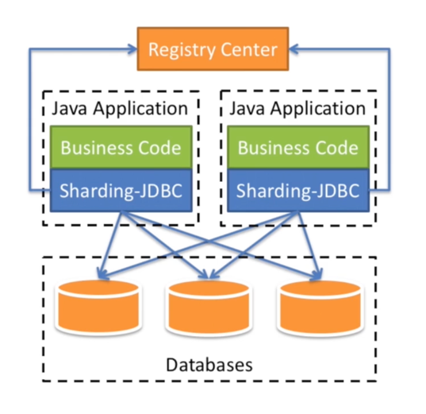

# 冷热字段分离
## 阐述
对于一条数据来说，比如用户数据，有些字段读取多，更新少，但是有些字段读取多，更新也多。  
那么可以静态属性，存一张表，动态的属性再存一张表。这样，更新多的那部分数据，在被更新时，不会影响到读取多的那部分数据。  

# 分库分表
## 分表
- 所有的分表都放到一个数据库中，比如用户表有100张，user1,...user100，这些表都存在一个数据库中
- 可以有事物操作
- 但是数据库连接有限

## 分库
- 所有的分表分散在不同的数据库中。比如10个数据库，每个库存10张表
- 数据库连接充足
- 不能做联表查询
- 夸数据库的事务无法完成

# Sharding JDBC
## 介绍
一款轻量的java框架，对原先的jdbc基础做了封装，可以兼容各类常用的orm框架

## 执行过程

### 路由规则

### 归并
把多个查询结果集进行合并
