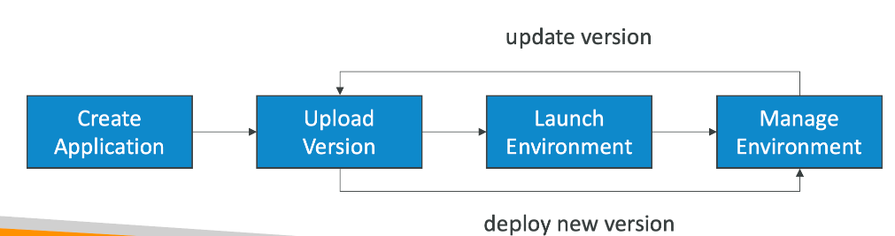
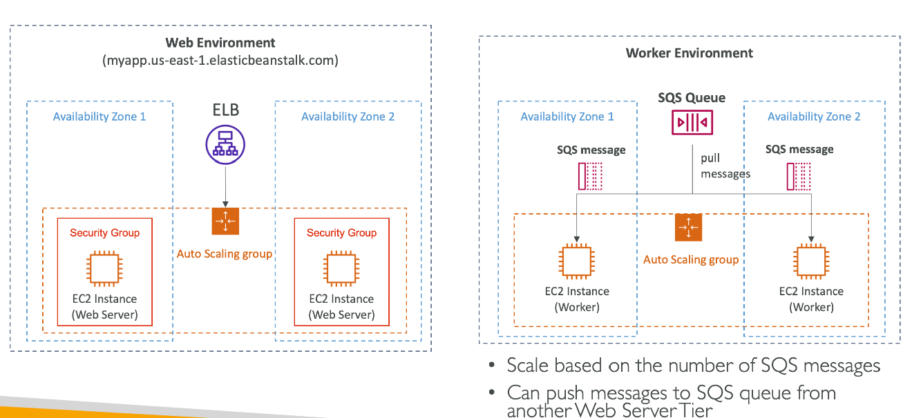
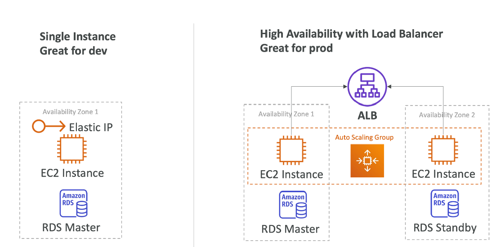

# Elastic Beanstalk
## 总览
- Elastic Beanstalk是一种开发者的关于部署app到aws上的中心观点
- 使用了一些常用的组件：EC2, ASG, ELB, EDS, ...
- 管理的服务
  - 自动处理：容量配置，负载均衡，伸缩，健康检查，实例配置等等
  - 开发人员只需要关注代码
- 全配置控制
- Beanstalk是免费的，但是里面的资源是收费的

## 组件
- Application：Elastic Beanstalk组件的集合（环境，版本，配置，，，）
- Application Version：开发的程序的版本
- Environment
  - Tiers：Web Server Environment Tier & Worker Environment Tier
  - 可以创建多环境（dev，stg，prod）

## Web Server Tier vs Worker Tier

## Elastic Beanstalk部署模式

