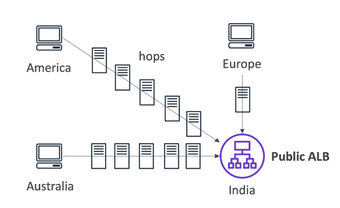

# Amazon CloudFront
## 总览
### 概念
- 就是一个缓存，这些缓存服务分布在世界各地，美国想取澳大利亚的s3的内容，首次会访问澳大利亚，然后缓存到美国的cloudFront，第二次访问就直接取cloudFront上取
- Content Delivery Network（CDN）
- 提高读的效率，内容被缓存在边缘位置（靠近用户的位置）
- 全球有216个边界位置
- DDoS保护（通过Web Application Firewall）

### CloudFront - Origins 源（CloudFront取内容的地方）
- s3桶
  - 用来分发文件并且缓存在边缘位置
  - 通过Origin Access Control（OAC）来提高CloudFront的安全性
  - OAC正在取代Origin Access Identity（OAI）
  - CloudFront可以背用来当作一个Ingress（存放文件到s3）
- Custom Origin（Http）
  - ALB
  - EC2
  - S3 静态网站
  - 任何HTTP后段服务器

### CloudFront图解

### S3作为源

### CloudFront vs S3 Cross Region Replication
- CloudFront
  - 全球edge网络
  - 文件可以被长时间缓存（可以一天）
  - 对静态内容非常友好，几乎可以在任何地方进行访问
- S3 Cross Region Replication
  - 必须在每一个想要region建立replication
  - 文件近乎实时更新
  - 只读
  - 对动态内容友好，可以在一些region实现低延迟

### S3 as CloudFront origin

### ALB as CloudFront origin

### CloudFront Geo Restriction 地域限制
- 可以限制谁能接入到cloudfront
  - 白名单（Allowlist）：允许你规定国家的用户访问你的资源
  - 黑名单（Blocklist）：不让你规定国家的用户访问你的资源
- 国家这个概念是通过第三方地理ip来被决定的
- 使用case：版权控制（比如B站的当前区域不能观看次内容）

### cloudFront价格
- CloudFront的edge location遍布世界
- 在各个地方的花费也不相同

### 价格类别 price classes
- 可以减少一些edge location的数量来减少花费
- 3种class
  - Price Class All：所有区域，性能最好
  - Price Class 200:大多数区域，但是除了最贵的区域
  - Price Class 200:只有最便宜的区域

### CloudFront - Cache Invalidations 缓存失效
- 万一更新了origin内容，cloudFront不会知道，只有TTL过期了cloudFront才去获取最新内容
- 然而，可以通过CloudFront Invalidation（缓存失效操作）来强制整个或者部分的缓存刷新
- 可以无效一些文件的缓存比如：all files（*），或者一些特殊files（/images/*）

# AWS Global Accelerator
## 前置概念
### 全球用户 vs 我们的app
- 现在已经部署了一个app，希望全球用户能直接访问他
- 用户通过网络来访问，但是太多次的网络跳转会增加延迟
- 希望通过走aws的网络来尽可能的减少延迟

### Unicast IP vs Anycast IP
- Unicast IP：每个服务器拥有一个IP地址
- Anycast IP：所有的服务器拥有一个IP地址并且客户端被路由到最近的那台服务器

## 全球加速器 - Global Accelerator
### 说明
- 利用AWS的内部网络来路由流量到app
- 会给你的应用创建2个Anycast IP
- Anycast IP会直接发送流量到edge location
- edge location在发送流量到你的app

### 特点
- 可以和Elastic IP，EC2，ALB，NLB，public or private合作使用
- 稳定的性能
  - 智能路由可实现最低延迟和快速区域故障转移
  - 不对客户端cache产生影响（因为ip不会变化）
  - 内部aws网络
- 健康检查
  - Global Accelerator会对应用进行健康检查
  - 帮助你的应用在1min内故障转移
  - 灾难恢复
- 安全
  - 只有2个外部ip需要添加到白名单
  - DDoS保护

### AWS Global Accelerator vs CloudFront
- Same
  - 都是用aws全球网络，edge location
  - 都有DDoS防御
- Differ
  - CloudFront
    - 提升缓存内容的性能（比如图片和视频）
    - 动态内容（比如API和动态网站发布）
    - 内容在edge层面提供服务
  - Global Accelerator
    - 通过 TCP 或 UDP 提高各种应用程序的性能
    - 将边缘的数据包代理到在一个或多个 AWS 区域中运行的应用程序。
    - 非常适合非 HTTP 使用案例，例如游戏 (UDP)、物联网 (MQTT) 或 IP 语音
    - 适合需要静态IP 地址的HTTP 使用案例
    - 适合需要确定性、快速区域故障转移的 HTTP 使用案例

