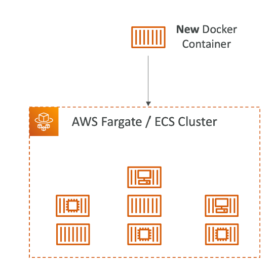

# Amazon CloudFront
## 总览
### 概念
- 就是一个缓存，这些缓存服务分布在世界各地，美国想取澳大利亚的s3的内容，首次会访问澳大利亚，然后缓存到美国的cloudFront，第二次访问就直接取cloudFront上取
- Content Delivery Network（CDN）
- 提高读的效率，内容被缓存在边缘位置（靠近用户的位置）
- 全球有216个边界位置
- DDoS保护（通过Web Application Firewall）

### CloudFront - Origins 源（CloudFront取内容的地方）
- s3桶
  - 用来分发文件并且缓存在边缘位置
  - 通过Origin Access Control（OAC）来提高CloudFront的安全性
  - OAC正在取代Origin Access Identity（OAI）
  - CloudFront可以背用来当作一个Ingress（存放文件到s3）
- Custom Origin（Http）
  - ALB
  - EC2
  - S3 静态网站
  - 任何HTTP后段服务器

### CloudFront图解

### S3作为源

### CloudFront vs S3 Cross Region Replication
- CloudFront
  - 全球edge网络
  - 文件可以被长时间缓存（可以一天）
  - 对静态内容非常友好，几乎可以在任何地方进行访问
- S3 Cross Region Replication
  - 必须在每一个想要region建立replication
  - 文件近乎实时更新
  - 只读
  - 对动态内容友好，可以在一些region实现低延迟

