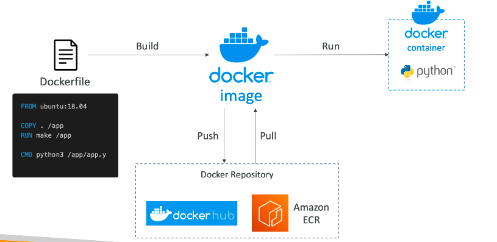
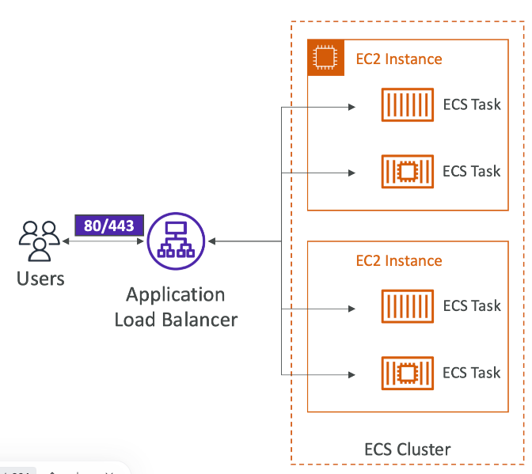

# Container 容器技术
## Docker
### 什么是docker
- 部署app的软件开发平台
- app被打包成一个容器，可以在任何OS上运行
  - 任何机器
  - 没有兼容性问题
  - 可预测的行为
  - 更小的工作量
  - 更容易维护和部署
  - 适配任何语言
- 使用case：微服务架构，从本地服务器迁移app到aws云

### Docker image存放在哪里
- docker image 存放在docker仓库中
- Docker hub
  - 公有仓库
- Amazon ECR（Amazon Elastic Container Registry）
  - 私有仓库
  - 公有仓库(Amazon ECR Public Galler y https://galler y.ecr.aws)

### Docker vs VM
- DOcker是有一点虚拟化的技术，但不是完全是
- 资源和宿主机共享，许多容器在一台服务器

### docker flow

### AWS的Docker容器管理
- Amazon Elastic Container Service(Amazon ECS): 自己的容器平台，类似dockerhub
- Amazon Elastic Kubernetes Service(Amazon EKS): aws的k8s
- AWS Fargate：AWS自己的无服务器容器平台，和ECS和EKS一起使用
- Amazon Elastic Container Registry（Amazon ECR）: 镜像仓库

# ECS
## ECS Launch type详解
### EC2 Launch Type
- 在aws上launch docker容器 = ECS集群上launch Tasks
- 必须要自己配置和维护infra（EC2 实例）
- 每个EC2实例必须运行一个ECS Agent，去把自己注册到ECS集群上面
- AWS负责容器的开始和停止
- 

### Fargate Launch Type
- 不用自己配置infra（EC2 实例）
- 完全是无服务器的
- 只需要创建task definitions
- AWS只会根据CPU/RAM来运行ECS tasks
- 只需要增加tasks的数量就可以进行扩展
- 

## ECS IAM Roles

### EC2 Instance Profile(EC2 Launch Type Only)
- 被ECS agent使用
- 可以使用API和ECS进行沟通
- 发送容器log到CloudWatch log
- 从ECR上面拉取镜像
- 从Secrets Manager或者SSM Parameter Store中应用敏感数据

### ECS Task Role
- 允许每个task拥有一个特定的role
- 给运行的ECS上的service，使用不能的role，也能做到
- Task的role是被定义在 task definition里面

## ECS LB Integrations

### ALB：支持绝大多数case
### NLB：高性能/高吞吐/和AWS private link使用的case
### CLB：支持但是不推荐（没有advanced features - no fargate）

## ECS - Data Volumes（EFS）
### 解释
- 可以mount EFS到ECS的tasks上面
- 两种launch type都可以使用（EC2 / Fargate）
- 运行在不同的AZ中的tasks，可以共享EFS中的数据
- Fargate + EFS = Serverless
- 使用case：为你的容器提供一个共享的跨AZ的存储
- **NOTE：S3不能被作为文件系统被mount**

### 图解

## ECS Auto Scaling
### 概念
- 自动伸缩ECS tasks的数量到想要的数字
- ECS使用**AWS Application Auto Scaling**进行伸缩，可以基于下面的标准
  - ECS服务Average CPU Utilization
  - ECS服务Average Memory Utilization - 基于Ram进行伸缩
  - 每个ALB的请求数量
- 伸缩策略
  - Target Tracking：根据特定 CloudWatch 指标的目标值进行扩展
  - Step Scaling：基于CloudWatch的Alarm进行扩展
  - Scheduled Scaling：基于特定时间段进行扩展
- ECS Ser vice Auto Scaling (task level) ≠ EC2 Auto Scaling (EC2 instance level)
- Fargate Auto Scaling is much easier to setup (because Serverless)

### EC2 Launch Type - 自动扩展
- 通过添加底层 EC2 实例来适应 ECS 服务扩展
- 自动扩展组扩展
  - 基于CPU Utilization扩展你的ASG
  - 随时间指挥家EC2实例
- ECS集群Capacity Provider
  - 为ECS的tasks，自动配置和扩展infra
  - Capacity Provider和Auto Scaling Group一起使用
  - 当您缺少容量（CPU、RAM...）时添加 EC2 实例

### ECS扩展  - CPU使用率例子

### Event Bridge来启动ECS tasks

### Event Bridge Schedule 启动 ECS tasks

### ECS整合SQS

