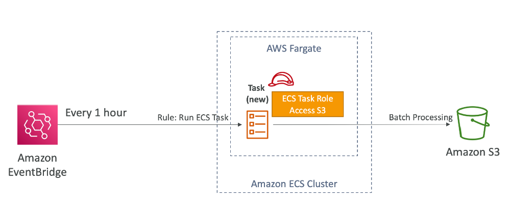
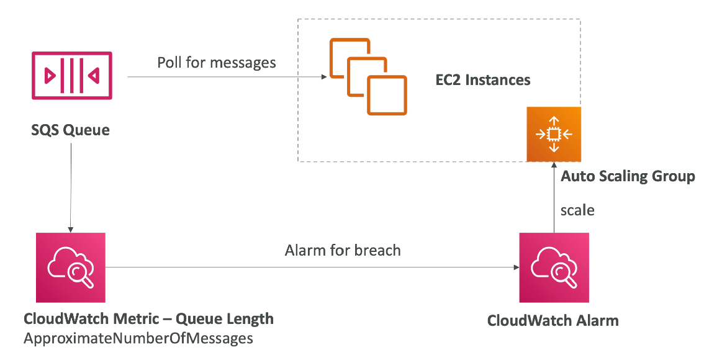
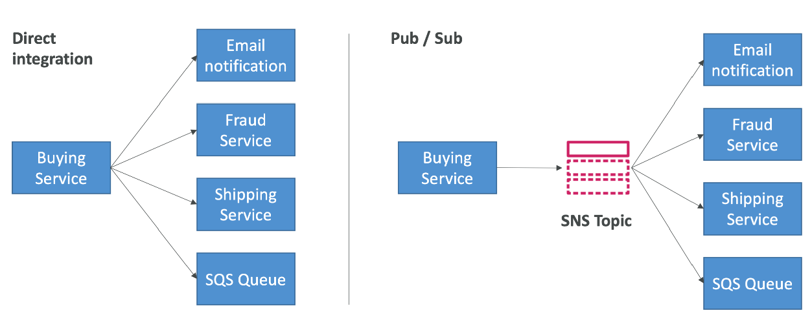

# RDS
## Amazon RDS总览
### 概念
- RDS = Relational Database Service
- 包括大多数关系型数据库

### 优势
- RDS是一种管理型的服务
  - 自动配置
  - 持续自动备份
  - 监控
  - 读的DB副本用来提高performance
  - 跨可用区，灾难恢复
  - 横向/纵向扩展
  - 数据备份在EBS
- 不能用ssh到RDS的instance上

### 存储自动扩展 - Storage Auto Scaling
- 帮助用户动态增加DB实例
- 当监测到storage快用完，会自动扩展。避免了手动扩展操作
- 必须设置最大存储空间（Maximum Storage Threshold）
- 自动修改存储，如果发生下面的情况
  - 空闲空间小于分配空间的10%
  - 在过去5分钟就是空间紧张状态
  - 从上次修改后6个小时
- 

### 仅可读副本 - RDS Read Replicas
- 最多15个读副本数据库
- 可以统一AZ，不同AZ，不同Region
- 副本数据会从Master数据库异步复制，最终的结果是满足一致性的
- 副本可以被提升为master

### RDS Read Replicas 使用场景

### RDS Read Replicas 网络花费

### 灾难恢复 - EDS Multi AZ(Disaster Recovery)
- 同步副本数据库
- 有一个dns名字，出现故障自动转移到被用数据库（auto fail-over）
- 

### 从单一AZ到复数AZ
- 0 down时间
- 内部发生的魔法
  - 取快照
  - 新AZ的新DB存储快照数据
  - 同步机制在两个DB中建立
- 

### hands on
配置都很简单，照着选就行了

### 自定义类型RDS - RDS Custom
- 只有Oracle和Microsoft SQL Server适用
- RDS和Custom RDS对比
  - RDS
    - 自动setup，操作，扩展
  - Custom RDS
    - 可以访问潜在的数据库和操作系统
    - 自己修改配置，安装补丁，开启原生功能
    - 可以用SSH链接到宿主EC2

# Amazon Aurora
## Aurora总览
### 概念
- AWS不开源的数据库
- 支持MYSQL和Postgres
- Aurora的存储可以自动增长，从10GIB到128TB
- Failover瞬间完成，高可用
- 比RDS贵20%，但是更有效率

### 高可用 - High Availability
- 会在3个AZ中备份6份用户的数据
  - 4个备份用来write
  - 3个备份用来读
  - 可以自己恢复
  - 存储分布在上百个数据卷中
- 1个Aurora实例负责写（master）
- 30秒内可完成failover
- Master + 15 Read Replicas
- 支持跨region
- 

### Aurora DB Cluster

# Amazon ElastiCache Overview
## 总览
### 概念
- ElastiCache是用来管理Redis或者Memcached
- AWS负责OS的维护，布丁，setup配置，监视等等等等

### 解决架构方案
**数据缓存**

**用户登录**

### Redis和MemCached对比

### HandsON

## 缓存安全
### 认证
- ElastiCache支持IAM认证
- IAM policy在ElastiCache上只能用于API级别的安全认证
- Redis AUTH
  - 可以设置password/token，当创建一个redis集群
  - 除了安全组以外，这是一个额外的安全级别
  - 支持SSL加密传输
- Memcached
  - 支持SASL-based认证

