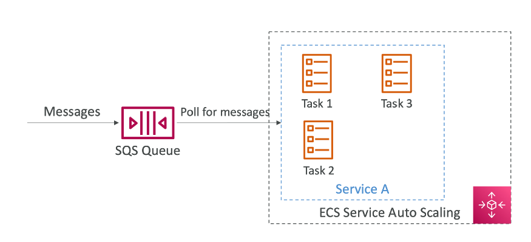
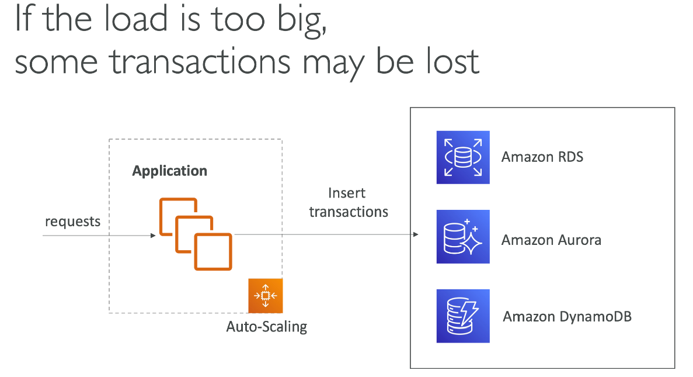

# 预算 - Budget
## 使用根用户，开启admin用户查看bill权限
右上 - Account - IAM user and role access to Billing information


## 查看服务收费
右上 - Billing Dashboard - Bills（left side） - Charge by services


## 免费使用的额度 - free tier
这个菜单标记了现在免费的额度使用了多少了

## 创建费用通知


# EC2
## 基础

- EC2 = Elastic Compute Cloud = Infrastructure as a Service
- 主要包括
  - 租虚拟机（EC2）
  - 在虚拟设备上存储数据（EBS）
  - 跨机器分布式负载（ELB）
  - 自动伸缩服务（ASG）

## 建立第一个EC2 Instance

### 步骤
- 搜索EC2 - 选择左边栏Instances - Launch Instance

- 配置选择默认的即可，keypair生成一个新的，用来login

- 配置网络和安全组

- Advance Details有用户数据的选项，这个是当首次launch instance之后会只执行一次的脚本

- 给分配的公网IP，每次重启都会变化（注意点）
- 访问公网IP，可以看到之前在user data里面执行脚本生成的html的文件


## EC2实例的类型
### Overview
- 可以在这个网站查看EC2实例的类型： https://aws.amazon.com/cn/ec2/instance-types/
- AWS有如下的命名规则： m5.2xlarge
  - m：实例类型
  - 5：代（aws会提升他们随时间上升）
  - 2xlarge：实例的size，比如内存的大小，存储大小

### 通用型
- 多种类型资源的平衡，比如服务器资源和代码仓库
- 这些平衡包括
  - 计算
  - 内存
  - 网络


### 计算优化型
- 擅长高性能计算任务
  - 批处理
  - 视频转义
  - 高性能服务器
  - 高性能计算
  - 科学模型，机器学习
  - 专属服务器


**详细参见上面的网站**

## 安全组
### 介绍
- 安全组是aws网络安全的基石
- 控制流量的进出
- 安全组只包含允许的规则
- 安全组可以背ip和其他安全组引用


### 安全组详细介绍
- 扮演防火墙的角色
- 他们控制：
  - 接入端口
  - 授权ip范围
  - 控制inbound 网络
  - 控制outbound 网络


### 安全组须知知识点
- 可以绑定到多个实例
- 依附于region/vpc
- 最好单独维护一个ssh的安全组
- 如果app不能反问（timeout），那是安全组的问题
- 如果给出了connection refused错误，那是app的错误或者app没有被launched
- 所有的入口流量默认被blocked
- 所有的出口流量默认放开

### 安全组之间相互引用


### 安全组端口须知
- 22：SSH，log into Linux实例
- 21：FTP（File Transfer Protocol） 上传文件
- 22：SFTP（Secure File Transfer Protocol） 使用SSH上传文件
- 80：HTTP 链接非安全的网站
- 443：HTTPS 链接安全的网站
- 3389：RDP（Remote Desktop Protocol） log into到一个Windows实例

## 链接EC2
### 本地连接
```shell
ssh -i key ec2-user@ip
```

### 网页链接


**给EC2追加role**


