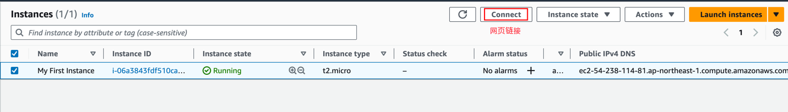
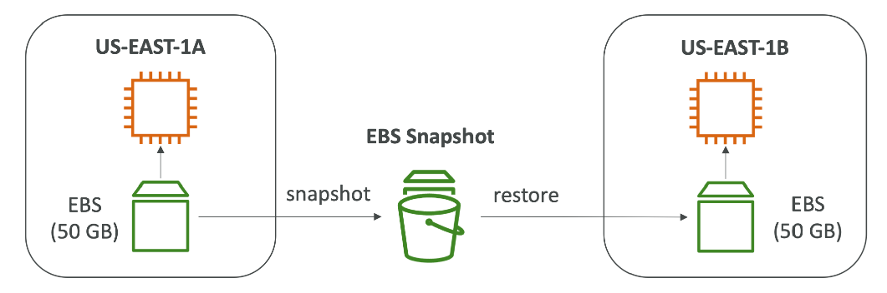

# 预算 - Budget
## 使用根用户，开启admin用户查看bill权限
右上 - Account - IAM user and role access to Billing information


## 查看服务收费
右上 - Billing Dashboard - Bills（left side） - Charge by services


## 免费使用的额度 - free tier
这个菜单标记了现在免费的额度使用了多少了

## 创建费用通知


# EC2
## 基础

- EC2 = Elastic Compute Cloud = Infrastructure as a Service
- 主要包括
  - 租虚拟机（EC2）
  - 在虚拟设备上存储数据（EBS）
  - 跨机器分布式负载（ELB）
  - 自动伸缩服务（ASG）

## 建立第一个EC2 Instance

### 步骤
- 搜索EC2 - 选择左边栏Instances - Launch Instance

- 配置选择默认的即可，keypair生成一个新的，用来login

- 配置网络和安全组

- Advance Details有用户数据的选项，这个是当首次launch instance之后会只执行一次的脚本

- 给分配的公网IP，每次重启都会变化（注意点）
- 访问公网IP，可以看到之前在user data里面执行脚本生成的html的文件


## EC2实例的类型
### Overview
- 可以在这个网站查看EC2实例的类型： https://aws.amazon.com/cn/ec2/instance-types/
- AWS有如下的命名规则： m5.2xlarge
  - m：实例类型
  - 5：代（aws会提升他们随时间上升）
  - 2xlarge：实例的size，比如内存的大小，存储大小

### 通用型
- 多种类型资源的平衡，比如服务器资源和代码仓库
- 这些平衡包括
  - 计算
  - 内存
  - 网络


### 计算优化型
- 擅长高性能计算任务
  - 批处理
  - 视频转义
  - 高性能服务器
  - 高性能计算
  - 科学模型，机器学习
  - 专属服务器


**详细参见上面的网站**

## 安全组
### 介绍
- 安全组是aws网络安全的基石
- 控制流量的进出
- 安全组只包含允许的规则
- 安全组可以背ip和其他安全组引用


### 安全组详细介绍
- 扮演防火墙的角色
- 他们控制：
  - 接入端口
  - 授权ip范围
  - 控制inbound 网络
  - 控制outbound 网络


### 安全组须知知识点
- 可以绑定到多个实例
- 依附于region/vpc
- 最好单独维护一个ssh的安全组
- 如果app不能反问（timeout），那是安全组的问题
- 如果给出了connection refused错误，那是app的错误或者app没有被launched
- 所有的入口流量默认被blocked
- 所有的出口流量默认放开

### 安全组之间相互引用


### 安全组端口须知
- 22：SSH，log into Linux实例
- 21：FTP（File Transfer Protocol） 上传文件
- 22：SFTP（Secure File Transfer Protocol） 使用SSH上传文件
- 80：HTTP 链接非安全的网站
- 443：HTTPS 链接安全的网站
- 3389：RDP（Remote Desktop Protocol） log into到一个Windows实例

## 链接EC2
### 本地连接
```shell
ssh -i key ec2-user@ip
```

### 网页链接



**给EC2追加role**


## 网络

### 概念
- 网络分为两种：ipv4， ipv6
- ipv4是最常用的格式
- ipv6是新的，用来解决ipv4不足的问题

### 内网 vs 公网 ip

- 公网ip - public ip
  - 公网ip意味着机器可以被网络识别到
  - 在整个网络种必须唯一
  - 可以背简单的定位
- 内网ip - private ip
  - 内网ip意味着机器只能在内部网络环境中被识别
  - ip在整个内网中是唯一的，但是不同的内部网络，可以有相同的ip
  - 机器链接网络是使用的NAT+网管
  - 只有特定的ip范围可以被当作内网ip使用

### 弹性IP - Elastic IP
- 当重启EC2的时候，公网IP会自动变换
- 如果需要一个固定的公网ip，那么就需要弹性ip
- 一个弹性ip只要不删掉他，就会一直存在于公网
- 可以把弹性ip绑定到一个EC2上


- 有了动态ip，可以通过重新绑定动态ip到不同的EC2上来防止因为EC2宕机而影响到自己的程序
- 只能创建5个动态ip，但是可以要求AWS的人帮忙加
- 总的来说，要避免使用动态ip
  - 使用它反应出架构烂
  - 相反，要使用随机的公网ip和注册域名到DNS
  - 或者使用负载均衡器

## 替换组 - Placement Groups
- 有事想要控制EC2实例的替换策略
- 这个策略可以由替换组来定义
- 当创建一个替换组时，要指明使用的策略是以下哪种
  - Cluster - 集群所有的实例到一个低延迟的组里面，这些实例在同一个az
  - Spread - 传播实例，跨硬件（每个可用区，每个组，最大7个实例）
  - Partition - 在同一个az种，分散实例到不同的分区（依赖不同的硬件）

### Cluster

- 优点：网络好
- 缺点：如果硬件down了，所有的实例一起死
- 使用case：
  - 需要快速处理的大数据工作
  - 需要极低延迟的应用

### Spread

- 优点：
  - 可以跨可用区
  - 减少同时down的风险
  - EC2实例在不同的硬件上
- 缺点：
  - 每个az，每个组，最大7个实例
- 使用case：
  - 需要高可用的程序
  - 每个实例的失败都需要和其他实例分割开的重要应用

### Partition

- 每个AZ可以创建7个分区
- 可以在同一个region下跨多个可用区
- 一个分区的down会影响本分区的实例，但是不会影响其他分区

### hands on


## 弹性网络接口 - Elastic Network Interfaces（ENI）
- VPC中的逻辑组件，代表了一个虚拟网卡
- ENI有下列属性
  - 一个主内网ip，一个副内网ip
  - 每个内网IP有一个弹性ip
  - 一个公网ip
  - 一个或者多个安全组
  - 一个MAC地址
- 可以独立创建ENI，并且绑定到EC2的实例上
- 必须在一个特定的可用区


## EC2休眠 - Hibernate
- 在重启EC2实例的时候，下面的事情将会发生
  - OS启动， EC2的userdata被执行
  - 自己的App启动，缓存热身（花时间）

### 概念
- 内存状态会被保存
- 实例启动会更快
- 内存状态被写进一个文件，这个文件存在根EBS数据卷上面
- 根EBS数据卷必须是加密的

使用case
- 长时间运行的任务
- 需要保存内存状态


在launch新的实例的时候


# EC2 - Instance Storage 实例存储
## EBS Volume - 数据卷
### 概念
- EBS - Elastic Block Store 就是一个网络优盘，可以mount到EC2上面
- 可以持久化数据，一次只能mount到一个实例上，区分可用区
- 每次创建实例，都会创建一个root的EBS数据卷
  - root数据卷默认在EC2被删除的时候删除，但是可以改
  - 非root的EBS数据卷，默认EC2被删除的时候保留

### 图解


## EBS Snapshots 数据卷快照
### 概念
- 就是EBS的一个备份，制作快照的时候不用detach EBS，但是推荐detach
- 可以跨可用区甚至是region复制快照


### 特点
- EBS快照归档
  - 移动快照到归档层（archive tier）便宜75%，从归档层回复快照需要花费1-3天
- 循环使用的桶 - Recycle Bin
  - 建立一个桶，桶里面有保存规则（比如保存多少天，范围是1天到1年），这个桶用来存被删除的快照
- Fast Snapshot Restore（FSR）
  - 0延迟恢复快照，很花钱

### 图解


# AMI - Amazon Machine Image
## 概念
- 就是一个类似docker镜像的东西，只不过这AMI是一个EC2实例的镜像
- 可以通过AMI镜像快速launch一个EC2实例，可以跨可用区launch

## 图解


# EC2 Instance Store
## 概念
- EBS是网络硬盘，性能好，但也是有限制
- 如果要高性能，用EC2 Instance Store。因为这个是硬件形式安装在EC2中
  - 更好io表现
  - 实例被删除的话，EC2 Instance Store就丢了
  - 适合做buffer，cache，temporary content
  - 如果硬件失效，有丢数据风险

## EBS Multi-Attach 提供单个数据卷mount都多个EC2上


# EBS Encryption EBS加密
## 概念
- 当加密一个EBS以后，会发生下面的事
  - 数据被加密
  - 快照被加密，通过快照创建出的EBS 数据卷也被加密
- 加密解密由AWS完成，不需要自己干涉
- 加密对EC2延迟几乎吴映香
- 拷贝一个非加密的快照时，允许对其加密

## 操作顺序
- 创建一个EBS volume的数据卷，非加密的
- 使用拷贝创建一个EBS快照，这时候也不加密
- 从上面的快照复制一个新的快照，这时候要加密
- 从快照创建一个新的EBS Volume，这时数据卷已经被加密
- Attach加密的数据卷到EC2上


# EFS - Elastic File System
## 概念
- 就是数据卷，NFS。但是和EBS不同的是，这个可以mount到多个EC2上
- EFS可以跨可用区
- 高可用，可扩展，有点贵
- 通过安全组来控制哪个EC2可以访问EFS


## 使用
创建EFS，mount到EC2上即可


## EBS vs EFS
### 对比
- 只能attach到一个实例（除了多重attach的 io1 / io2）
- 锁可用区
- EFS可以mount到超过100多个EC2上
- EFS比EBS贵