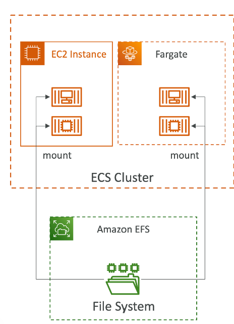

# IAM
## 区域 - Regions

### 概念
- Aws的区域遍布世界，区域的名字可以是us-east-1, eu-west-3
- 一个区域是数据中心的集群
- 大多数aws的服务是分区域的
  

### 可用区 - Availability Zones

- 每个区域有很多可用区（通常3个，最小3个，最大6个）
    - 比如：ap-southeast-2a, ap-southeast-2b, ap-southeast-2c
- 每个可用区是一个或者多个的离散的数据中心，他们有冗余的殿宇，网络和链接
- 他们之间彼此隔离，出现的灾难的时候也不会相互影响
- 它们通过高带宽连接，超低延迟网络
  

## AWS IAM 用户管理 - AWS Identity and Access Management
### 用户和组
- IAM = Identity and Access Management
- Root用户被默认创建，不会被使用或者共享
- 用户是在公司或者组织里面干活儿的人
- 组包含用户，但是不能包含其他组
- 用户可以不用属于某个组，也可以属于多个组
  

### 用户权限 - IAM:Permissions
- 用户和组可以被Json 文档描述，成为政策（policies）
- 这些政策定义了用户的权限
- AWS遵循最小优先原则，即不要给用户的权限超过他的需求
  

### 怎么创建新用户和组
- 搜索IAM，左边栏可以看到user 和 groups
- 创建user/group以后，给group赋予AdministratorAccess权限，那么管理员权限的用户就创建好了
- 点击dashboard后可以编辑用户名的别名，这样就可以用IAM而不是跟用户来login了
  

### 权限继承 - IAM Policies inheritance
白话就是操作组的权限，或者操作人的权限。因为人可以不属于组，所以可以对人直接加权限

### 密码保护政策 - Password Policy
- 对密码进行一系列的保护措施 policy，比如密码长度，复杂度，定期修改密码
  
  

### 动态密码令牌 - MFA （Multi Factor Authentication）
- 就是一个相当于QQ令牌的东西，每次login的时候，需要动态密码
- 右上角 - secret credentials - Assign MFA - 扫码下载app，输入两遍动态密码，绑定令牌即可

## 怎么访问AWS
- 访问AWS，其实有3种方法
  - AWS控制台，就是需要用户名密码登陆的页面
  - AWS CLI(Command Line Interface)，登陆需要访问密钥
  - AWS SDK(Software Developer Kit)，登陆需要访问密钥，一般在项目种使用
- 访问密钥通过aws控制台生成

### 什么是AWS CLI
- 一个能使用命令行和AWS交互的工具
- 可以直接访问开放AWS的开放API
- 开源地址： https://github.com/aws/aws-cli
- 安装： 搜索 install aws cli mac version 2, 下载v2版本

### 什么是AWS SDK
- 能用代码去访问和管理AWS服务
- 嵌入在开发的APP中
- 支持多种编程语言

