# High Availability & Scalability
## Scalability 扩展
- 两种形式
  - Vertical Scalability 纵向扩展： 加机器的配置
  - Horizontal Scalability 横向扩展： 加机器数量

## High Availability
- 跨数据中心部署app

# Load Balancing
## AWS上面Load Balancer的种类
- Classic Load Balancer： 2009 CLB。基本不用了
  - HTTP，HTTPS，TCP，SSL（Secure TCP）
- Application Load Balancer： 2016 ALB
  - HTTP，HTTPS，WebSocket
- Network Load Balancer： 2017 NLB
  - TCP，TLS（Secure TCP），UDP
- Gateway Load Balancer： 2020 GWLB
  - Operates at layer 3（Network layer） IP Protocol

## Load Balancer Security Groups
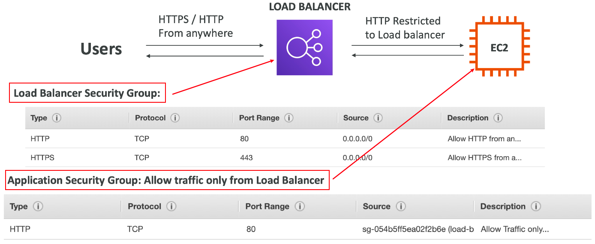

## Application Load Balancer
- 根据url转发
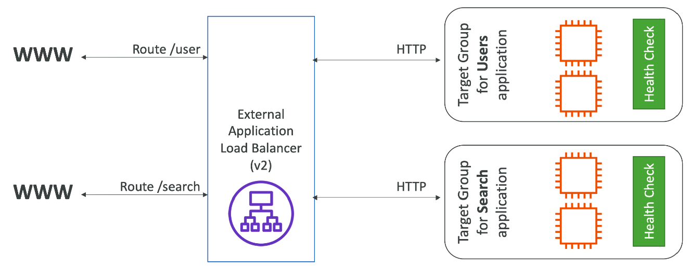

- 根据参数转发
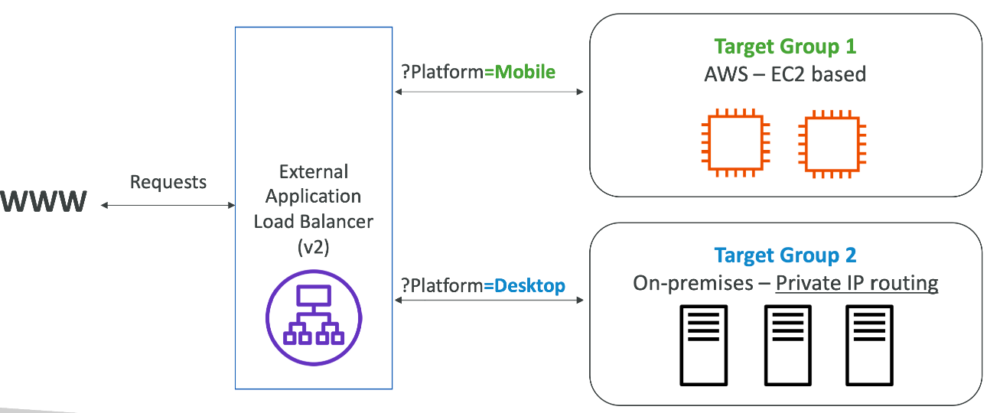

### ALB注意点
- 固定的hostname（xxx.region.elb.amazonaws.com）
- app服务器不直接看用户的ip地址
  - 真正的用户ip被嵌入到了请求头X-Forwarded-For
  - 可以获得端口（X-Forwarded-Port）和协议（X-Forwarded-Proto）
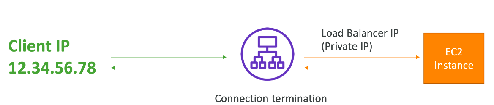

### ALB hands on
- 创建ALB
- 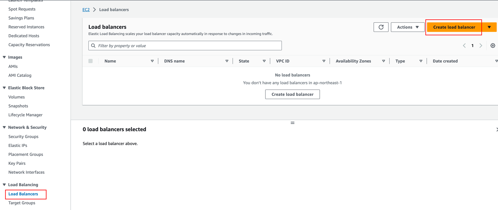
- 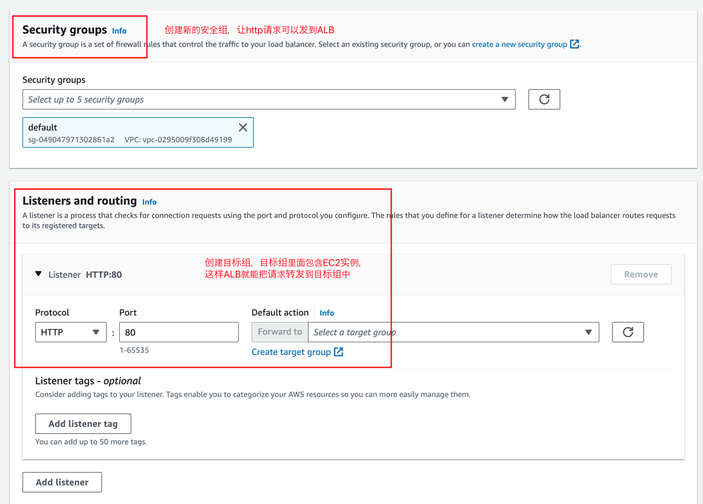
- 创建完成之后，找到dns name访问即可
- 如果不要用ip来访问ec2，只有alb能访问到ec2，那么就把ec2的的安全组，入口流量改成alb就行
- 修改ALB的rule，可以根据路径，header之类的东西，控制转发的目标组

## Network Load Balancer
### 概念
- NLB允许：
  - 转发TCP/UDP请求到实例
  - 处理百万QPS请求
  - 低延迟
- 每个可用区每个NLB有一个静态IP，但是也可以分配动态
- NLB适用于即高性能的TCP/UDP转发
- 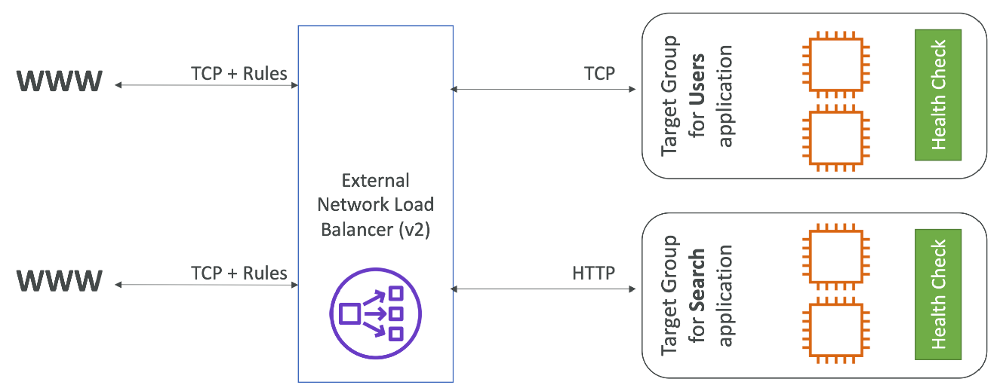
- 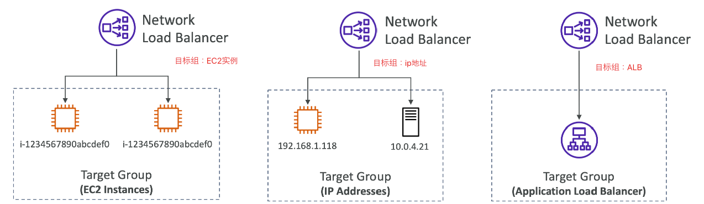

## Gateway Load Balancer
### 概念
- 用来部署，扩展和管理第三方网络虚拟应用
- 比如：防火墙入侵检测和预防系统之类
- 发生在网络的第三层
- 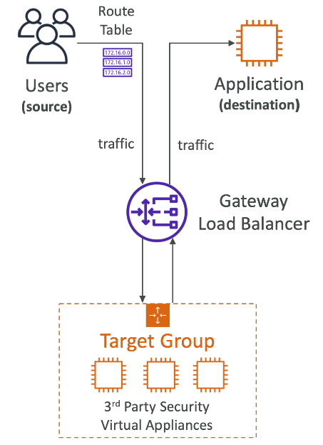
- 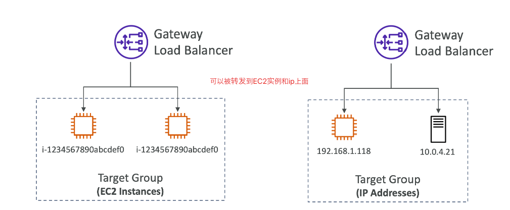

## Sticky Session（Session Affinity）- 亲和度
### 概念
- 可以修改LB，让某个请求只被转发到固定的EC2实例上
- CLB，ALB，NLB适用
- CLB/ALB，使用cookie来实现
- 使用case：确保user不会丢失session数据

### 分类
- Application-based Cookies
  - Custom cookie
    - 由转发目标生成，可包含由app生成任何自定义的属性
    - Cookie名字必须由每个转发目标单独指定（不能重复）
    - 已被aws占用的名字：AWSLB, AWSALBAPP, AWSALBTG
  - Application cookie
    - 被LB生成
    - 名字是AWSALBAPP
- Duration-based Cookies
  - cookie由LB生成
  - cookie名字是AWSALB（ALB），AWSELB（CLB）

## 跨区负载均衡 - Cross-Zone Load Balancing
### 有无跨区的差别
- 有：请求会被平均分给ec2
- 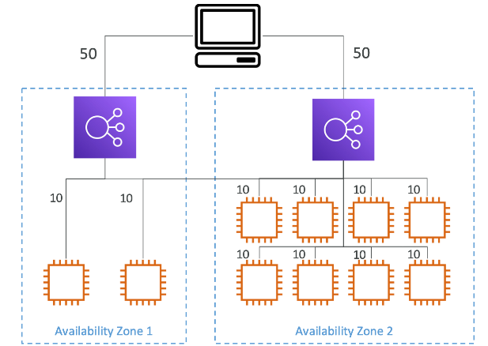
- 无：请求会被平均分给LB
- 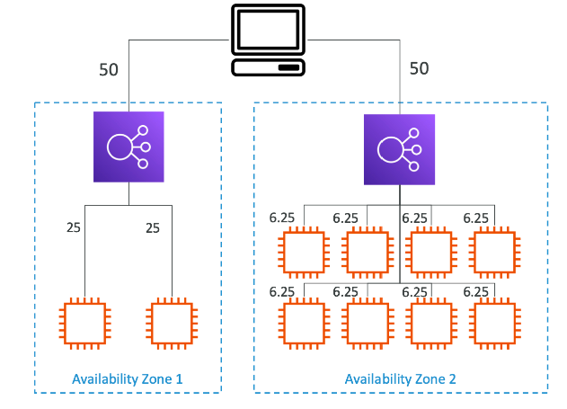

### ALB/NLB/CLB默认开启状况
- ALB
  - 默认开启
  - 跨区负载不收钱
- NLB&GLB
  - 默认不开启
  - 跨区负载收钱
- CLB
  - 默认不开启
  - 跨区负载不收钱

## SSL/TLS
### 概念
- SSL整数允许数据加密，从客户端发到LB的这段距离，数据是加密的
  - SSL指加密sockets层
  - TLS指传输层加密
  - 现在TLS整数是被主要使用的，但大多数人都把TLS当成SSL
- 有过期时间，过期的时候需要更新

### LB - SSL Certificates
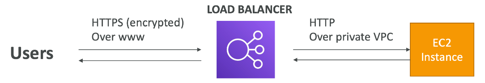

### Server Name Indication(SNI)
- 用来解决多个整数绑定到同一个web服务器的问题
- 是一种新的协议，要求用户在初始的SSL握手的时候，指明目标服务器hostname
- 服务器就能发现正确的证书
- 只在ALB&NLB起作用
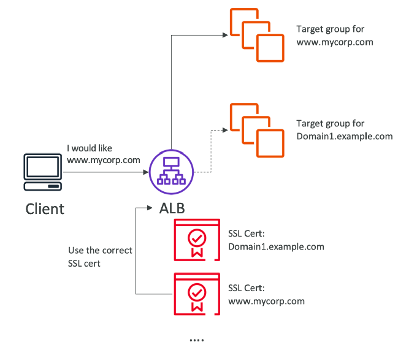

### Elastic Load Balancers - SSL Certificates
- CLB
  - 只支持SSL整数
  - 必须用多个CLB匹配多个SSL证书
- ALB
  - 支持多个监听器监听多个SSL证书
  - SNI使上面的生效
- NLB
  - 支持多个监听器监听多个SSL证书
  - SNI使上面的生效

### 链接排空 - Connection Draining
- 名字
  - 链接排空 - Connection Draining： CLB
  - 注销延迟 - Deregistration Delay: ALB & NLB
- 当注销一个EC2实例的时候，LB停止想这个实例发送请求，这个实例把已经收到的请求处理完，然后在注销。从声明注销 - 处理请求 - 注销的这段时间，就是注销延迟
- 1 - 3600秒范围
- 可以被禁用
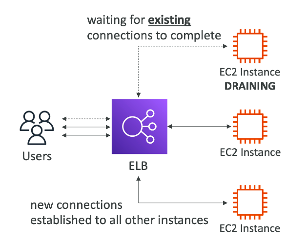

## 自动扩展组 - Auto Scaling Group
### 概念
- 自动增加/减少EC2的实例
- ASG免费

### EC2 数量指标
- 三种设定参数
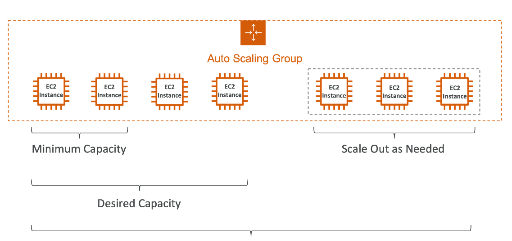
- 自动使用LB
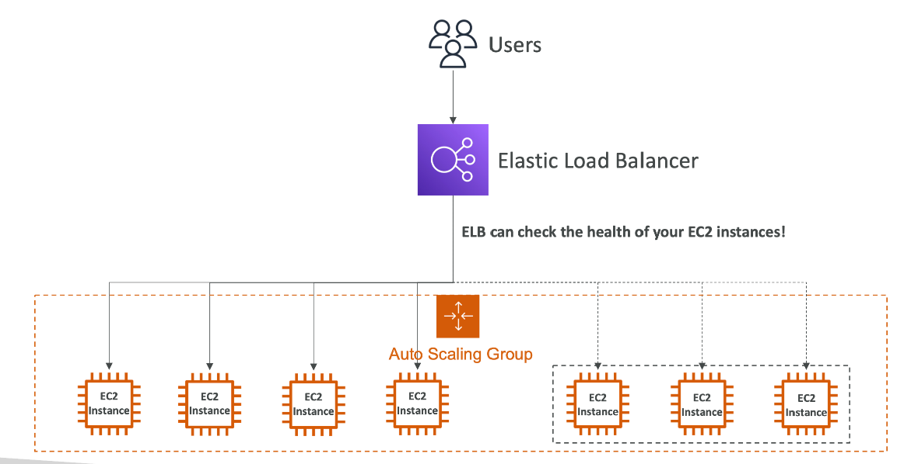

### 使用ASG的EC2启动模板
因为启动EC2的时候，实例必须要一样，所以需要创建一个模板
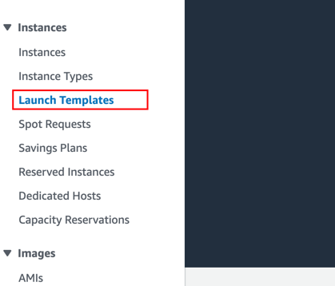

### 自动扩展 - CloudWatch Alarms & Scaling
- 基于CloudWatch，实现ASG的自动扩展
- 一个alarm监视器就是一种指标
  - 比如平均CPU利用
- 基于警告
  - 可以创建扩展/减少的policy
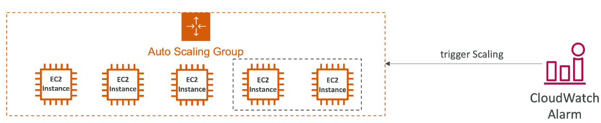

### ASG - Dynamic Scaling Policies 动态扩展政策
- 目标追踪扩展 - Target tracking Scaling
  - 最容易setup
  - 例如：保持平均ASG的CPU利用率在40%
- 简单/步骤扩展 - Simple/Step Scaling
  - 当CloudWatch警告被触发（CPU > 70%），加2个实例
  - 当CloudWatch警告被触发（CPU < 70%），减1个实例
- 预定扩展 - Schedule Actions
  - 基于已知使用量预定一个扩展
  - 比如：在双11追加10个实例

### 扩展时常用的一些指标
- CPUUtilization： CPU平均使用率
- RequestCountPerTarget： 每个EC2处理的请求数量保持稳定
- Average Network In/Out：平均网络吞吐
- 可以自定义指标

### ASG - Scaling Cooldowns 扩展冷却
- 在ASG完成扩展/减少后，会进入一个冷却期，这时候不会在进行伸缩活动。冷却器默认300秒

### hands on
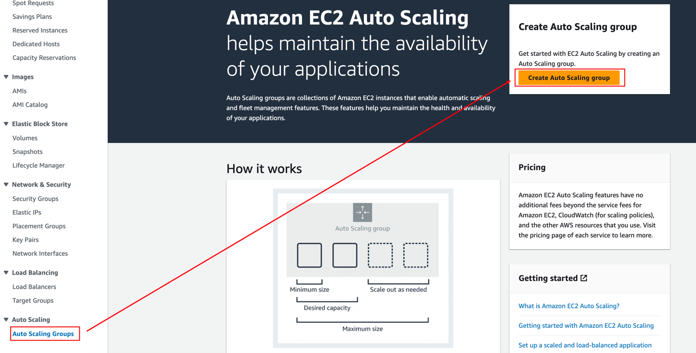
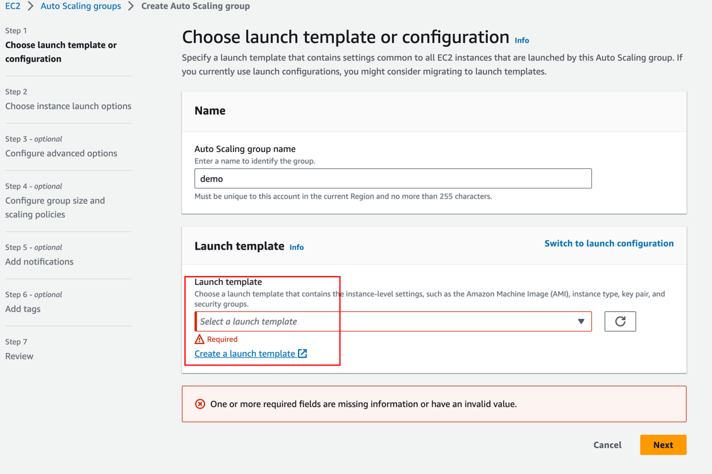