# 消息系列
## 章节介绍
- 当部署多个应用的时候，多个应用之间会进行交流
- 有两种方式进行app 交流
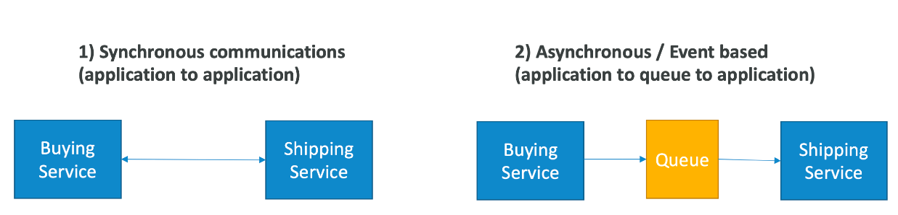

- 不同的app之间进行同步的时候，如果有流量高峰会产生问题
- 假如你想要加密100个video，但通常是10个video
- 在这种情况下，最好取结偶app
  - 使用SQS：队列模型
  - 使用SNS：发布订阅模型
  - 使用Kinesis：实时流处理模型
- 这些应用可以独立的进行伸缩

## Amazon SQS
### 什么是SQS
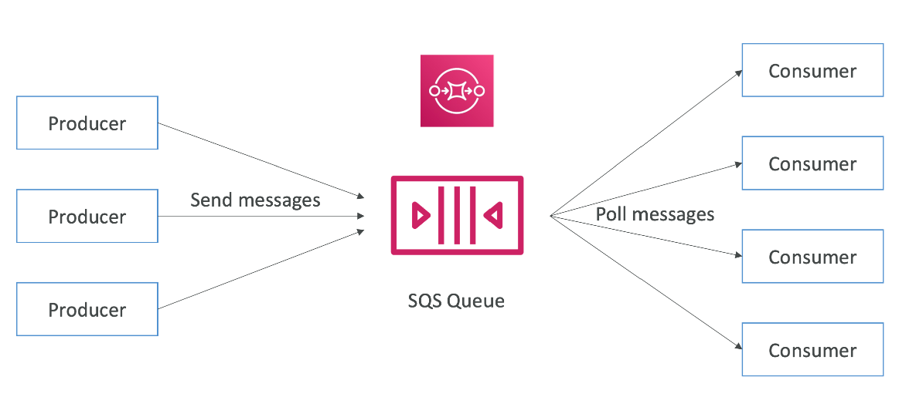

### Standard Queue
- 最老的队列（超过10年）
- 完全托管的应用，被用来结偶app
- 特点
  - 无限的吞吐量，队列里的消息容量也是无限
  - 默认信息保留时间：4天，最大14天
  - 低延迟（小于10ms）
  - 每天消息最大size256KB
- 可以有重复的消息（至少一次消息推送）
- 可以有乱序的消息（最好是有序的）

### 生产消息
- 使用SDK生产消息（SendMessage API）
- 信息被持久化到SQS中，直到消费者删除他
- 信息保留：默认4天，最长14天
- 例子：发送一个将被处理的订单
  - 订单id
  - 消费者id
  - 想要的任何属性
- SQS standard：无限的吞吐量
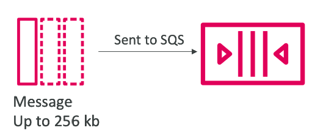

### 消费消息
- 消费者：EC2实例，服务器，Lambda
- 拉取消息：一次最大10条
- 处理消息：插入消息到RDS数据库
- 使用DeleteMessage API删除消息
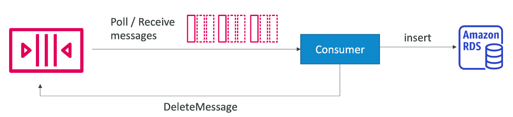

### 多个EC2实例消费者
- 消费者平行的接受和处理消息
- 至少一次消息推送
- 尽量完成消息排序
- 消费者在处理完消息以后删除消息
- 可以水平扩展消费者以提高处理吞吐量
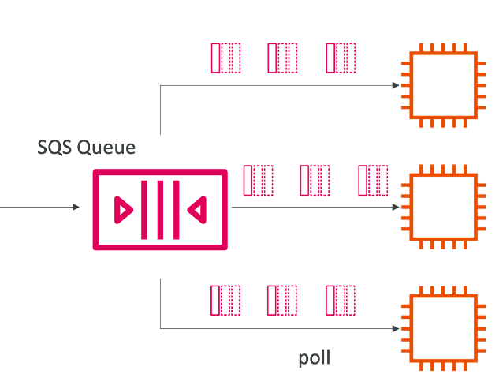

### SQS和Auto Scaling Group（ASG）
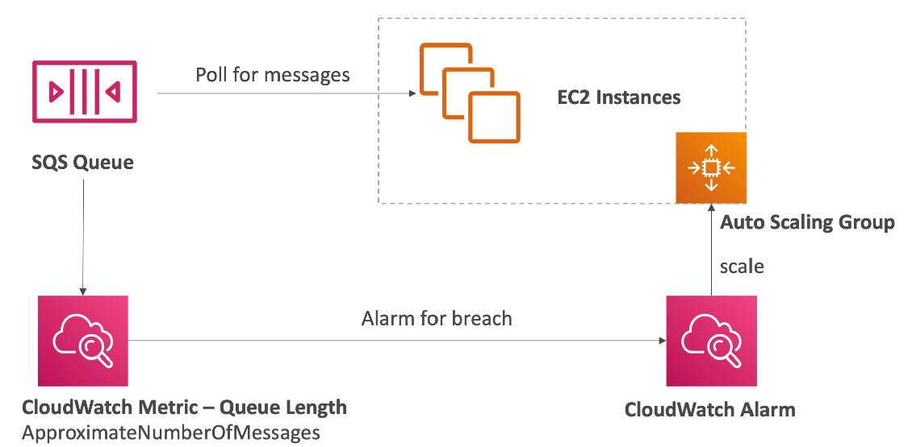

### SQS在两个app间结偶
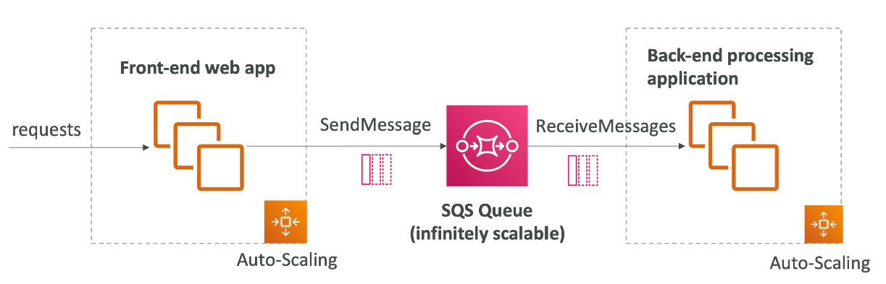

### SQS Security
- 加密
  - 使用https api进行传输加密
  - 使用 KMS 密钥进行静态加密
  - 如果客户想要在自己的端加密，可以自己加密
- 访问控制：IAM policy图闺房SQS API的访问
- SQS Access Policies（类似于s3 bucket policies）
  - 对于跨账户的SQS访问是有用的
  - 允许其他服务（SNS，S3）写消息到SQS

### 消息可见Timeout
- 在一条消息被一个消费者拉取以后，对于其他的消费者来说，这条消息就是不可见
- 默认消息的不可见市场是30秒
- 这意味着消息有30秒时间可以被处理
- 在消息可见timeout到期后，消息在SQS中又是可见的
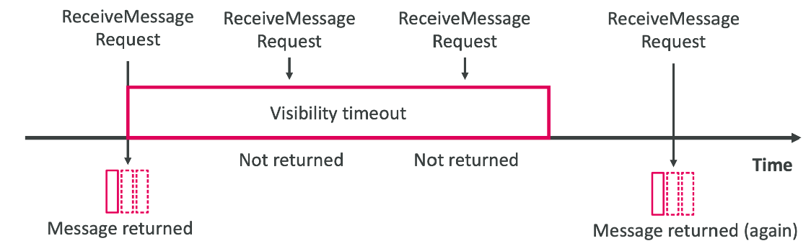
- 如果一条消息在过期时间内没有被处理，那么这条消息就会被处理两次
- 一个消费者可以call ChangeMessageVisibility API去延长过期时间
- 如果可见性超时很高（小时）并且消费者崩溃，重新处理将需要时间
- 如果可见性超时太低（秒），我们可能会得到重复项

### 消息长拉取（轮询）
- 如果消费者从queue中取消息，可以设置消费者等待，直到queue中出现消息。这被叫做长拉取（Long Polling）
- 长拉取可以减少SQS api的调用次数，增加效率和降低延迟
- 等待时间介于1-20秒
- 长轮询优于短轮询
- 可以在队列级别启用长轮询或者在 API 级别使用 WaitTimeSeconds

### FIFO Queue 先进先出队列
- 吞吐量有限制：300msg/s 非批量处理。 3000msg/s 批量处理
- 一次性发送功能（通过删除重复项）
- 消息被消费者按照顺序处理
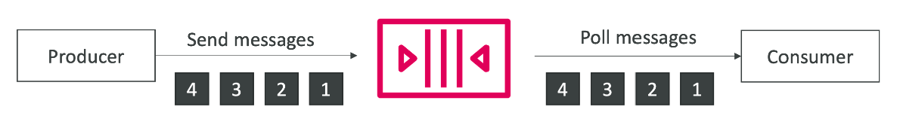

### SQS整合ASG
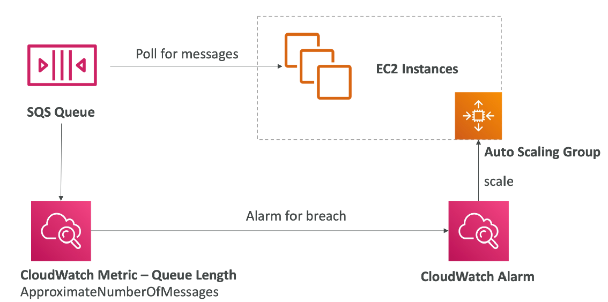
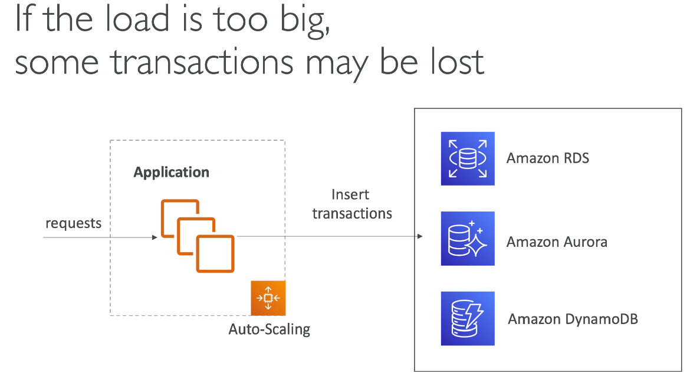
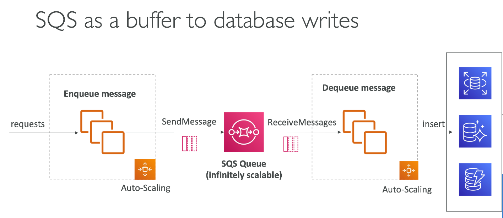
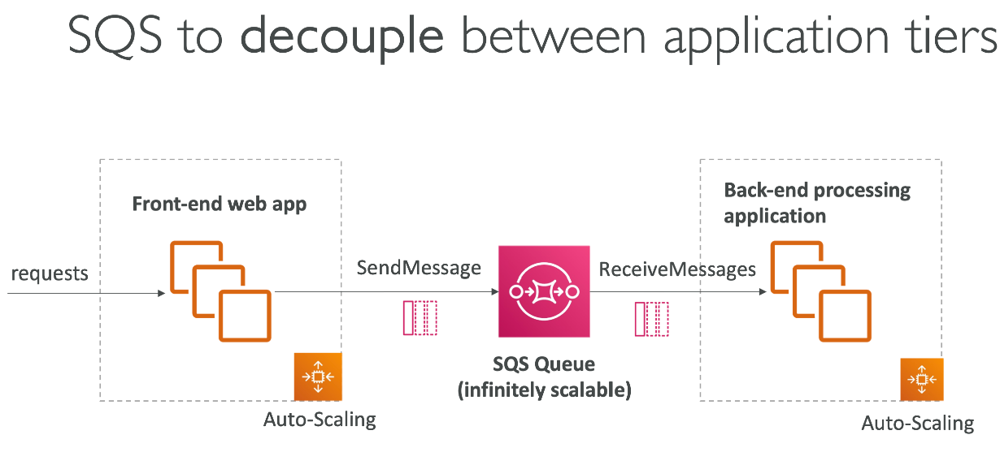

## Amazon SNS
### 什么是SNS（发布订阅模型）
- 想要一条消息发送给多消费者
- 生产者只发送消息到SNS topic
- 消费者订阅topic
- 每个订阅topic的消费者会获得所有的信息（最新功能：过滤）
- 每个topic最多12，500，000个订阅者
- topic最多100，000个
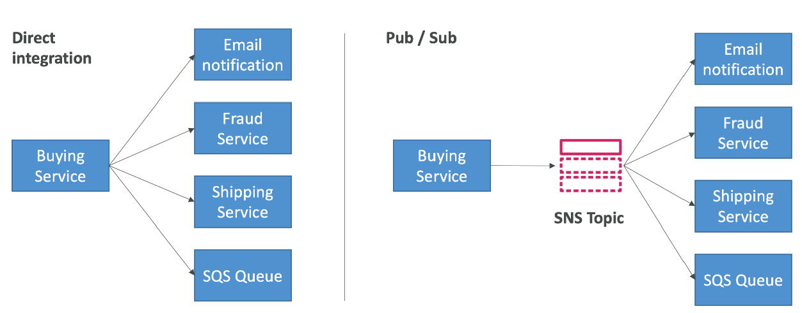
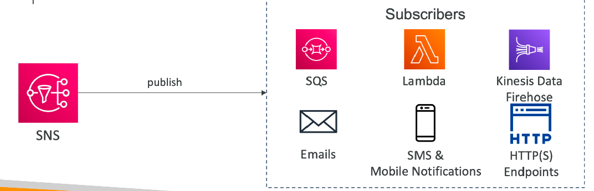

### SNS整合其他服务
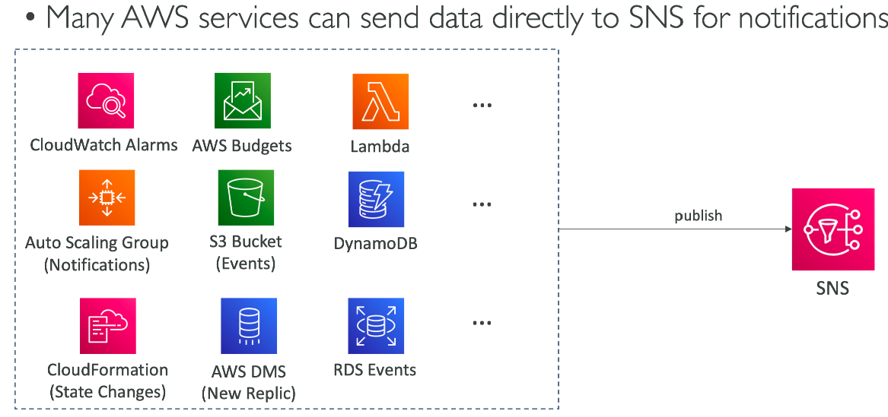

### 怎么publish消息
- Topic发布（使用SDK）
  - 创建topic
  - 创建订阅者
  - 发送消息到topic
- 直接发送（针对手机apps SDK）
  - 创建平台应用
  - 创建平台endpoint
  - 发布到平台endpoint
  - 和Google GSM， Apple APNS，Amazon ADM共同工作。。。

### SNS 安全
- 加密
  - 使用 HTTPS API 进行动态加密
  - 使用 KMS 密钥进行静态加密
  - 用户如果想，可以在客户端自己加密
- 访问控制
  - IAM policies规范SNS api的访问
- SNS Access Policies（类似于S3bucket policy）
  - 跨账户访问SNS api
  - 允许其他服务写入sns topic

### SNS + SQS：Fan Out
- 推送消息到SNS，SQS作为订阅者接受消息
- 完全结偶，没有数据丢失
- SQS可以：数据持久化，延迟处理和重试
- 随时间推移，可以追加更多的SQS订阅者
- 确保SQS的policies要允许SNS写入
- 跨区发送
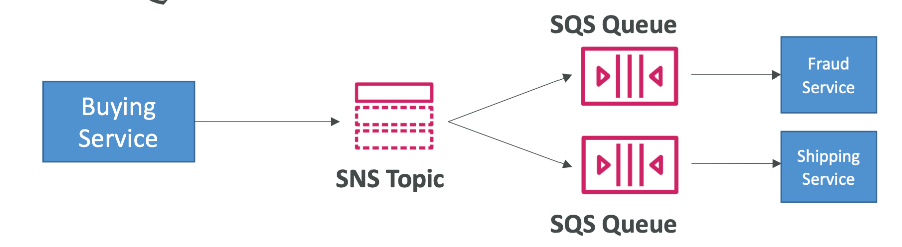

### S3时间推送到队列
- 对于某些s3的object的是将，可以发送这些时间到SQS
- 如果想发送相同的s3时间到多个sqs队列，使用fan-out
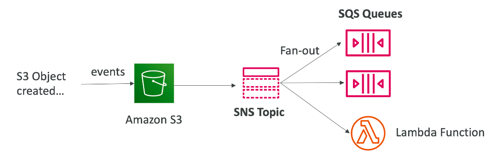

### SNS到S3 - 使用Kinesis Data Firehose
- sns可以发送到Kinesis，因为可以有下面的解决方案
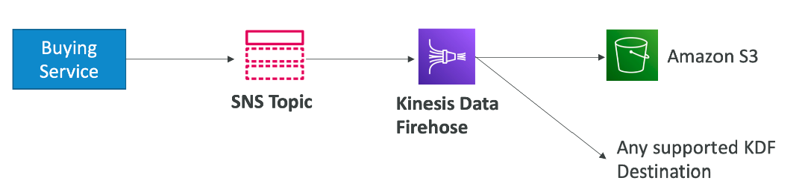

### SNS - FIFO Topic
- 和SQS FIFO类似
  - 使用消息分组id排序（所有的消息在相同的组是被排序的）
  - 冗余使用重复id或者基于内容的重复
- 只能使用SQS FIFO当作订阅者
- 有限的吞吐量（和SQS FIFO相同）
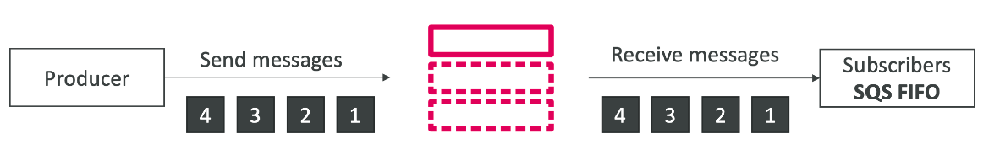

### SNS FIFO + SQS FIFO：Fan Out
- 万一想要：fan out + ordering + deduplication
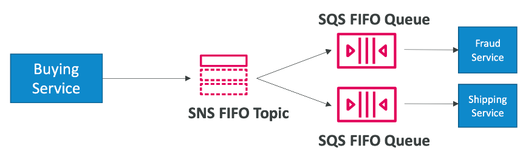

### SNS - 消息过滤
- JSON policy被用来过滤SNS发送给订阅者的消息
- 如果订阅者没有过滤的policy，订阅者会接受每条消息
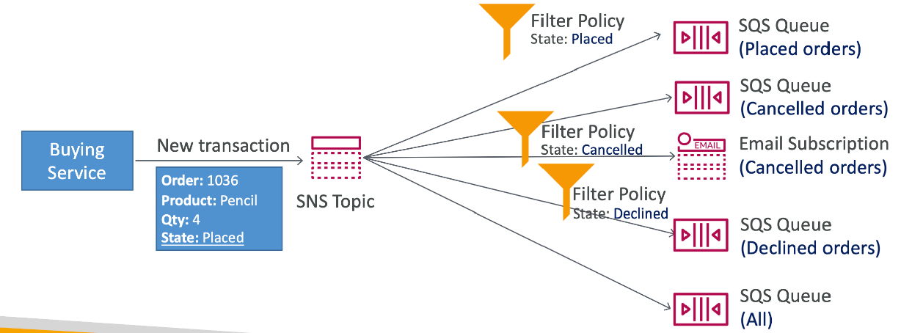

## Kinesis 总览
### 概念
- 容于收集，处理和分型实时流数据
- 摄取实时数据，例如：应用程序日志、指标、网站点击流、 物联网遥测数据...
- Kinesis Data Streams: 捕获，处理，并且存储到数据流
- Kinesis Data Firehose： 加载数据流到AWS数据存储
- Kinesis Data Analytics： 使用SQL和Apache Flink分析数据流
- Kinesis Video Streams： 捕获，处理和存储视频资料

### Kinesis Data Streams
- 保留期间：1-365天
- 有重新处理数据能力
- 一旦数据被插入到Kinesis，不能被删除
- 共享同一分区的数据进入同一shard（排序）
- 生产者：AWS SDK，Kinesis Producer Library（KPL），Kinesis Agent
- 消费者
  - 编写您自己的：Kinesis Client Library (KCL)、AWS SDK
  - 托管：AWS Lambda、Kinesis Data Firehose、Kinesis Data Analytics
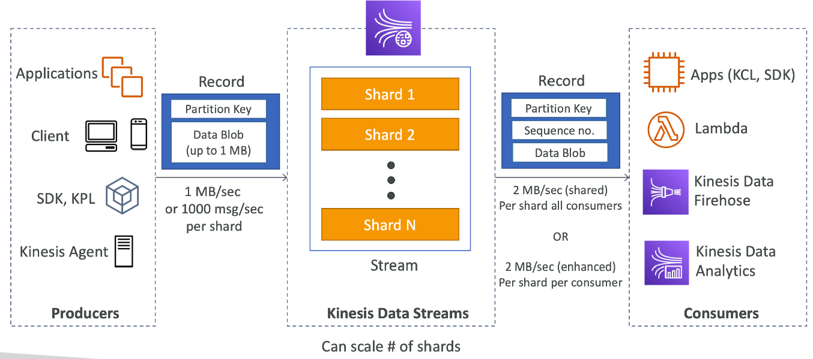

### Kinesis Data Streams - Capacity Modes
- 配置模式（provisioned mode）
  - 您可以选择手动提供或使用 API 扩展的分片数量
  - 每个分片的速度为 1MB/s（或每秒 1000 条记录）
  - 每个分片的输出速度为 2MB/s（经典或增强型扇出消费者）
  - 您按每小时提供的分片付费
- 需求模式（on-demand）
  - 不需要配置或者管理capacity
  - 默认的capacity配置（4MB/s或者4000条记录/s）
  - 基于观察过去30条的吞吐量峰值自动进行伸缩
  - 按照流每小时in/out的流量来收费

### Kinesis Data Streams - Security
- 使用IAM policy 控制访问/授权
- 使用HTTPS动态加密
- 使用KMS静态加密
- 可以在客户端自己实现加密/解密
- VPC endpoints在vpc内可以被Kinesis访问
- 使用CloudTrail监视API访问
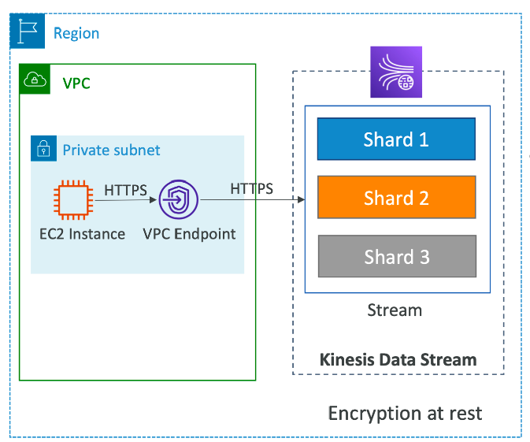

### Kinesis Data Firehose
- 完全托管服务
  - 无管理机制，自动伸缩，serverless
  - 第三方partner：Splunk/MongoDB/DataDog/...
  - 自定义：发送到任何http的endpoint
- 按照通过Firehose的数据量来支付
- 接近实时
  - 非完整批次的最低延迟为 60 秒
  - 或者一次最小1MB数据
- 支持许多数据格式，对话，变形和压缩
- 支持使用AWS Lambda自定义数据变形
- 可以把发送失败或者所有数据备份到s3
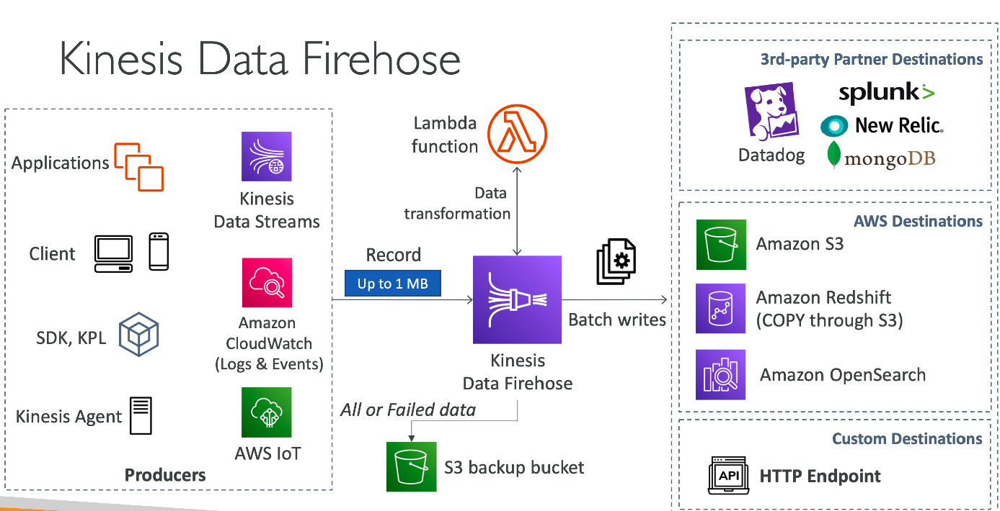

### Kinesis Data Streams vs Firehose
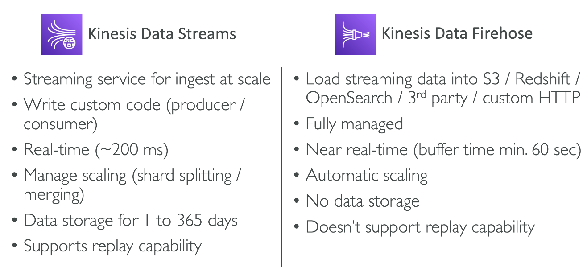

### Kinesis中的数据排序
- 使用一个特定的分区key来标注，数据应该被发送到那个shard
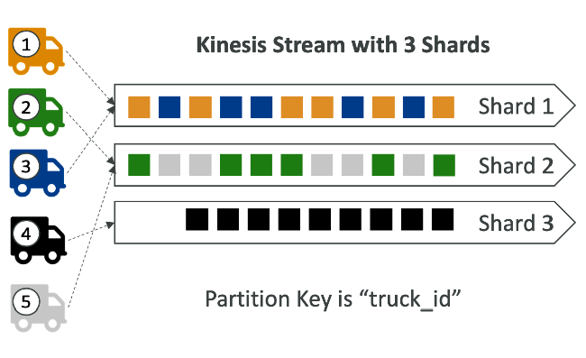

### Ordering data into SQS（数据在SQS中排序）
- 对于SQS来说，没有排序
- 对于SQS FIFO，如果不实用Group ID，消息会按照他们被发来的顺序排序，如果只有一个消费者
- 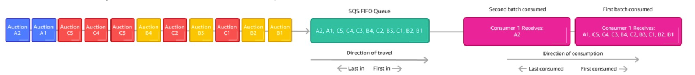
- 如果想入伸缩消费者数量，但是你想要消息被分组，可以使用分组id（类似于Kinesis的分区id）
- 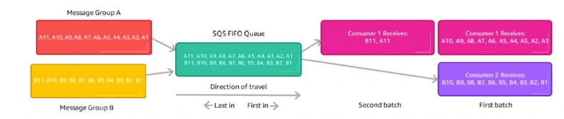

### Kinesis vs SQS排序
- 假设100辆卡车，5个kinesis shards，1个SQS FIFO
- Kinesis Data Streams
  - 平均每个shard会有20辆车的数据
  - 在每个shard中，卡车会有自己的排列顺序
  - 消费者平行的处理请求的最大熟练是5
  - 可以接受醉倒5 MB/s的数据
- SQS FIFO
  - 只有一个SQS FIFO队列
  - 将会有100个分组id
  - 可以有多达100个消费者（因为有100个分组id）
  - 有多大300条信息/s（或者3000条如果是批处理）

### SQS vs SNS vs Kinesis
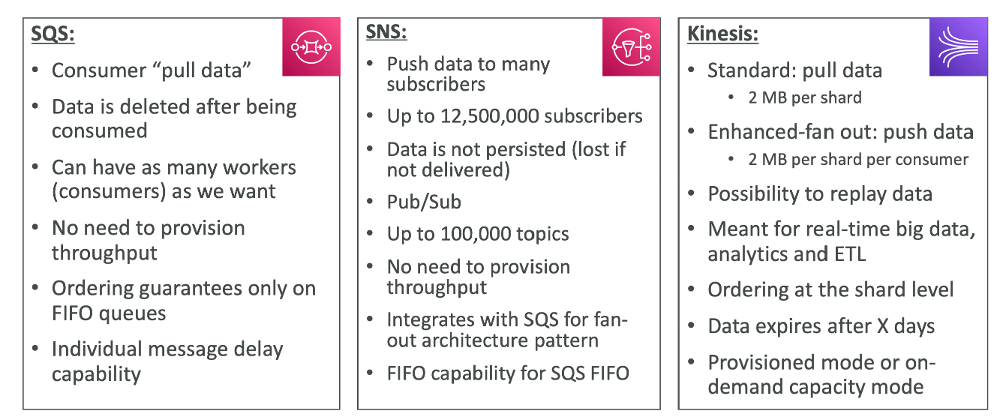
