# Amazon Route 53 (域名注册)
## DNS
### 什么是DNS
- 域名系统，用来把域名翻译成ip
- www.google.com => 172.217.18.36
- DNS是网络骨干
- DNS使用层级命名结构

### DNS术语
- Domain aRegistrar（域名注册）： Amazon Route53， Go Daddy
- DNS Records：A，AAAA，CNAME，NS
- Zone File：包含DNS records
- Name Server：处理DNS请求
- Top Level Domain（TLD）：com，us，in，gov，org
- Second Level Domain（SLD）：amazon.com, google.com
- 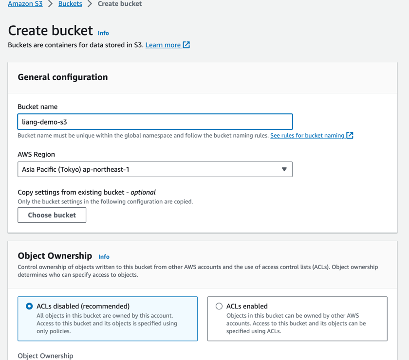

### DNS怎么工作的

# Amazon Route 53
## 简介
- 一个高可用，可扩展，可控制和权威（Authoritative）的DNS
  - Authoritative = 用户可以更新DNS records
- Route 53也是一个域名注册器
- 可以检查资源的健康情况
- 为什么教Route 53。 因为53是传统DNS的端口号

## Route 53 - Records
- 如果想要为一个域名路由流量
- 每一个record包含
  - Domain/subdomain Nmae: example.com
  - Record Type: A or AAAA
  - Value: ip address
  - Routing Policy: Route 53怎样回应查询
  - TTL: record在DNS中缓存的时间
- Route 53支持的DNS Records Type
  - （must know）A/AAAA/CNAME/NS
  - （advanced）CAA/DS/MS/NAPTR/PTR/SOA/TXT/SPF/SRV

## Route 53 - Record Types
- A: 路由hostname到ipv4
- AAAA: 路由hostname到ipv6
- CNAME: 路由hostname到另一个hostname
  - 目标是一个必须有A or AAAA记录的域名
  - 不能在DNS命名空间的top节点创建一个CNAME记录
    - 比如不能创建example.com。但是可以创建xxxx.example.com
- NS: 针对Hosted Zone的名字服务器
  - 控制怎么路由流量到一个域名

## Route 53 – Hosted Zones
- 是一个records的容器，定义了怎么路由流量到一个域名和他的自域名
- 分类
  - Public Hosted Zones：这里包含的records定义了怎么从互联网路由流量
  - Private Hosted Zones：这里包含的records定义了怎么从一个或者多个VPC中路由流量
- 不免费
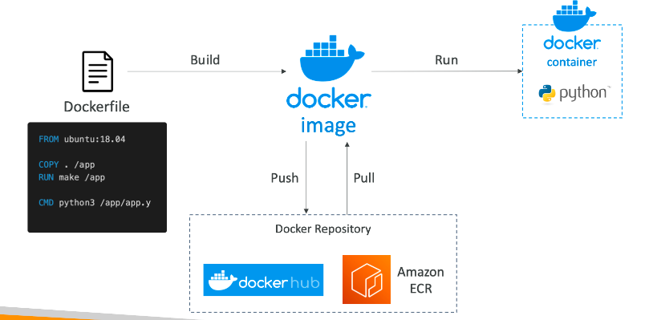

## 实践
### 创建一个域名
下面的操作会自己生成一个hosted name（在这里面可以创建record）
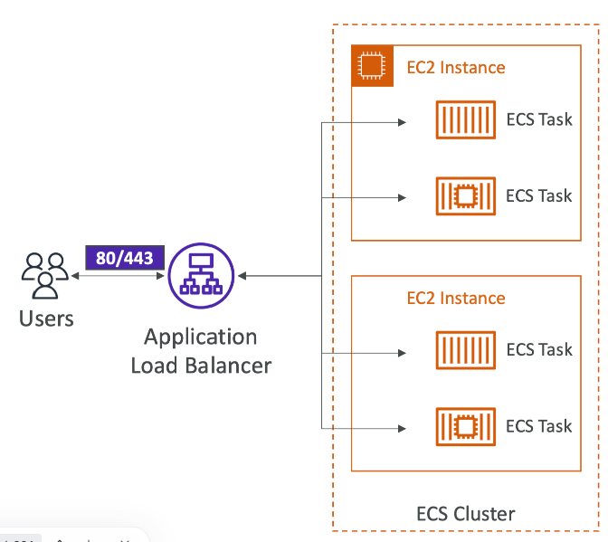

### 创建record
点击hosted name，创建record。
创建完成后，访问record name，会query hosted server，server把record的value返回给浏览器，浏览器就能得到ipv4的地址了
使用nslookup可以发现ipv4和record的名字是对应的

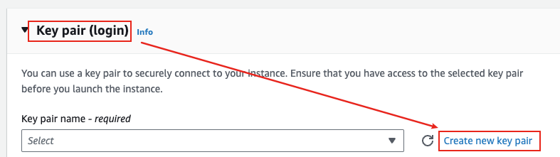

## Route 53 – Record TTL(Time To Live)
- 高TTL：比如24小时
  - Route 53的流量压力小
  - record有可能是旧的
- 低TTL：比如60秒
  - Route 53的流量压力大
  - record更新快，较少时间出现outdated
  - 容易改变record的设定
- 除了Alias records，TTL是一个强制的设定

## CNAME vs Alias
- 如果想要把AWS的资源（LB之类的）暴露成一个AWS的hostname。可以使用下面两种
  - 比如lb的域名，暴露成route 53上注册的一个域名
- CNAME
  - 从一个hostname指向另一个hostname（app.mydomain.com -> lb.xxx.com)
  - 只适用于非Root 域名（根域名：example.com, 非根域名：xxx.example.com）
- Alias
  - 从一个hostname指向另一个hostname（app.mydomain.com -> lb.xxx.com)
  - 根/非根域名都可使用
  - 免费
  - 有原生的健康检查

## Route 53 – Alias Record
- 别名的类型总是A/AAAA
- 不能设置TTL

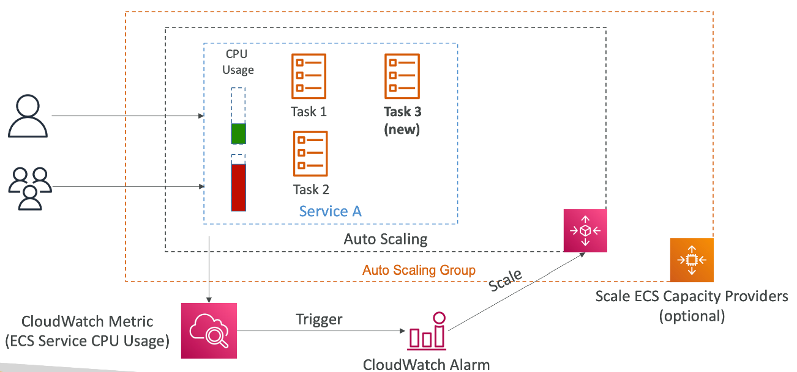

## Route 53 – Routing Policies
### 基础
- 定义了Route 53怎样回应DNS查询请求
- 不要和普通的路由混淆
  - 这个和LB的负载均衡不一样
  - DNS不会转发任何流量，他只会回应DNS请求
- Route 53支持多种路由规则
  - Simple
  - Weighted
  - Failover
  - Latency based
  - Geolocation
  - Multi-Value Answer
  - Geoproximity（using Route 53 Traffic Flow feature）

### Routing Policies - Simple
- 路由DNS请求到单一的资源ip上
- 可以在同一个record上定义多个值
- 如果多个ip地址被返回了，那么client会随机挑选一个去访问
- 如果启动了别名，只能定死一个AWS资源
- 不能使用健康检查
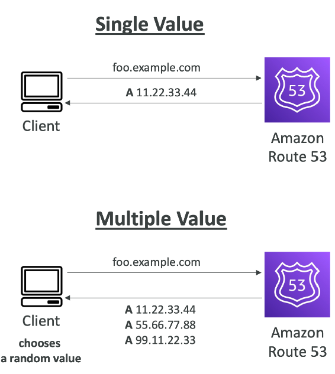

### Routing Policies - Weighted
- 控制DNS请求的百分比到某个资源上
- DNS records必须有相同的名字和type
- 可以使用健康检查
- 赋予0给一个record，可以停止发送请求到某个资源上
- 如果所有的record的比重都是0，那么就相当于每个record的比重一样
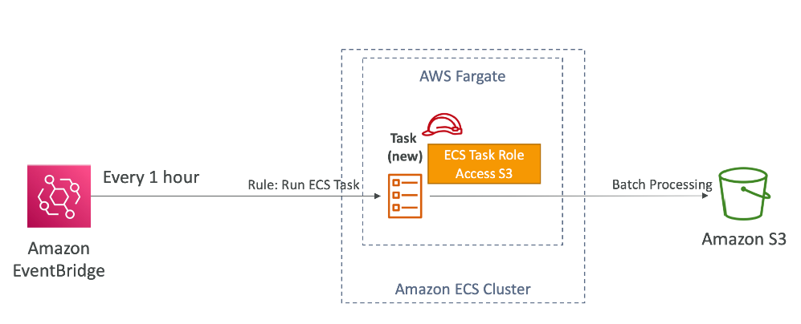

### Routing Policies - Latency-based（基于延迟）
- 重定向资源到延迟更低的region
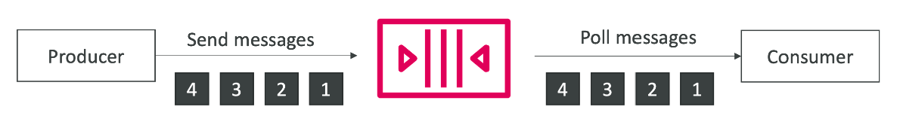

## Route 53 – Health Checks
### 总览
- 健康检查只适用于public资源
- Health Check => Automated DNS failover:

### Health Checks - 监听一个endpoint
- 差不多15个全球的健康检查器会检查endpoint的健康情况
  - 默认的健康/不健康的临界值是3
  - 间隔，30秒钟（可以设置成10秒，但是花费更高）
  - 支持协议：HTTP，HTTPS，TCP
  - 如果大于18%的健康检查器回报endpoint是健康的，那么route 53认为资源是健康的，否则就是不健康
- 只有endpoint返回状态码2xx,3xx，健康检查才会通过
- 配置路由器和防火墙，允许来自route 53的健康检查请求
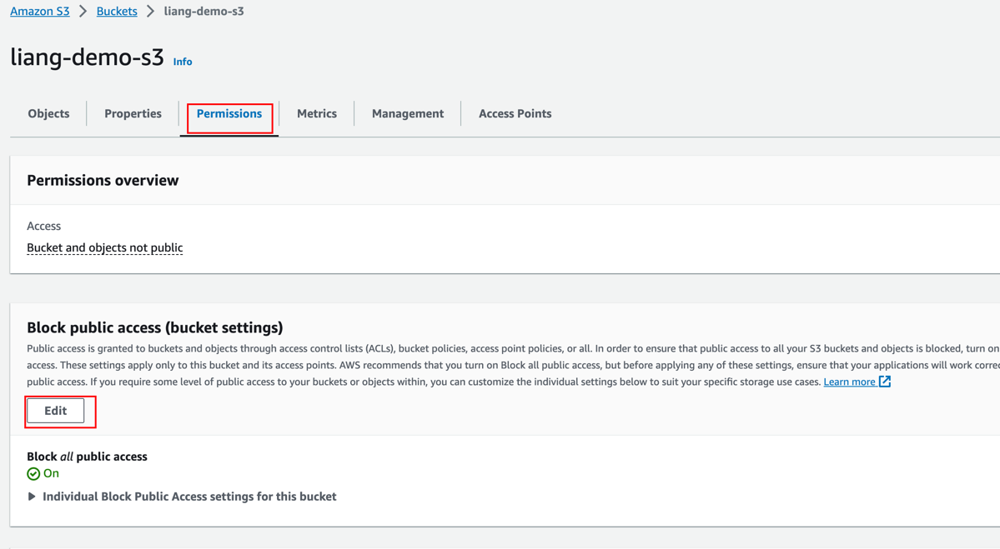

### Route 53 – Calculated Health Checks
- 组合多个健康检查的结果到一个单个的健康检查
- 可以使用OR，AND，NOT来组合结果
- 可以监视高达256个子健康检查
- 定义有多少个子检查通过才算父检查通过
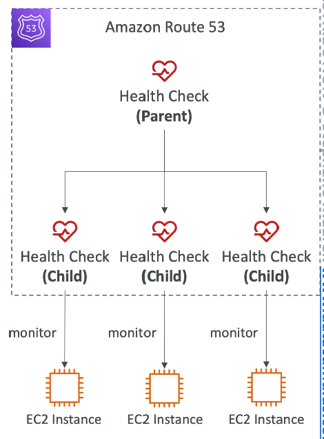

### Health Checks – Private Hosted Zones
- Route 53健康检查器是在VPC的外部
- 不能访问私有的endpoints
- 可以创建一个CloudWatch Metric并且监视CloudWatch Alarm
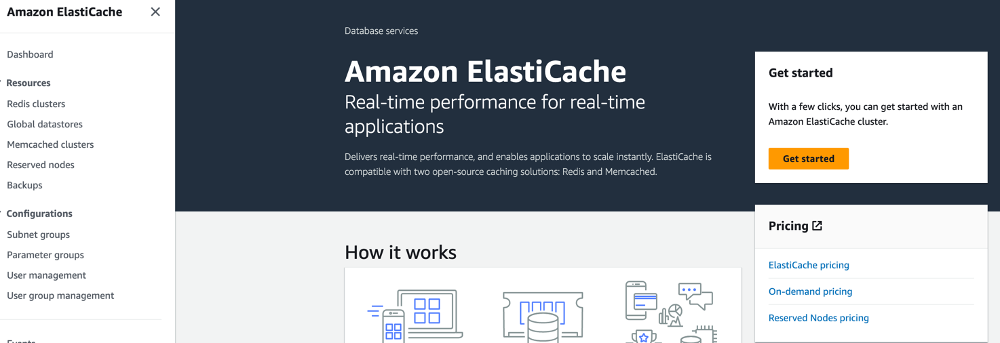

