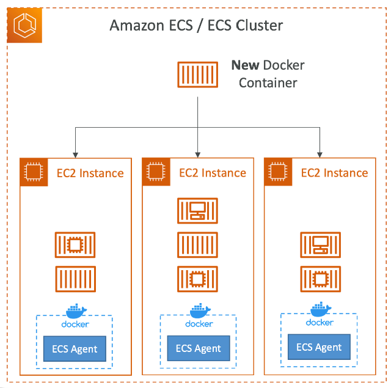

# Amazon Route 53 (域名注册)
## DNS
### 什么是DNS
- 域名系统，用来把域名翻译成ip
- www.google.com => 172.217.18.36
- DNS是网络骨干
- DNS使用层级命名结构

### DNS术语
- Domain aRegistrar（域名注册）： Amazon Route53， Go Daddy
- DNS Records：A，AAAA，CNAME，NS
- Zone File：包含DNS records
- Name Server：处理DNS请求
- Top Level Domain（TLD）：com，us，in，gov，org
- Second Level Domain（SLD）：amazon.com, google.com
- 

### DNS怎么工作的

# Amazon Route 53
## 简介
- 一个高可用，可扩展，可控制和权威（Authoritative）的DNS
  - Authoritative = 用户可以更新DNS records
- Route 53也是一个域名注册器
- 可以检查资源的健康情况
- 为什么教Route 53。 因为53是传统DNS的端口号

## Route 53 - Records
- 如果想要为一个域名路由流量
- 每一个record包含
  - Domain/subdomain Nmae: example.com
  - Record Type: A or AAAA
  - Value: ip address
  - Routing Policy: Route 53怎样回应查询
  - TTL: record在DNS中缓存的时间
- Route 53支持的DNS Records Type
  - （must know）A/AAAA/CNAME/NS
  - （advanced）CAA/DS/MS/NAPTR/PTR/SOA/TXT/SPF/SRV

## Route 53 - Record Types
- A: 路由hostname到ipv4
- AAAA: 路由hostname到ipv6
- CNAME: 路由hostname到另一个hostname
  - 目标是一个必须有A or AAAA记录的域名
  - 不能在DNS命名空间的top节点创建一个CNAME记录
    - 比如不能创建example.com。但是可以创建www.example.com
- NS: 针对Hosted Zone的名字服务器
  - 控制怎么路由流量到一个域名

## Route 53 – Hosted Zones
- 是一个records的容器，定义了怎么路由流量到一个域名和他的自域名
- 分类
  - Public Hosted Zones：这里包含的records定义了怎么从互联网路由流量
  - Private Hosted Zones：这里包含的records定义了怎么从一个或者多个VPC中路由流量
- 不免费

