# S3
## Amazon S3 Use cases
- 备份和存储(Backup and storage)
- 灾难恢复(Disaster Recovery)
- 归档(Archive)
- 混合云存储(Hybrid Cloud storage)
- 应用程序托管(Application hosting)
- ...

## Buckets 桶
- s3允许人存储文件到桶里（路径）
- 桶的名字必须唯一，跨所有区，所有账户，都唯一
- 桶在region的层级被定义
- s3看起来像是全球服务，但是是在region区域内被创建的
- 命名
  - 没大写，没下划线
  - 3-36字符长度
  - 不能是ip
  - 开头必须小写或者数字
  - 开头不能是xn--
  - 结尾不能是-s3alias

## Object 文件对象
- Object有一个key
- key是一个全路径
  - s3://my-bucket/my_folder1/another_folder/my_file.txt
- key由**前缀**+***object***名字组成
  - s3://my-bucket/**my_folder1/another_folder**/***my_file.txt***
- s3里面没有文件夹的概念，只是ui展示的时候会展示成文件夹

## Object size
- 最大文件的size是5TB
- 如果文件上传的时候超过5GB，使用分段上传 multi-part upload
- Metadata，元数据（键值对集合）
- Tags 类似于lable
- Version ID，如果启用了version的功能

## Hands on

## Security
- 基于用户 user based
  - IAM policies 应允许特定用户从 IAM 调用哪些 API
- 基于资源 resource based
  - Bucket policies 来自 S3 控制台的存储桶范围规则 - 允许跨帐户
  - Object Access Control List(ACL) 可以被禁用
  - Bucket Access Control List(ACL) 可以被禁用
- Note: 一个IAM委托人可以访问s3文件，如果
  - 用户IAM权限允许或者资源允许
  - 并且没有明确的拒绝
- 加密
  - s3使用加密key来加密文件

## Bucket Policies
- JSON based policies
  - Resources：桶和文件（object）
  - Effect：Allow/Deny
  - Actions：允许或者拒绝API的访问
  - Principal：收policy影响账户或者用户
- 使用s3的bucket policy可以
  - 开放bucket共public使用
  - 强制object必须被加密，在上传的时候
  - 开放另一个账户的访问bucket权限

### Public Access - Use Bucket Policy

### User Access to S3 - IAM permissions

### EC2 Access to S3 - Role

### Cross-Account Access - Use Bucket Policy

### Bucket settings Block Public Access 

- 这些设定是用来防止公司数据泄漏
- 如果知道数据绝不是公开的，那么就开启这些设定
- 可以在账户级别设置

### 开放bucket给public

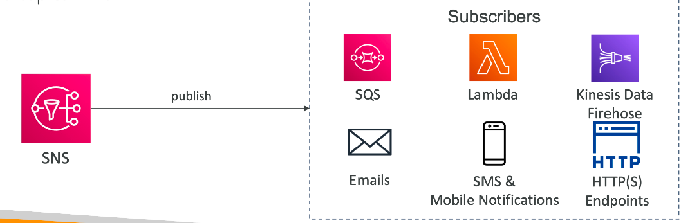

## S3挂载静态网页

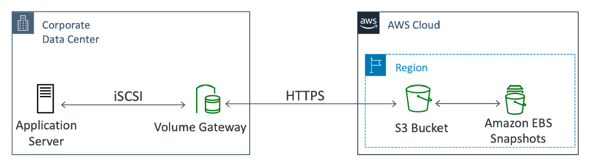

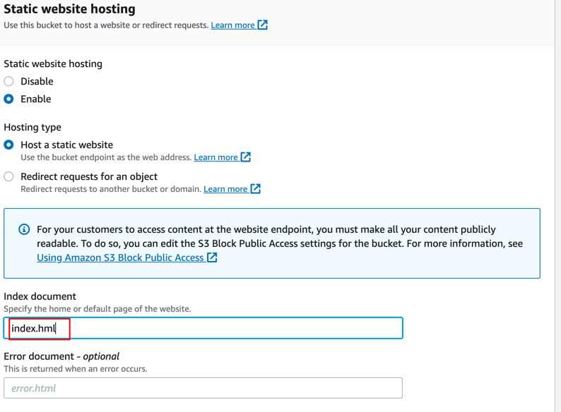
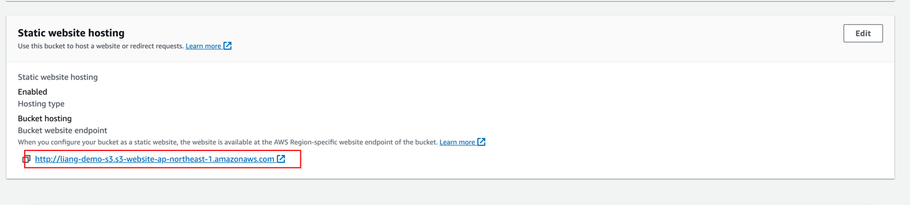

## S3 Versioning 版本控制
- 可以在s3中控制文件版本
- 在bucket level启用
- 相同的key发生覆盖，就会改变版本
- 好处
  - 防止误操作
  - 容易回滚
- 注意
  - 任何文件在开启版本控制之前，有一个null的版本
  - 暂停版本控制不会删除以前的版本
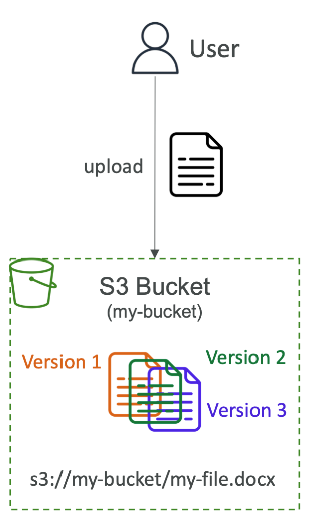

### hands on

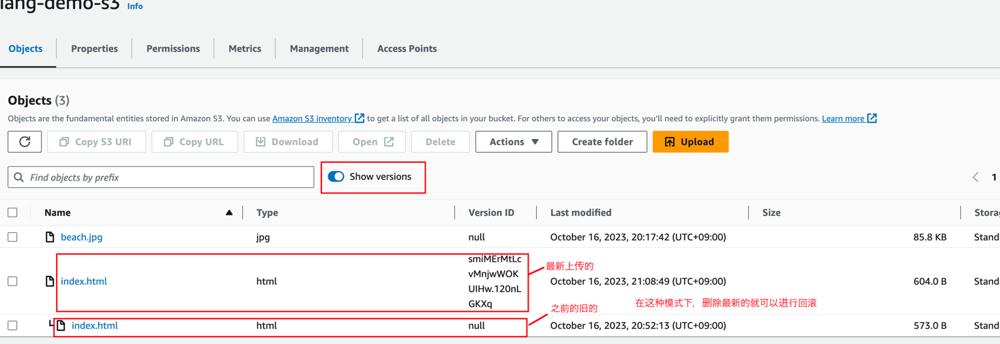

## S3 Replication 副本（CRR & SRR）
### 概念
- 必须在source / dest bucket中启动版本控制
- Cross-Region Replication（CRR）跨region同步文件
- Same-Region Replication（SRR）同region同步文件
- 桶可以在不同的账户
- 复制是异步进行的
- 必须给适当的IAM权限到S3
- 使用case
  - CRR：合规性、低延迟访问、跨域复制
  - SRR：日志聚合，生产和测试之间的实时复制

### Notes
- 在启用replication后，只有新的object会被做副本
- 可以使用S3 batch replication在同步之前存在的文件
- 对于删除操作
  - 可以复制删除marks（可选设定），即不开启Show versions，直接删除，s3会生成一个delete marker来标记某个object会被删除，这个delete marker会被复制到dest桶
  - 不能复制删除带有版本id的文件（避免恶意删除），开启Show versions在删除以后，不会进行删除操作的复制
- 没有链式复制
  - a和b同步，b和c同步。但是a和c不同步

### hands on
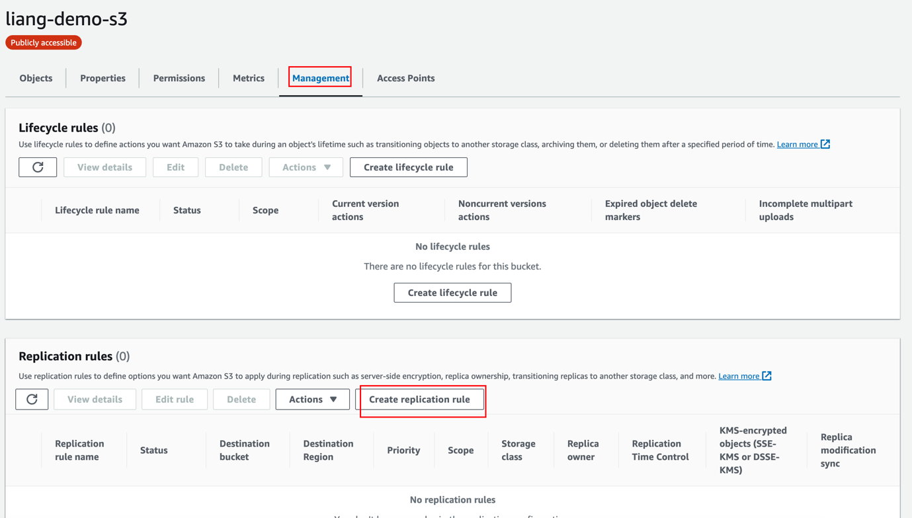
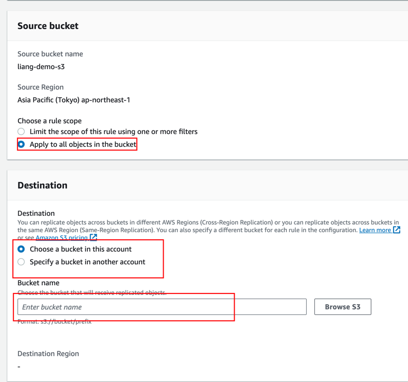
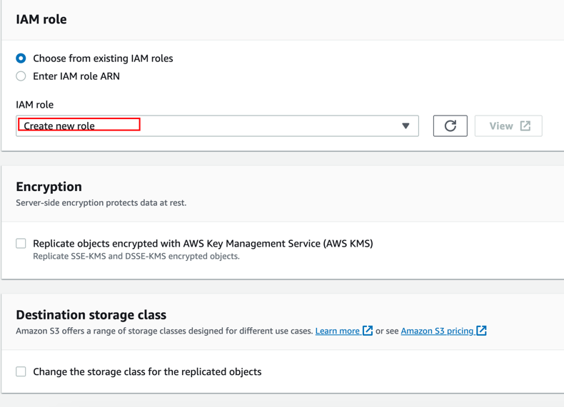

## S3 Storage Classes 存储类别
### 分类
- Amazon S3 Standard - General Purpose
- Amazon S3 Standard-Infrequent Access (IA)
- Amazon S3 One Zone-Infrequent Access
- Amazon S3 Glacier Instant Retrieval
- Amazon S3 Glacier Flexible Retrieval
- Amazon S3 Glacier Deep Archive
- Amazon S3 Intelligent Tiering
- Can move between classes manually or using S3 Lifecycle configurations

### 持久性和可用性
- Durability
  - 文件跨可用区，高持久性
  - 如果存储了10000000个文件在s3，文件损失的平均频率是10000年一个
  - 所有的存储类别都是高持久
- Availability
  - 根据存储类别的不同来变化
  - 比如：standard 有99.99%可用性 = 一年只有53分钟不可用

### 对比
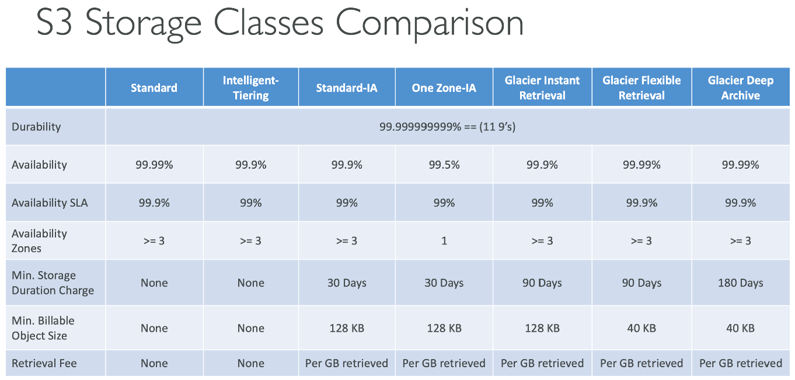

### hands on

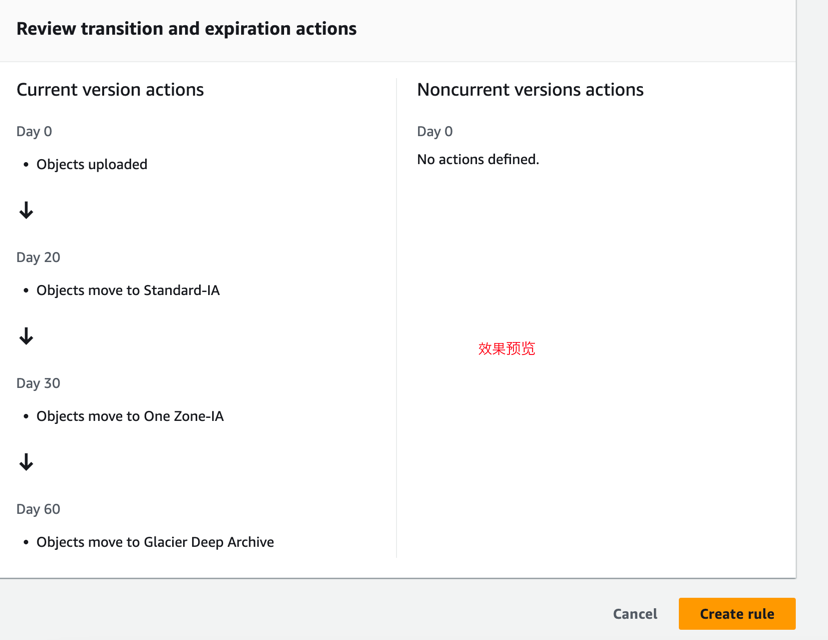

## Moving between Storage Calsses
- 可以把文件在不同的存储类中转移
- 对于不常访问的，可以放到Standard IA
- 对于不需要快速访问的，可以归档到Glacier或者Glacier Deep Archive
- 可以使用Lifecycle Rules来移动文件
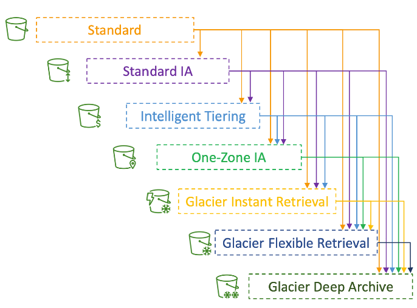

### Lifecycle Rules
- 转移行为：配置文件转移到另一存储类中
  - 移动文件到Standard IA在创建后的60天
  - 移动到Glacier 进行归档在6个月之后
- Expiration actions：配置文件过期（删除）在一定时间之后
  - 访问日志文件可以被删除在365天之后
  - 可以删除旧版本的文件如果启动了版本控制的话
  - 可以删除不完成的Multi-Part文件
- 可以位特定的前缀创建规则（比如：s3://mybucket/mp3/*）
- 可以位特定Tag创建规则（比如：Department: Finance）

### hands on
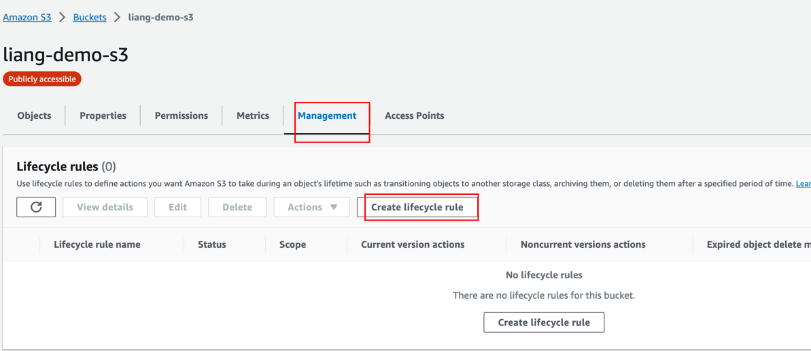
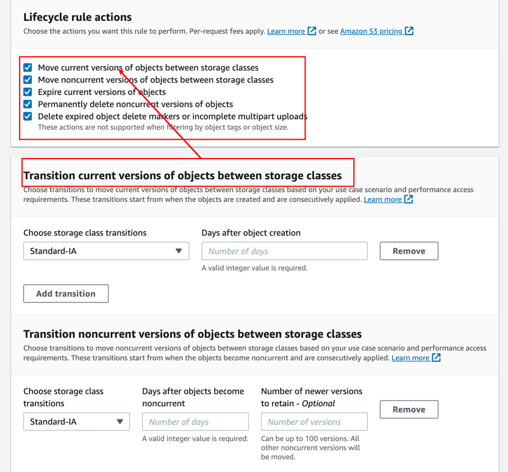

## 请求着支付
- 总的来说，bucket的拥有者会支付s3存储和数据转移的所有费用
- 但是在请求者支付的模式下，请求者会支付请求s3和下载文件的文勇
- 当分享大文件的时候，可以使用
- 请求者必须是被aws认证过的
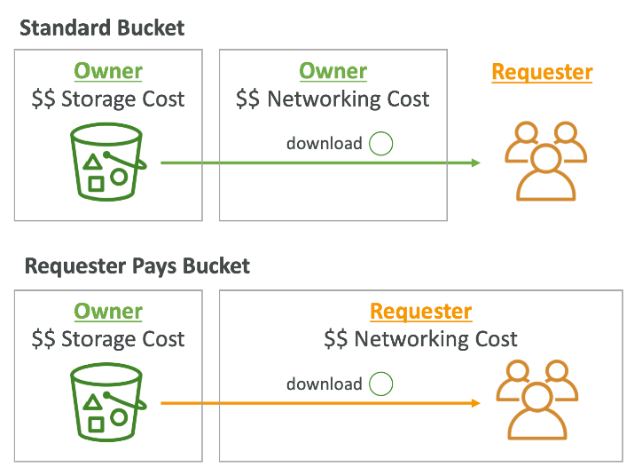

## S3 Event Notifications 事件通知
### 理论
- 事件是啥：S3:ObjectCreated, S3:ObjectRemoved, S3:ObjectRestore, S3:Replication…
- 可以过滤对象的名字（可以*.jpg）
- 可以创建很多s3的事件
- s3推送消息需要花费几秒钟，长的话可能几分钟
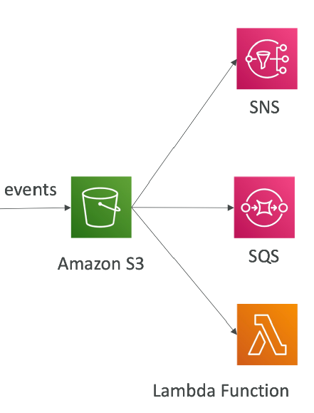

### s3向外部推送消息
需要接受消息的一样设置权限，能够接受s3推送过来的消息
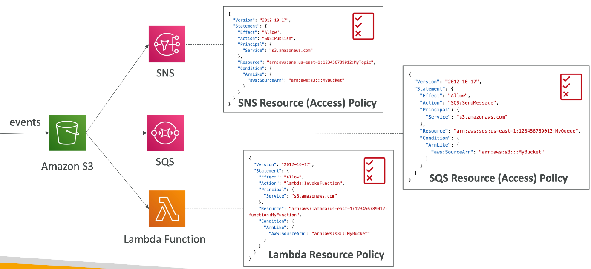

### EventBridge 监听s3的所有事件
- 更高级的过滤器：可以使用JSON规则（metadata，object size，name）
- 多个推送目的地
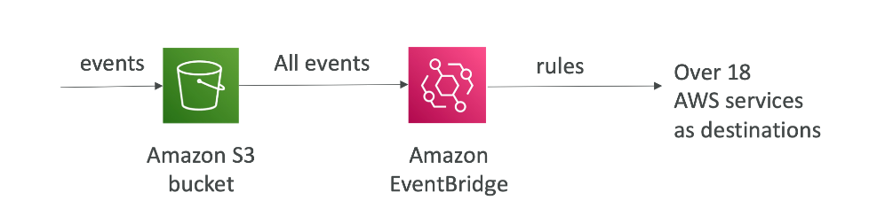

### Practice 推送消息到SQS队列

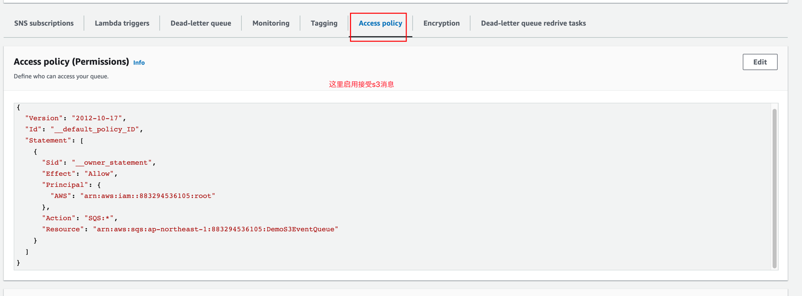
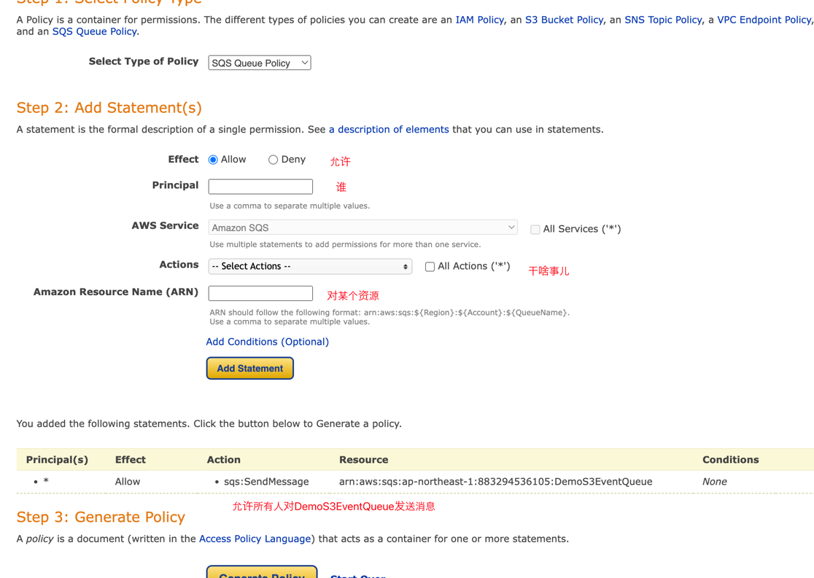
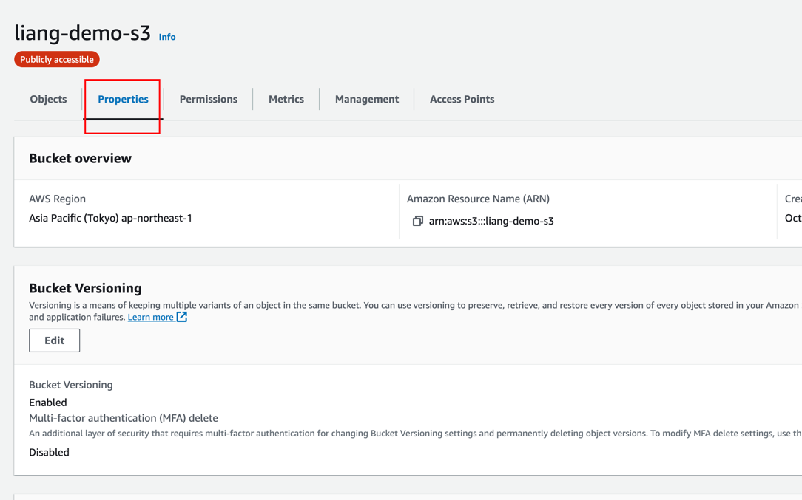
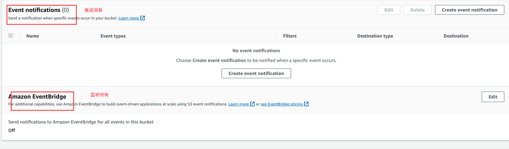

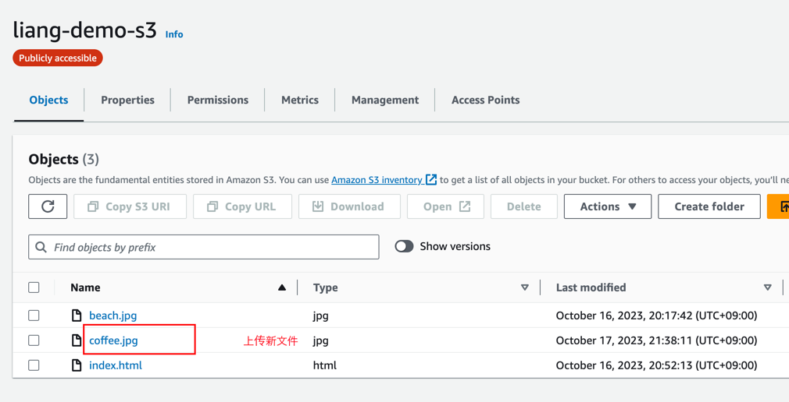
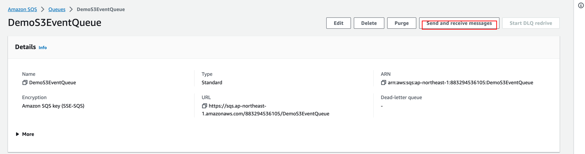

## S3 Performance
### 基础表现
- App可以对s3进行3500 put/copy/post/delete 或者5500 get/head的请求每秒钟。针对每个前缀在同一个桶内
- 并且在桶内没有对文件数量的限制就可以达到上面的效果
- 什么是前缀（object path => prefix）
  - bucket/folder1/sub1/file  => /folder1/sub1/
  - bucket/folder1/sub2/file  => /folder1/sub2/

### 其他performance
- Multi-Part upload
  - 推荐使用，当文件大于100MB。当文件大于5GB，必须使用
  - 可以并发upload

- S3 Transfer加速
  - 通过上传文件到一个边缘的Location，这个location会传输文件到想到的地方
  - Multi-part upload也使用

### S3 Byte-Range Fetches 子节范围内拉去
- 并发的获取特定的子节范围
- 发生故障时候，更好恢复

- 也可以只获取部分数据（比如文件的前多少子节是文件头，只获取文件头之类）

## S3 Select & Glacier Select
- 使用SQL进行服务器端的过滤，拉取更晓得数据来提高性能
- 可以过滤行/列（简单的SQL）
- 更少的网络传输，客户端更少的CPU消耗

## S3 Batch Operations 批量操作
- 对s3的文件进行批量操作，只用一次请求。比如
  - 修改metadata&properties
  - 在桶之间复制文件
  - 加密数据
  - 修改ACLs和tags
  - 从Glacier中复原文件
  - 执行Lambda函数
- 一个job由3部分组成
  - object的list
  - 要执行的动作
  - 可选择的参数
- 可以使用s3仓库获取object list然后使用S3 select区过滤文件

## Object Encryption
- 可以在s3的桶中，使用下面4中加密方法
  - Server-Side Encryption(SSE) 服务器端加密
    - 使用AWS S3管理的key加密：Amazon S3-Managed Keys(SSE-S3) 默认开启
    - KMS keys加密啊，存储在AWS KMS(SSE-KMS)
    - 使用用户提供的key加密, Customer-Provided Keys(SSE-C)
  - 客户端加密后上传到s3

### SSE-S3
- 加密用的key，由aws来管理和保存以及处理
- object在服务器端加密
- 加密类型是AWS-256
- 必须设置请求头: "x-amz-server-side-encryption" : "AWS256"
- 默认给新的桶和新的object开启

### SSE-KMS
- 加密使用的key，由AWS KMS（Key Management Service）保管
- KMS优势：用户控制+CloudTrail审查key
- object在服务器端加密
- 必须设置请求头： "x-amz-server-side-encryption" : "aws:kms"

- KMS缺点
  - 如果使用SSE-KMS，必须接受KMS的缺点
  - 当上传的时候，会调用GenerateDataKey KMS API
  - 下载的时候会调用Decrypt KMS API
  - 计入每秒 KMS 配额 （5500、10000、30000 请求/秒，具体取决于区域）
  - 您可以使用以下方式请求增加配额： 服务配额控制台

### SSE-C
- 服务端加密的key由用户提供
- S3不会存储用户提供的key
- 必须使用HTTPS
- 加密的key必须在HTTP请求头中设置

### Client-Side Encryption
- 使用客户端类库类进行加密，比如：Amazon S3 Client-Side Encryption Library
- 加密必须在发送给s3之前完成
- 解密在object从s3上下载后进行
- 用户控制key

### 传输加密 Encryption in transit(SSL/TLS)
- 传输加密也叫做 SSL/TLS
- s3会开放两个endpoints
  - HTTP endpoint：非加密的
  - HTTPS endpoint：加密的
- HTTPS是推荐的
- SSE-C强制使用HTTPS
- 多数客户端默认使用HTTPS endpoints

### 传输强制加密
- aws:Secure Transport

### hands on

## Default encryption vs Bucket Policies

