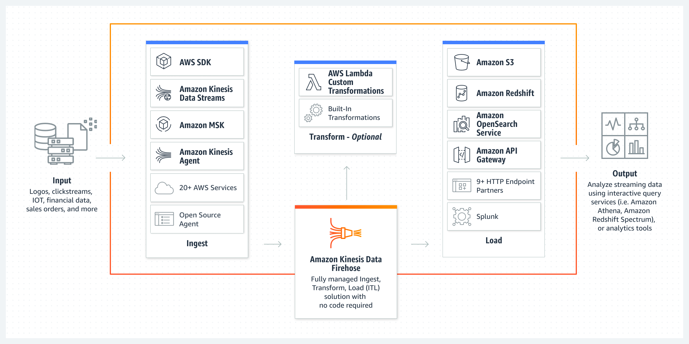

# Practice 1
## Points

### 1. ASG scaling policy
- target tracking scaling policy：可以根据【CPU使用率】/【ALB的目标组的单台服务器的最大请求数】等指标来进行伸缩
  - 
- step/simple scaling policy：设定指标临界值，CloudWatch检测到临界值被打破后，触发伸缩。
  - 这种的policy不能基于CPU的目标使用率
- ASG不能直接使用CloudWatch去观测CPU使用率

### 2. AWS WAF(Web Application Firewall)
- AWS WAF可以监视请求和保护web app，使用WAF可以屏蔽或着允许ip访问你的程序
  - Geographic (Geo) Match允许你根据访问者的地理位置进行限制
- CloudFront的Geo Restriction可以根据用户的地区限制流量，但是CLoudFront在edge location工作，不属于某一个VPC
- Security group不能根据地理位置进行访问的限制

### 3. Integrate data files between on-premises and AWS cloud through NFS interface
- AWS Storage Gateway：给本地权限去接入AWS云存储（S3之类），有3种不同类型
  - File Gateway：支持SMB / NFS接入
  - Volume Gateway：不支持NFS接入，支持配置Volume网关口，提供ISCSI存储快都本地app
  - Tape Gateway：磁带网关允许将磁带备份移动到云。 磁带网关不支持 NFS 接口
- AWS Site-to-Site VPN：可以讲本地网络和AWS VPC相连，可以使用Site-to-Site VPN把本地数据扩展到云，这使用的是两个站点之间建立的互联网协议安全 (IPSec)隧道，不支持NFS

### 4. File Server
- Amazon FSx for Windows File Server: 完全托管的，高可用的文件存储，基于Windows Server构建
  - 提供：用户配置，终端用户文件存储，AD（Microsoft Active Directory）整合
- Amazon FSx for Lustre：高性能文件系统，用于机器学习，高性能计算，影像处理，金融模型。不支持微软DFS
- AWS Directory Service for Microsoft Active Directory (AWS Managed Microsoft AD)
  - AWS Managed Microsoft AD 基于实际的 Microsoft Active Directory 构建，不需要您将数据从现有 Active Directory 同步或复制到云。 AWS Managed Microsoft AD 不支持 Microsoft 的分布式文件系统 (DFS)

### 5. Aurora Global Database & Local Database
- Amazon Aurora Global Database为了全球分布式系统设计，允许单一的DB扩展到跨Regions
  - 建立副本时不会影响性能，每个region快读的本地读取和低延迟，灾难恢复

### 6. Kinesis

- Kinesis Data Firehose：加载流数据，进行处理（Lambda Function），写到存储（S3）
- Kinesis Data Analytics：实时分析流数据的服务，没法直接从数据源里面提取数据，只能从Kinesis Data Streams 或者 Kinesis Data Firehose提取
- Kinesis Data Streams： 数据提取和数据处理服务，和AWS很多服务继承，包括拥挤近乎实时转换的Kinesis Data Firehose
  - 无法直接输出到s3，和firehose不一样，无法通过Lambda Function将处理结果写到s3
- Amazon EMR 使用开源框架 Hadoop 在可调整大小的 Amazon EC2 实例集群中分发数据和处理。 使用 EMR 集群意味着管理底层基础设施，因此被排除在外，因为给定用例的正确解决方案应该需要最少的基础设施维护。

### 7. Real-time data
- Amazon Kinesis Data Streams: 实时处理流式大数据。支持数据排序，相同数据读取...
  - 将相关数据路由到同一个处理器，当给定键的所有记录都路由到同一记录处理器时，计数和聚合会更简单。
  - 数据排序，把数据传到处理器上的时候，数据原来的顺序保持不变
  - 多个处理器同时消费数据
  - 在几个小时以后，以同样的顺序消费数据（Amazon Kinesis Data Streams最多保存365天）

### 8. RDS Multi-AZ vs Read-replicas
- Multi-AZ：synchronous replication / at least two Availability Zones (AZs) within a single region
- Read-replicas：asynchronous replication / can be within an Availability Zone (AZ), Cross-AZ, or Cross-Region

### 9. API Gateway: Stateful & State less

- Amazon API Gateway creates RESTful APIs
  - 基于HTTP
  - 启用无状态client-server沟通形式
  - 实现标准的HTTP方法：GET，POST...
- Amazon API Gateway creates WebSocket APIs
  - 遵守Websocket协议，启用clent-server沟通有状态

### 10. 数据库缓存
- Amazon DynamoDB Accelerator (DAX)：完全托管，高可用的DynamoDB数据库缓存
  - 
- Amazon ElastiCache：Amazon RDS 或 Amazon DynamoDB 等数据存储的理想前端，为具有极高请求率和/或低延迟要求的应用程序提供高性能中间层

### 11. Connection between AWS and data-center

- AWS Direct Connect plus virtual private network (VPN)：有足够时间
  - AWS Direct Connect: dedicated connection between AWS and data-center
  - Virtual private network (VPN): IPsec-encrypted, low latency, high throughput
- AWS site-to-site VPN: 需求紧急，对宽带要求适中，可以容忍网络链接的固有变化
  - IPsec-encrypted
  - not low latency / high throughput
- VPC transit gateway： 中转网关是一个网络中转中心，可用于互连虚拟私有云 (VPC) 和本地网络。
  - not low latency / high throughput
- AWS Direct Connect
  - low latency / high throughput
  - not encrypted

### 12. Accelerate S3 uploading speed
- Amazon S3 Transfer Acceleration (Amazon S3TA): 利用CloudFront locations，加快传输
- Multipart uploads：大文件分片传输

### 13. Amazon S3 存储桶的哪项功能在启用后只能暂停而不能禁用？
- Versioning： 版本控制

### 14. Origin(US) keep same，optimize loading time in other region(Asia)
- 使用cloudFront可以在单个站点上为不同类型的内容使用不同的来源 
  - 用于静态对象的 Amazon S3、
  - 用于动态内容的 Amazon EC2 以及
  - 用于第三方内容的自定义源

### 15. EC2 High IO performance
- Use Instance Store based Amazon EC2 instances

### 16. Backup S3不常用Objects
- Amazon S3 One Zone-Infrequent Access (S3 One Zone-IA)
  - 当有需要的时候，还是能快速获取
  - S3 One Zone-IA只在一个AZ中保存数据，其他的classes需要在至少3个AZ中保存
  - 是介于Amazon S3 Standard 和 Amazon S3 Standard-IA
  - 最低的存储时间是30天

### 17. S3 无效的lifecycle

- Any storage class -> Amazon S3 Standard storage class
- Any storage class -> Reduced Redundancy storage class
- The Amazon S3 Intelligent-Tiering storage class -> Amazon S3 Standard-IA storage class
- Any storage class -> Reduced Redundancy storage class
- The Amazon S3 One Zone-IA storage class -> Amazon S3 Standard-IA / Amazon S3 Intelligent-Tiering storage classes

### 20. 可以/不可以被当作root的数据卷
#### 可以
- General Purpose Solid State Drive (gp2)
- Provisioned IOPS Solid state drive (io1)
- Instance Store

#### 不可以
- Throughput Optimized Hard disk drive (st1)
- Cold Hard disk drive (sc1)

### 23 Aurora发生故障转移（failover）的时候，可读副本提升的优先级
- 首先提升编号最小的
- 如果编号相同，提升容量大的
- 如果编号和容量相同，在同一层级中提升任意一个副本
- 例子
  - tier-1 (16 terabytes)： 2
  - tier-1 (32 terabytes)： 1
  - tier-10 (16 terabytes)： 3
  - tier-15 (16 terabytes)： 5
  - tier-15 (32 terabytes)： 4
 
### 24 本地数据传输到aws
- 本地数据每个70TB,一共有10个，时间紧急
 - 看到时间紧急 -> AWS site-to-site VPN: 需求紧急，对宽带要求适中，可以容忍网络链接的固有变化
 - 看到数值接近80TB -> AWS Snowball Edge Storage Optimized devices(80TB的容量)

### 25 GuardDuty & Amazon Inspector
- GuardDuty:
  - 监视保护aws account，workloads，s3
  - 分析由Aws CloudTrail Events，VPC Flow Logs，DNS logs产生的账户和网络数据
- Inspector
  - 检查EC2的网络活动 & vulnerabilities
 
### 27 EC2 High performance computing
- 看到HPC -> low network latency & high network throughput
- Cluster placement group: 把实例放在了一个AZ中，减少了网络延迟，提高了网络吞吐
- A partition placement group: 在一个region中的不同AZ来部署，通常由大型分布式和复制工作负载使用，例如 Hadoop、Cassandra 和 Kafka。但是没有低延迟
- A spread placement group: 每个实例都放置在不同的机架上，每个机架都有自己的网络和电源。 这些实例放置在不同的底层硬件上，以减少相关故障。 每个组的每个可用区最多可以有七个正在运行的实例。

### 28 S3 retention period to an object version
- 可以对S3的object的某个版本设置保留期间retention period
  - 当显示的（explicitly）的设置保留期限，需要设定***Retain Until Date***
  - 当使用默认设定的时候，不需要设置
- 不同的object版本可以有不同的retention period

### 29 有hot/code数据需要分开处理，hot需要并行和分布式的快速处理和存储，cold需要保留，并且低成本快速访问和更新
- FSx For Lustre
  - 适用于机器学习，HPC，食品处理，金融建模。可以并行处理和保存文件的高性能文件系统
  - 可以和S3集成，连接到s3时，会透明的将s3对象呈现为文件，并且允许写会s3
- Amazon FSx for Windows File Serve
  - 不允许将 S3 对象呈现为文件，也不允许将更改的数据写回 S3
- Amazon EMR
  - 大数据平台，不提供和FSx for Lustre 相同的存储和处理速度
- AWS Glue
  - 完全托管的提取、转换和加载 (ETL) 服务，使客户可以轻松准备和加载数据以进行分析。 AWS Glue 作业旨在用于批量 ETL 数据处理。 AWS Glue 不提供与 FSx for Lustre 相同的存储和处理速度
 
### 30 使用S3 TA上传大文件的收费问题
- Pay only for transfers that are accelerated： 如果上传的时候S3 TA没加速，那就不用付钱

### 31 CloudTrail
- 可以把log发到CloudWatch中，然后cloudWath查看是否有error，然后可以给予metric来进行警告然后通过SNS发送消息

### 32 EBS/EFS/S3 收费问题
- EFS：$0.30 per GB per month，只需要付使用的量的钱
- EBS：$0.10 per GB-month of provisioned storage：配置了多少付多少钱
- S3：$0.023 per GB per month
- 总的来说S3 < EFS < EBS

### 33 EC2 on demand vs EC2 spot
- Amazon EC2 Spot 
  - 实例允许您以比按需价格最高 90% 的价格请求备用 Amazon EC2 计算容量
  - 容错或无状态工作负载
  - 灵活的开始，结束时间
- On-Demand
  - 无法中断的工作负载
  - 在EC2上开发或者测试应用程序
 
### 38 EC2 Instance Pricing model
- On-Demand: 按照小时或者秒收费，便宜。可以使用dev环境，比如dev环境每天只开启8个小时
  - 成本低，无需提前付款，和长期承诺
  - 短期应用程序，不可预测或者流量巨大的APP
  - APP首次在AWS是进行测试的时候选择这个
- Savings Plans(Reserved Instances): 最高减少on-demand的成本到72%，但是需要预定1或者3年，适用于prod环境
  - 承诺长期使用EC2的APP
  - 希望利用最新计算产品同时继续省钱的用户
- EC2 Spot Instances: 利用 AWS 云中未使用的 EC2 容量，并且与按需价格相比可享受高达 90% 的折扣
  - 能容错的APP（出错了也没事，能自己恢复），或者无状态的服务
  - 可以在异构的硬件上面运行的APP
  - 灵活的开始和结束时间

### 41 节流（throttling）请求，保护APi的手段
- API Gateway: 使用令牌桶算法限制对您的 API 的请求，其中令牌计入请求
  - API Gateway 对您账户中所有 API 的稳态速率和突发请求提交设置了限制。 在令牌桶算法中，突发就是最大桶大小
- SQS: 消息队列，把请求存入队列，然后APP慢慢处理
- Kinesis: 提供实时的流的存储，处理服务

### 42 电子表格(spreadsheet)被保存一个region的EFS里，其他region也想直接访问，进行共同读写，怎么办？
- EFS是一个region的服务，数据会被保存在多个AZ
- EC2可以跨AZ，Region，VPN访问，前提是建立inter-region VPC peering connection
- 本地服务器可以访问，前提是建立AWS Direct Connect

### 43 SQS FIFO QPS？
- SQS FIFO的QPS是300，每秒钟可以处理300条信息
- SQS FIFO有batch处理模式，如果每10条消息当作一次operation，那么QPS会上涨到3000
- 如果目标值是1000左右，那么可以把4条消息当作一次oepration，那么每秒钟就可以处理1200条消息

### 44 
