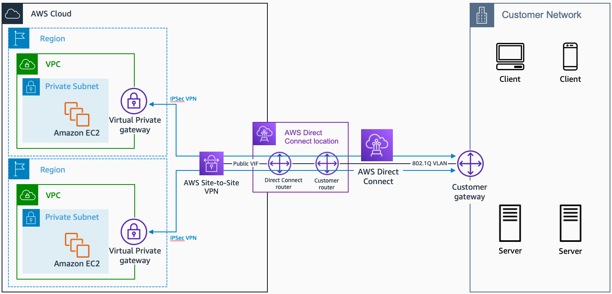

# Practice 1
## Points

### 1. ASG scaling policy
- target tracking scaling policy：可以根据【CPU使用率】/【ALB的目标组的单台服务器的最大请求数】等指标来进行伸缩
  - 
- step/simple scaling policy：设定指标临界值，CloudWatch检测到临界值被打破后，触发伸缩。
  - 这种的policy不能基于CPU的目标使用率
- ASG不能直接使用CloudWatch去观测CPU使用率

### 2. AWS WAF(Web Application Firewall)
- AWS WAF可以监视请求和保护web app，使用WAF可以屏蔽或着允许ip访问你的程序
  - Geographic (Geo) Match允许你根据访问者的地理位置进行限制
- CloudFront的Geo Restriction可以根据用户的地区限制流量，但是CLoudFront在edge location工作，不属于某一个VPC
- Security group不能根据地理位置进行访问的限制

### 3. Integrate data files between on-premises and AWS cloud through NFS interface
- AWS Storage Gateway：给本地权限去接入AWS云存储（S3之类），有3种不同类型
  - File Gateway：支持SMB / NFS接入
  - Volume Gateway：不支持NFS接入，支持配置Volume网关口，提供ISCSI存储快都本地app
  - Tape Gateway：磁带网关允许将磁带备份移动到云。 磁带网关不支持 NFS 接口
- AWS Site-to-Site VPN：可以讲本地网络和AWS VPC相连，可以使用Site-to-Site VPN把本地数据扩展到云，这使用的是两个站点之间建立的互联网协议安全 (IPSec)隧道，不支持NFS

### 4. File Server
- Amazon FSx for Windows File Server: 完全托管的，高可用的文件存储，基于Windows Server构建
  - 提供：用户配置，终端用户文件存储，AD（Microsoft Active Directory）整合
- Amazon FSx for Lustre：高性能文件系统，用于机器学习，高性能计算，影像处理，金融模型。不支持微软DFS
- AWS Directory Service for Microsoft Active Directory (AWS Managed Microsoft AD)
  - AWS Managed Microsoft AD 基于实际的 Microsoft Active Directory 构建，不需要您将数据从现有 Active Directory 同步或复制到云。 AWS Managed Microsoft AD 不支持 Microsoft 的分布式文件系统 (DFS)

### 5. Aurora Global Database & Local Database
- Amazon Aurora Global Database为了全球分布式系统设计，允许单一的DB扩展到跨Regions
  - 建立副本时不会影响性能，每个region快读的本地读取和低延迟，灾难恢复

### 6. Kinesis

- Kinesis Data Firehose：加载流数据，进行处理（Lambda Function），写到存储（S3）
- Kinesis Data Analytics：实时分析流数据的服务，没法直接从数据源里面提取数据，只能从Kinesis Data Streams 或者 Kinesis Data Firehose提取
- Kinesis Data Streams： 数据提取和数据处理服务，和AWS很多服务继承，包括拥挤近乎实时转换的Kinesis Data Firehose
  - 无法直接输出到s3，和firehose不一样，无法通过Lambda Function将处理结果写到s3
- Amazon EMR 使用开源框架 Hadoop 在可调整大小的 Amazon EC2 实例集群中分发数据和处理。 使用 EMR 集群意味着管理底层基础设施，因此被排除在外，因为给定用例的正确解决方案应该需要最少的基础设施维护。

### 7. Real-time data
- Amazon Kinesis Data Streams: 实时处理流式大数据。支持数据排序，相同数据读取...
  - 将相关数据路由到同一个处理器，当给定键的所有记录都路由到同一记录处理器时，计数和聚合会更简单。
  - 数据排序，把数据传到处理器上的时候，数据原来的顺序保持不变
  - 多个处理器同时消费数据
  - 在几个小时以后，以同样的顺序消费数据（Amazon Kinesis Data Streams最多保存365天）

### 8. RDS Multi-AZ vs Read-replicas
- Multi-AZ：synchronous replication / at least two Availability Zones (AZs) within a single region
- Read-replicas：asynchronous replication / can be within an Availability Zone (AZ), Cross-AZ, or Cross-Region

### 9. API Gateway: Stateful & State less

- Amazon API Gateway creates RESTful APIs
  - 基于HTTP
  - 启用无状态client-server沟通形式
  - 实现标准的HTTP方法：GET，POST...
- Amazon API Gateway creates WebSocket APIs
  - 遵守Websocket协议，启用clent-server沟通有状态

### 10. 数据库缓存
- Amazon DynamoDB Accelerator (DAX)：完全托管，高可用的DynamoDB数据库缓存
  - 
- Amazon ElastiCache：Amazon RDS 或 Amazon DynamoDB 等数据存储的理想前端，为具有极高请求率和/或低延迟要求的应用程序提供高性能中间层

### 11. Connection between AWS and data-center

- AWS Direct Connect plus virtual private network (VPN)：有足够时间
  - AWS Direct Connect: dedicated connection between AWS and data-center
  - Virtual private network (VPN): IPsec-encrypted, low latency, high throughput
- AWS site-to-site VPN: 需求紧急，对宽带要求适中，可以容忍网络链接的固有变化
  - IPsec-encrypted
  - not low latency / high throughput
- VPC transit gateway： 中转网关是一个网络中转中心，可用于互连虚拟私有云 (VPC) 和本地网络。
  - not low latency / high throughput
- AWS Direct Connect
  - low latency / high throughput
  - not encrypted

### 12. Accelerate S3 uploading speed
- Amazon S3 Transfer Acceleration (Amazon S3TA): 利用CloudFront locations，加快传输
- Multipart uploads：大文件分片传输

### 13. Amazon S3 存储桶的哪项功能在启用后只能暂停而不能禁用？
- Versioning： 版本控制

### 14. Origin(US) keep same，optimize loading time in other region(Asia)
- 使用cloudFront可以在单个站点上为不同类型的内容使用不同的来源 
  - 用于静态对象的 Amazon S3、
  - 用于动态内容的 Amazon EC2 以及
  - 用于第三方内容的自定义源

### 15. EC2 High IO performance
- Use Instance Store based Amazon EC2 instances

### 16. Backup S3不常用Objects
- Amazon S3 One Zone-Infrequent Access (S3 One Zone-IA)
  - 当有需要的时候，还是能快速获取
  - S3 One Zone-IA只在一个AZ中保存数据，其他的classes需要在至少3个AZ中保存
  - 是介于Amazon S3 Standard 和 Amazon S3 Standard-IA
  - 最低的存储时间是30天

### 17. S3 无效的lifecycle

- Any storage class -> Amazon S3 Standard storage class
- Any storage class -> Reduced Redundancy storage class
- The Amazon S3 Intelligent-Tiering storage class -> Amazon S3 Standard-IA storage class
- Any storage class -> Reduced Redundancy storage class
- The Amazon S3 One Zone-IA storage class -> Amazon S3 Standard-IA / Amazon S3 Intelligent-Tiering storage classes

### 20. 可以/不可以被当作root的数据卷
#### 可以
- General Purpose Solid State Drive (gp2)
- Provisioned IOPS Solid state drive (io1)
- Instance Store

#### 不可以
- Throughput Optimized Hard disk drive (st1)
- Cold Hard disk drive (sc1)

### 22