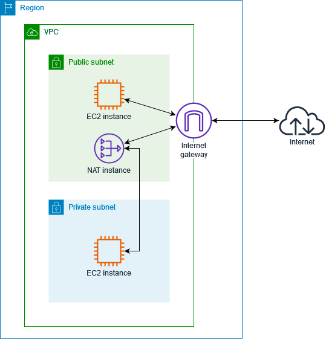
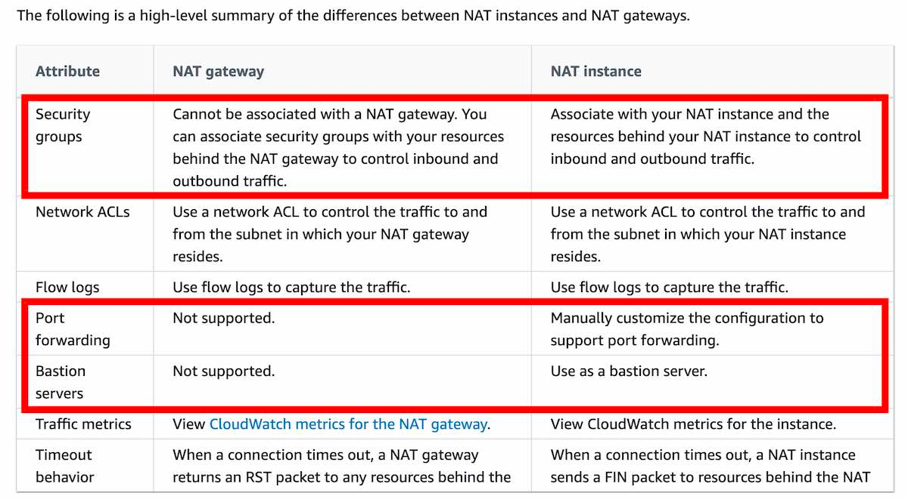
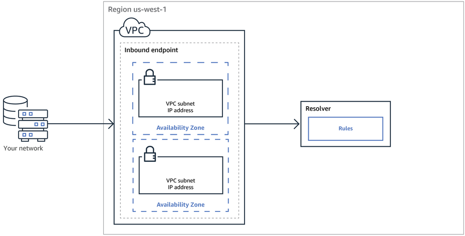
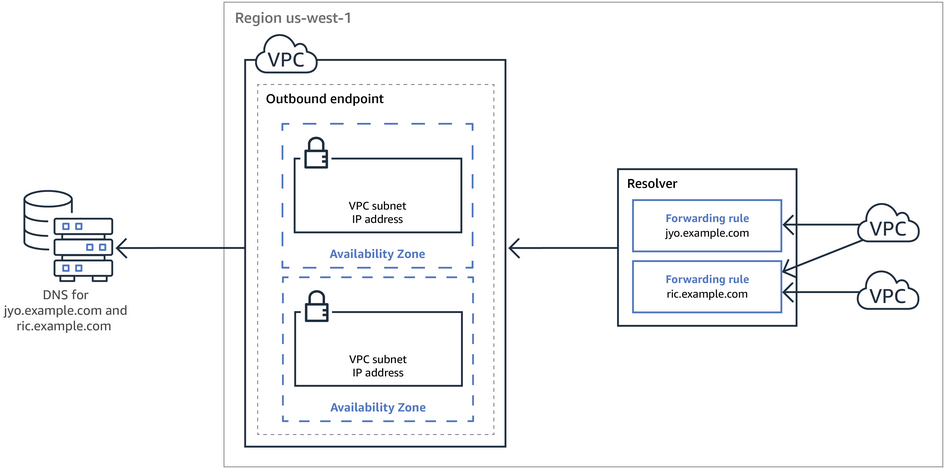

# Practice 3
## Points
### 1. 游戏公司用ALB，EC2，微服务。但是架构越来越复杂
- 很多ALB分布在不同的AWS regions，安全更新，防火墙配置，和路由逻辑太复杂，想要简化配置，减少WAF的IP地址准入规则
- 答案：使用AWS Global Accelerator，为所有的region创建endpoints，给每个region的endpoint注册ALB

### 2. 想要使用DNS创建record，完成下面的流量发送
- 从covid19survey.com -》www.covid19survey.com 应该在DNS上创建什么样的record
- Create an alias record for covid19survey.com ⭕️
- Create a CNAME record　for covid19survey.com　❌ CNAME不能route跟域名流量

### 3. EBS volume type适用于那些workload
- Provisioned IOPS SSD (io1)
  - IO intensive, throughput-intensive
- General Purpose SSD (gp2)
  - dev/test environments, low-latency interactive applications, and boot volumes
- Cold HDD (sc1)
  - less frequently accessed workloads with large, cold datasets
- Throughput Optimized HDD (st1)
  - frequently accessed, throughput-intensive workloads with large datasets and large I/O sizes, such as MapReduce, Kafka, log processing, data warehouse, and ETL workloads

### 4. SQS的削减成本方式
- short polling：默认选项，立刻发送response给请求端，即使是没有消息。
- long polling：收集到至少1条可用消息（至多定义好的maximum number）给请求端，只有当wail time过期，才会返回空response

### 8. Microsoft Active Directory是什么
- 就是一个管理系统，可以管理账户，用户名密码，服务器之类的东西
- 还支持单点登陆

### 9. EC2的租赁（tenancy）属性
- tenancy attribute
- 
  - 默认的，EC2运行在shared-tenancy hardware
  - Dedicate实例运行在一个单一客户VPC的hardware上，不同Aws account的Dedicate实例的是在hardware层面被隔开。但是在同一个aws账户里面，非dedicated实例可能会于dedicated实例共享hardware
  - Dedicate host（主机）是一个专属于单个用户的物理主机
- 关于租赁属性，只能从dedicated to host 或者 host to dedicated

### 10. ELB跨区负载均衡option
- cross-zone load balancing is enabled
- 
- cross-zone load balancing is disabled
- 

### 12. 公司想要自定义一个APP，用来process和analyze实时数据
- Amazon Kinesis Data Streams

### 13. Network Address Translation (NAT) instance vs Network Address Translation (NAT) gateway
- 在public子网的NAT instance和Nat gateway可以让在private子网的instance访问外界IPv4的互联网
- How NAT Gateway works:
- 
- How NAT Instance works：
- 
- 对比
- 

### 14. 使用ECS部署服务，使用ASG自动扩展，使用CloudWatch来触发扩展
- 配置当CloudWatch alerm‘s的CPU使用到达临界值，让ASG进行scale out
- ps：这里是CloudWatch alerm‘s的临界值，不是ECS的临界值

### 15. 公司已经给本地data center和aws建立了AWS Direct Connect，想要实现下面诉求（纯粹是英语题）
- The company wants to be able to resolve Domain Name System (DNS) queries for any resources in the on-premises network from the AWS VPC and also resolve any DNS queries for resources in the AWS VPC from the on-premises network.
- 想要解析来自AWS针对本地的任何资源的DNS查询，想要解析来自本地针对AWS的任何资源的DNS查询
- Create an inbound endpoint on Amazon Route 53 Resolver and then DNS resolvers on the on-premises network can forward DNS queries to Amazon Route 53 Resolver via this endpoint
- 
- Create an outbound endpoint on Amazon Route 53 Resolver and then Amazon Route 53 Resolver can conditionally forward queries to resolvers on the on-premises network via this endpoint
- 

### 16. 高度可用且容错的解决方案来从源捕获点击流（click stream）事件，然后向下游应用程序提供数据流的并发源（concurrent）
- Amazon Kinesis Data Streams：对，实时流数据处理，当您需要多个应用程序能够同时使用同一流时（concurrent），建议使用 Amazon Kinesis Data Streams
- Amazon Kinesis Data Firehose：错，加载流数据到数据存储和数据分析工具上，load流数据到数据存储

### 17. 想要跨账户协调可用区，必须使用
- AZ ID，可用区ID，是可用区的唯一且一致的标识符。 例如，usw2-az2 是 us-west-2 区域的可用区 ID，它在每个 AWS 账户中具有相同的位置。

### 19. 一个系统有些功能处理快，有些功能处理满，想变成微服务，怎么结偶
- SQS：Amazon SQS 允许解耦应用程序组件，以便程序组件独立运行和失败，从而提高系统的整体容错能力。能够存储消息并replay它们是解耦系统架构的一个非常重要的功能

### 25. 

