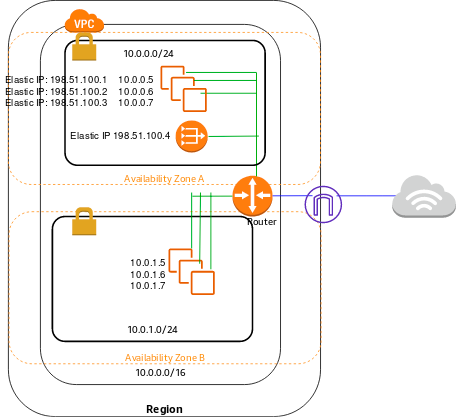
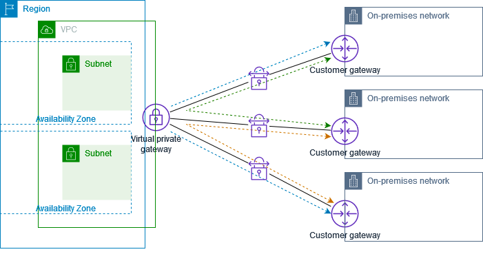

# Practice 3
## Points
### 1. 游戏公司用ALB，EC2，微服务。但是架构越来越复杂
- 很多ALB分布在不同的AWS regions，安全更新，防火墙配置，和路由逻辑太复杂，想要简化配置，减少WAF的IP地址准入规则
- 答案：使用AWS Global Accelerator，为所有的region创建endpoints，给每个region的endpoint注册ALB

### 2. 想要使用DNS创建record，完成下面的流量发送
- 从covid19survey.com -》www.covid19survey.com 应该在DNS上创建什么样的record
- Create an alias record for covid19survey.com ⭕️
- Create a CNAME record　for covid19survey.com　❌ CNAME不能route跟域名流量

### 3. EBS volume type适用于那些workload
- Provisioned IOPS SSD (io1)
  - IO intensive, throughput-intensive
- General Purpose SSD (gp2)
  - dev/test environments, low-latency interactive applications, and boot volumes
- Cold HDD (sc1)
  - less frequently accessed workloads with large, cold datasets
- Throughput Optimized HDD (st1)
  - frequently accessed, throughput-intensive workloads with large datasets and large I/O sizes, such as MapReduce, Kafka, log processing, data warehouse, and ETL workloads

### 4. SQS的削减成本方式
- short polling：默认选项，立刻发送response给请求端，即使是没有消息。
- long polling：收集到至少1条可用消息（至多定义好的maximum number）给请求端，只有当wail time过期，才会返回空response

### 8. Microsoft Active Directory是什么
- 就是一个管理系统，可以管理账户，用户名密码，服务器之类的东西
- 还支持单点登陆

### 9. EC2的租赁（tenancy）属性
- tenancy attribute
- 
  - 默认的，EC2运行在shared-tenancy hardware
  - Dedicate实例运行在一个单一客户VPC的hardware上，不同Aws account的Dedicate实例的是在hardware层面被隔开。但是在同一个aws账户里面，非dedicated实例可能会于dedicated实例共享hardware
  - Dedicate host（主机）是一个专属于单个用户的物理主机
- 关于租赁属性，只能从dedicated to host 或者 host to dedicated

### 10. ELB跨区负载均衡option
- cross-zone load balancing is enabled
- 
- cross-zone load balancing is disabled
- 

### 12. 公司想要自定义一个APP，用来process和analyze实时数据
- Amazon Kinesis Data Streams

### 13. Network Address Translation (NAT) instance vs Network Address Translation (NAT) gateway
- 在public子网的NAT instance和Nat gateway可以让在private子网的instance访问外界IPv4的互联网
- How NAT Gateway works:
- 
- How NAT Instance works：
- 
- 对比
- 

### 14. 使用ECS部署服务，使用ASG自动扩展，使用CloudWatch来触发扩展
- 配置当CloudWatch alerm‘s的CPU使用到达临界值，让ASG进行scale out
- ps：这里是CloudWatch alerm‘s的临界值，不是ECS的临界值

### 15. 公司已经给本地data center和aws建立了AWS Direct Connect，想要实现下面诉求（纯粹是英语题）
- The company wants to be able to resolve Domain Name System (DNS) queries for any resources in the on-premises network from the AWS VPC and also resolve any DNS queries for resources in the AWS VPC from the on-premises network.
- 想要解析来自AWS针对本地的任何资源的DNS查询，想要解析来自本地针对AWS的任何资源的DNS查询
- Create an inbound endpoint on Amazon Route 53 Resolver and then DNS resolvers on the on-premises network can forward DNS queries to Amazon Route 53 Resolver via this endpoint
- 
- Create an outbound endpoint on Amazon Route 53 Resolver and then Amazon Route 53 Resolver can conditionally forward queries to resolvers on the on-premises network via this endpoint
- 

### 16. 高度可用且容错的解决方案来从源捕获点击流（click stream）事件，然后向下游应用程序提供数据流的并发源（concurrent）
- Amazon Kinesis Data Streams：对，实时流数据处理，当您需要多个应用程序能够同时使用同一流时（concurrent），建议使用 Amazon Kinesis Data Streams
- Amazon Kinesis Data Firehose：错，加载流数据到数据存储和数据分析工具上，load流数据到数据存储

### 17. 想要跨账户协调可用区，必须使用
- AZ ID，可用区ID，是可用区的唯一且一致的标识符。 例如，usw2-az2 是 us-west-2 区域的可用区 ID，它在每个 AWS 账户中具有相同的位置。

### 19. 一个系统有些功能处理快，有些功能处理满，想变成微服务，怎么结偶
- SQS：Amazon SQS 允许解耦应用程序组件，以便程序组件独立运行和失败，从而提高系统的整体容错能力。能够存储消息并replay它们是解耦系统架构的一个非常重要的功能

### 25. 在sites之间提供安全的沟通手段 - VPN CloudHub
- 如果有多个AWS的Site-to-Site的VPN链接，这时候可以使用VPN CloudHub提供一种安全的沟通手段
- 

### 27. 公司有一些自己的本地服务器，想要挪到云上。同时一些软件和license也想要在云上继续用
- Use Amazon EC2 dedicated hosts ⭕️
  - 在专有的物理机上面launch EC2实例。可以有额外的权限来控制这个服务器
  - 可以使用现存的软件licenses，比如windows服务器
- Use Amazon EC2 dedicated instances ❌
  -  部署在VPC上的硬件上的，专属于一个用户的EC2
  - 这个实例在物理层面上和其他用户的实例是隔开的，但是和本用户的非dedicated实例，有可能公用hardware
  - 不能使用几寸的软件licenses

### 28. 公司想要进行HPC工作负载，把这些工作转到AWS上面
- Elastic Fabric Adapter (EFA)：可以attach到实例上的网络设备，可以进行HPC和机器学习。还提供了ENA的所有功能，外加一个新的操作系统硬件接口，可直接与硬件沟通
  - 
- Elastic Network Interface (ENI)：就是一个VPC中存在的虚拟网卡，可以attach到实例上，也可以从实例上取下来，安到别的实例上。但是执行HPC，不够看
- Elastic Network Adapter (ENA) ：提供加强办网络，可以执行HPC。但是功能没有EFA全，有EFA选EFA，无EFA选ENA

### 30. 公司在不同的region有想要upload/download video，最大的文件，能到达10GB，怎么加快速度，提升体验
- Amazon S3 Transfer Acceleration (Amazon S3TA)： ⭕️
- Amazon CloudFront：❌，只有object的大小是小于1GB的时候可以使用

### 32. EC2 launch configuration
- 当configuration指定的EC2实例类型（dedicated or shared）和vpc默认的类型不一样的时候，有限使用configuration
- 

### 34. 使用cloudwatch自动触发修复受损的EC2，在EC2恢复之后，什么不变
- instance ID, private IP addresses, Elastic IP addresses, and all instance metadata
- public IPv4 address

### 35. Service Control Policies(SCPs) 组织中所有账户的最大可用权限进行集中控制
- 如果一个user或者role有一个IAM权限policy，这个policy既没有被允许执行某个动作，也没有明确拒绝可以执行这个动作，则默认不能执行这个动作
- SCP影响所有的users和roles，包括root
- SCP不影响任何服务相关（service-linked）role

### 37. 复制来自不同数据库的数据，传输到Redshift
- AWS Database Migration Service 可帮助您快速、安全地将数据库迁移到 AWS。迁移过程中，最大程度减少以来数据库和程序的停止时间。可以将数据传输到Redshift和S3，将数据整合到PB级别的数据库中
- 
- Amazon Redshift是一个完全托管的，petabyte-scale级别的数据仓库。
- 在数据库迁移到 Amazon Redshift 期间，AWS DMS 首先将数据移动到 Amazon S3 存储桶。 当文件驻留在 Amazon S3 存储桶中时，AWS DMS 会将它们传输到 Amazon Redshift 数据仓库中的正确表。

### 40. 关于spot实例
- 一个spot实例请求既可以是one-time也可以是persistent，如果请求是persistent，
  - 在spot实例被interrupted之后，请求会再次开启
  - 并且stop了实例，则request只会在重新start spot实例后开启
- 
- spot fleet通过在实例被terminated之后发布替换的实例，来维持目标数量
- 当cancle一个或者的spot request的，不会terminal 关联（associated）的实例

### 41. 数据库迁移，可以处理复杂的db配置，比如secondary indexes, foreign keys, and stored procedures
- AWS Schema Conversion Tool (AWS SCT)
- AWS Database Migration Service (AWS DMS)
- Basic Schema Copy ❌　只能做简单的test，不能处理secondary indexes, foreign keys, and stored procedures

### 43. 零售公司网站的数据库后端托管在 Amazon RDS for MySQL 上，具有一个主实例和三个只读副本以支持读取可扩展性。 该公司强制要求只读副本落后主实例的时间不得超过 1 秒，以提供最佳的用户体验。 在流量高峰期间，只读副本会进一步落后，导致搜索产生不一致的结果，从而导致糟糕的用户体验
- 设置从 Amazon RDS MySQL 到 Amazon Aurora MySQL 的数据库迁移。 将 MySQL 只读副本替换为 Aurora 副本。 配置 Aurora Auto Scaling
- > Aurora 具有分布式、容错和自我修复的存储系统，该系统与计算资源分离，并且每个数据库实例可自动扩展到 128 TiB。 它通过最多 15 个低延迟只读副本、时间点恢复、持续备份到 Amazon Simple Storage Service (Amazon S3) 以及跨三个可用区 (AZ) 的复制来提供高性能和可用性。
- > 由于 Amazon Aurora 副本与同一 AWS 区域中的主实例共享相同的数据量，因此几乎不存在复制延迟。 副本延迟时间为 10 毫秒（与 MySQL 只读副本的复制延迟数秒相比）。 因此，这是确保只读副本落后主实例不超过 1 秒的正确选择。

### 44. 公司想建立aws organization去管理一些部门的account
- 这些部分来个不同的国家分布在不同的aws regions，公司想建立一套资源配置逻辑，然后每个部门都用这套逻辑，以便每个资源都遵循预定义的配置，例如使用特定类型的 Amazon EC2 实例、AWS Lambda 函数的特定 IAM 角色等
- Answer：使用 AWS CloudFormation StackSets 跨 AWS 账户和区域部署相同的模板

