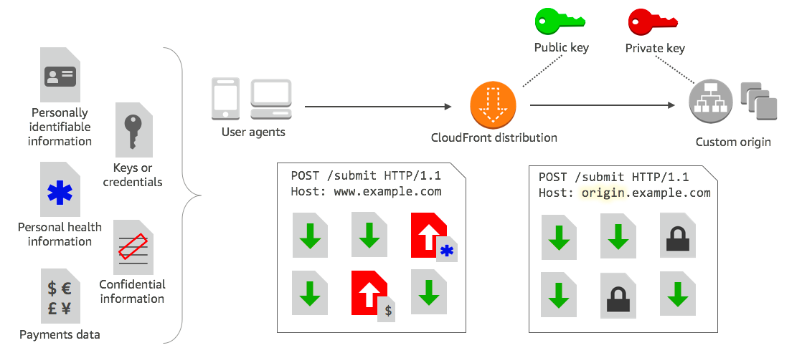
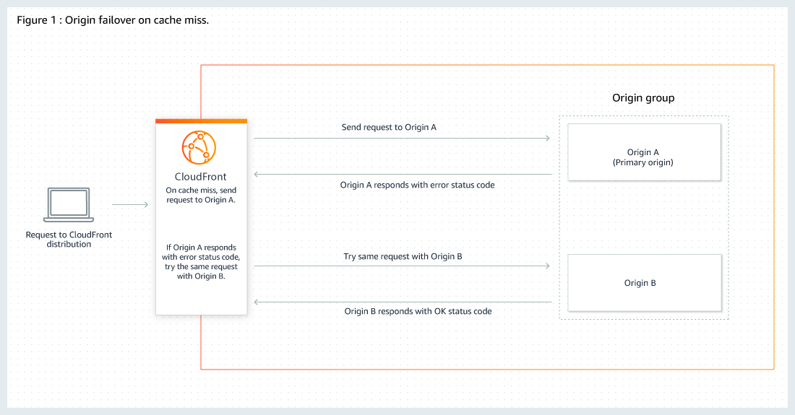
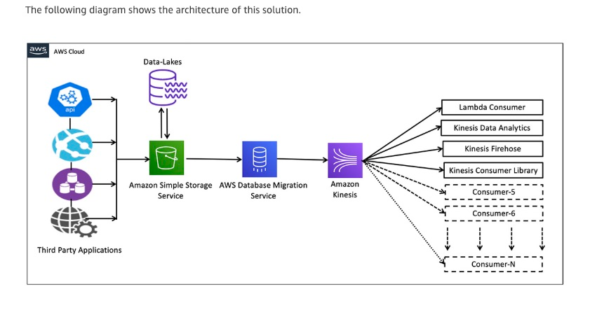
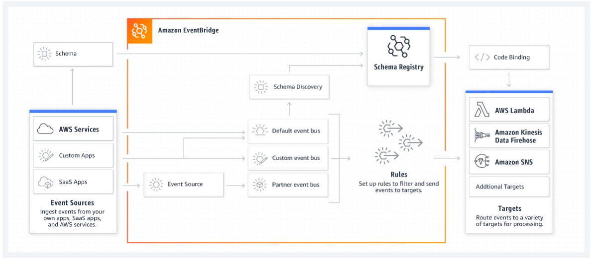
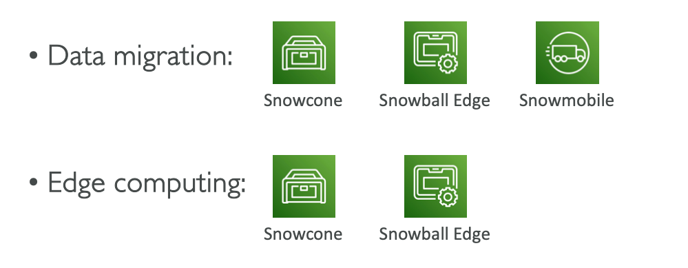
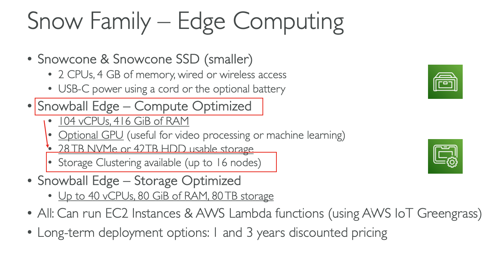

# Practice 4
## 1. 灾难回复策略 disaster recovery strategy
### Pilot Light  
用于暂难恢复，适中运行着一个环境的最小版本（a minimal version of an environment is always running in the cloud）。有点类似于备份
恢复场景，比如：使用aws维护一个只有核心功能的环境，当需要进行灾难恢复的时候，可以根据这个核心环境，快速配置一个full环境的版本

### Warm Standby  
是pilot light的升级版，适中运行了一个最小版本，但是全功能的环境。能进一步减少恢复时间

### Backup and Restore  
在大多数传统环境中，数据被备份到磁带并定期发送到异地。 如果您使用此方法，在发生中断或灾难时可能需要很长时间才能恢复系统。

### Multi Site  
在云上和本地配置full功能的环境，数据的复制时机是由自己来决定

## 2. CloudFront补充
### 加密敏感信息： Using field-level encryption to help protect sensitive data  

### 多源保证高可用/FailOver：Use an origin group with primary and secondary origins to configure Amazon CloudFront for high-availability and failover

## 4. 一个ALB路由多个engpoints的https的流量 
### Use Secure Sockets Layer certificate (SSL certificate) with SNI
有多个apps，就可以为每个app配置TLS证书，他们都被一个LB路由流量。要使用SNI，只需要把多个证书帮到LB上的同一个listener，LB会自动做选择

## 5. 由于周末计划进行限时抢购，流量将会激增。 您估计网络流量为 10 倍。 您网站的内容高度动态且经常变化
### 看到高度变化，使用ASG，而不是cloudfront

## 9. 系统峰值时候达到10倍，怎么保证高可用同时，降低成本
### 设置ASG最小数量到2 Set the minimum capacity to 2  
就算一个实例倒了，还有另一个。 为什么不设置为3，因为不是最低成本的  

### 使用预留实例（Reserved Instances (RIs)） Use Reserved Instances (RIs) for the minimum capacity  
因为预留实例比on-demand的便宜

## 10. 公司想要一个强壮的灾难恢复策略，保证最小的数据丢失和程序性能  
### 多可用区故障转移： Opt for Multi-AZ configuration with automatic failover functionality to help mitigate failure
Data-loss potential - Low  
Performance impact - Low  
Cost - Low to high  

## 12. 网站使用beanstalk部署，安装一次需要45min，包括动态静态文件，启动动态文件需要在安装的时候自动生成，怎么减少时间
### 创建安装完后的EC2 IAM  
直接使用IAM启动

### 使用user data，在开机时间（boot time）的时候自定义动态文件部分的安装  
可以使用 Amazon EC2 userdata在启动时自定义动态安装部分，而不是在启动时安装应用程序本身。

## 16. 放置s3的object在一段时间内被删除
### Use Amazon S3 Object Lock  
但是不能用S3 Glacier Vault Lock，这个只是针对Glacier的

## 20. serverless架构补充说明
### Lambda可以重建一个Layer存放公用的代码（reusable code），这样可以减少重复代码开发
可以以为layer的形式提取代码，包含库，自定义运行时等等，然后当成一个zip存档。可以在函数中直接使用

### Lambda方便扩展，可以部署cloudwatch alarm，超过阈值通知团队  
部署一个 Amazon CloudWatch 警报，当并发执行或调用等函数指标超过您的阈值时，该警报会通知您的团队

## 21. 降低EC2的成本
### 使用AWS Cost Explorer  
识别第使用率的EC2实例，未来会逐渐缩小规模。

### 使用AWS Compute Optimizer   
计算出最佳的aws compute资源，降本增效  

## 24. S3当作数据源，load到kinesis stream中，最快的方式
### 使用AWS Database Migration Service (AWS DMS)  
Leverage AWS Database Migration Service (AWS DMS) as a bridge between Amazon S3 and Amazon Kinesis Data Streams。

不能使用Amazon EventBridge events来触发Lambda，在加载到kinesis streams： 这个方案启动CloudTrail去使用object-level的actions来作为触发器。并且需要大量写代码，所以不是最快的

## 25. NoSQL数据库当作主数据库：single-digit millisecond latency，水平扩展，无服务器
### DynamoDB  
单个letter的数字延迟，key-value的document数据库。完全托管，跨区，多master，持久化的NoSql。
但是不能使用redis集群，因为elastic redis不能当作主数据库

## 26. Saas App把更新feeds给其他的内部的（in-house）和第三方（3rd party）app，怎么实现结偶
### Event-Bridge和SNS都可以  
但是SNS不能和第三方整合，只有Event-bridge可以整合第三方，所以选择event-bridge

## 31. DynamoDB两种mode的适用case
### on-demand mode
- table的workload未知
- 不可预测的app流量
- 更喜欢用多少付多少钱

### provisioned mode
- 可预测的流量
- app流量稳定或逐渐增加的app
- 预测容量需求以控制成本

## 32. EC2实例不能被ping，
### 可能的原因
- 被安全组block
- 没有配置internet gateway的路由表
### internet gateway详解
- 一个用来沟通在vpc中的ec2实例和网络的vpc组件，主要有2个目的
  - 给vpc的路由表提供一个可以和外部互联网沟通的目的地/目标（target）
  - 为已分配公共 IPv4 地址的EC2实例执行网络地址转换 (NAT)
### 要是在一个vpc中子网的实例连接到网络需要做
- attach一个internet gateway到vpc上
- 加一条路由规则在子网的路由表上面，让网络流量可以访问到internet gateway
- 确保EC2实例有一个全球唯一的ip地址
- 确保ACL和安全组允许流量进入/发出到EC2实例上

## 33. Snow Family
### 高安全，便携设备，在edge location收集和处理数据，并且迁移到aws

### Snow Edge-compute optimized有存储集群功能（storage cluster）

## 35. 
