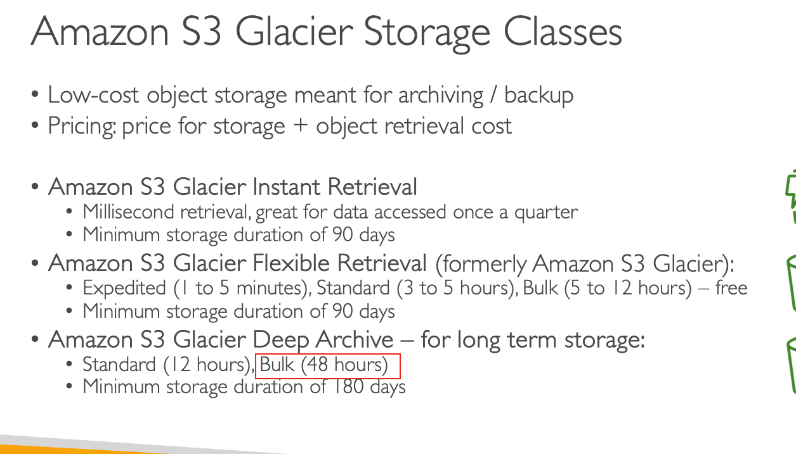

# Practice 5
## 2. cross-zone load balancing  

## 3. 公司想要缓存，并且支持地理空间数据（geospatial data）
- ElastiCache for Redis 对的
- ElastiCache for Memcached 错的，支持缓存，但是不支持地理空间数据

## 4. AWS DataSync & Storage Gateway
### AWS DataSync 移动大量数据
- 从/到 本地数据中心/AWS - 需要agent
- aws 到 aws

### AWS Storage Gateway
#### 本地和AWS之间的桥梁 
使用case：  
- 灾难恢复
- 备份恢复
- 分层存储 tiered storage
- 本地缓存，低延迟访问文件 on-premises cache & low-latency files access

分类：  
- S3 File Gateway
- FSx File Gateway
- Volume Gateway
- Tape Gateway
 

## 5. 想要一个数据库  
### 跟随时间改变数据的属性（attribute）/ 有自动扩展功能 / 输出留的能力  

## 9. 重要文件存储在S3，但是太高，怎么减少，并且需要的操作最少  
### S3 Intelligent-Tiering storage class  
被设计成依靠自动切换访问层来降低成本的class， 有两层：  
1，被频繁访问的层
2，不被频繁访问的层  
  

## 10. Amazon DynamoDB加密信息无法找到  
默认情况下，所有 Amazon DynamoDB 表均使用 AWS 拥有的密钥进行加密，这些密钥不会写入 AWS CloudTrail 日志  

## 11. 英语题目： 翻译
The engineering team wants to address any data discrepancies that might arise when the trading system overwrites an existing log file and then tries to read that specific log file.  
工程团队希望解决当交易系统覆盖现有日志文件然后尝试读取该特定日志文件时可能出现的任何数据差异。

## 13 长期保存数据，为了审查需要，保存的数据需要48小时内取出  

## 17. S3静态网站的endpoint
  

## 18. 多个消费者程序消费Kinesis Streams的数据，有滞后性  
默认情况下： 多有的消费者共享2MB/shared的数据，如果想要每个消费者有自己独立的2MB/shard可以用，使用Enhance-fan out功能  

## 20. Launch Template(Older Launch Configuration)
### Auto Scaling 组用于启动 Amazon EC2 实例的实例配置模板  
可以指定如下的配置
  

指定instance type的时候，一旦指定，则不能修改，所以想改的话，只能重新创建一个configuration，
让asg使用新的configuration，然后删除旧的  

## 22. ELB 发生故障从而导致流量下降时，具有跨 AWS 区域的全球用户的应用程序遇到了问题
### 怎么减少延迟，并且提供跨区域的故障转移  

## 25. 提高Aurora DB可用性
### 2个
- 建立reader的endpoint，读请求走到reader里面
- 在另外AZ建立replica，提高可用性  

## 28. WAF可以被部署到哪里

## 33. AWS Trusted Advisor  
AWS Trusted Advisor 是一款在线工具，它借鉴了从 AWS 为数十万 AWS 客户提供服务的汇总运营历史中学到的最佳实践。 AWS Trusted Advisor 会检查您的 AWS 环境并提出节省资金、提高系统性能或缩小安全漏洞的建议。 它会扫描您的 AWS 基础设施，并将其与五个类别（成本优化、性能、安全性、容错、服务限制）的 AWS 最佳实践进行比较，然后提供建议。  

## 35. 
