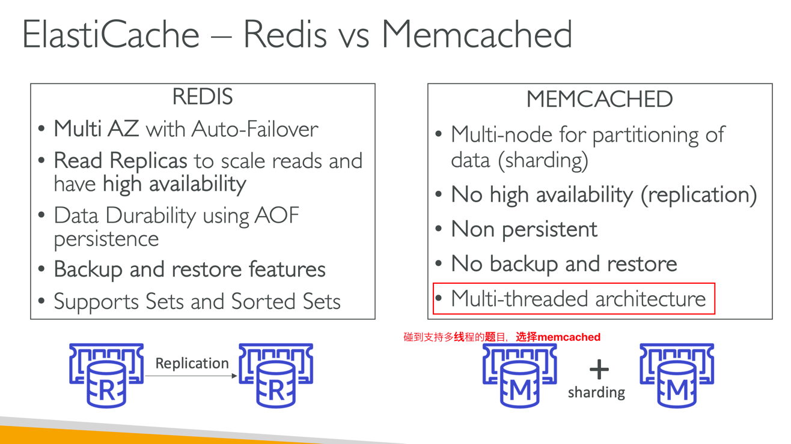
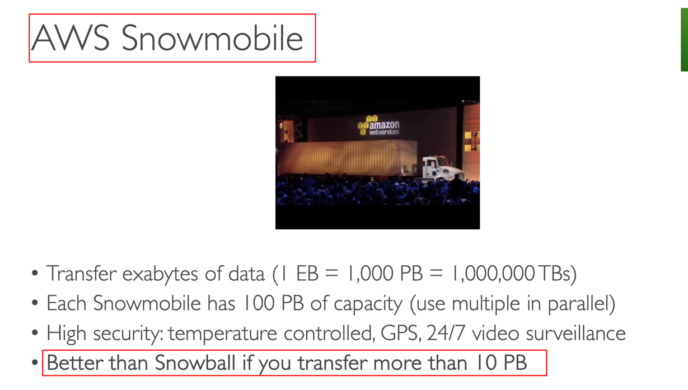

# Practice 6
## 1. 获得s3中object的某一部分bytes数
### S3 Byte-Range Fetches

## 3. AWS Glue
### 托管的抽取，转换，加载（ETL）服务
AWS之外：AWS Database Migration Service (DMS) 是数据库搬家服务，可以把别的云或者本地的数据库搬家到aws上。  
AWS内：AWS Glue

## 5. 数据库在report 队伍读取数据的时候慢
### 建立read replica，但是要和主数据库有相同的computed capacity和storage

## 6. 两个队列，A队列有限处理，B队列不有限
### 错误答案： long polling/short polling。这个只是拉取消息的方式不同，并不能代表优先级  
### 正确答案： 队列的Priority功能

## 7. Redis和Memcached区别

## 9. 如果EC2已经是running状态，怎么改变DeleteOnTermination属性的值
### 使用command line

## 12. VPC内有一个domain，怎么定义路由规则
### 创建一个private hosted zone，这是一个record的容器
一个record可以告诉route53，在一个VPC内的domain，流量应该怎么样被路由。同时应该修改下面的两个设定  
**enableDnsHostnames**  
**enableDnsSupport**

## 13. 数据库是Multi-AZ的，指定了定时升级的任务，那么多个AZ中的数据库如何升级？
### 多个az的primary和standby数据库同时时候，在完成之前会有数据库downtime

## 14. Elastic Fabric Adapter (EFA)

## 15. 用户要访问s3，必须通过cloudfront，怎么做？

## 19. Amazon Simple Queue Service (Amazon SQS) temporary queues
### 使用request-response的常用消息模式，帮助减轻开发和部署成本。使用临时队列来创建高吞吐，经济高效的队列

## 22. 关于Amazon RDS Multi-AZ，有下面的说法
- Amazon RDS会先更新standby数据库所在OS，然后把standby转换成primary数据库，但后去更新primary数据库那边
- primary自动failover到standby
- standby数据库不能接受read请求

## 24. Network access control list (network ACL) 
### 在子网级别起作用，不是ec2实例级别作用

## 28. Amazon EMR

## 30. A Spot fleet 
### 不仅可以有Spot Instances，也可以optionally选择on-demand的实例

## 31. EBS and RAID configuration

## 33. AWS Firewall Manager管理范围

## 34. Amazon Kinesis Data Streams / Amazon Kinesis Data Analytics
试试处理和分析数据，但是不提供长期的存储，（不想数据库）。如果题目中有出现存储的字样，用Firehose

## 43. ASG的替换EC2 instances策略
先停止旧的，在开启新的 对的  
先开启新的，在停止旧的 错误

## 47. SSE-S3加密
每个对象都使用唯一密钥进行加密。 作为额外的保护措施，它使用定期轮换的根密钥对密钥本身进行加密。  
每个object，都有唯一一个unique key

## 51. EBS attach到多个EC2上，EBS的type是什么？

## 54. 支持replication and archival的缓存

## 55. 传输20PB的文件

## 62. 符合POSIX标准的文件系统  

