# Practice 1
## S3Ta 加速文件上传
如果上传完发现没有被加速，那么就不需要付加速的费用。S3Ta只会请求被加速上传的部分

## GuardDuty可以对哪些服务进行可靠性check
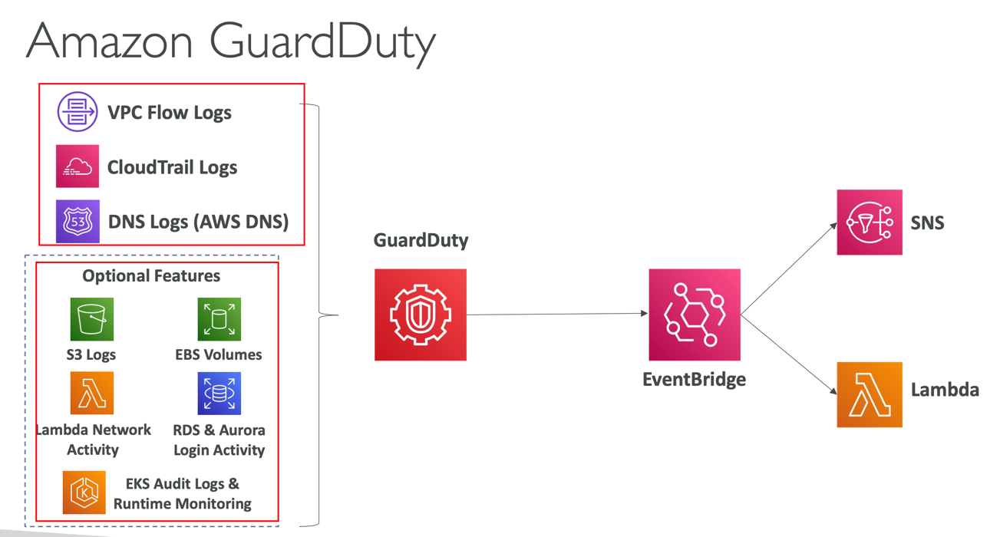

## 当复制一个AMI镜像从一个region到另一个region的时候
当新的 AMI 从区域 A 复制到区域 B 时，它会自动在区域 B 中创建快照，因为 AMI 基于底层快照。
如果在B region中创建了一个instance，那么就会有3个新的资源来B region：AMI，snapshot，instance

## 给DynamoDB做缓存有限DAX（Amazon DynamoDB Accelerator (DAX)）
虽然用Redis也可以，但是会更复杂，题目一般要求更加的快捷，所以用DAX

## Lambda支持的并发数量
AWS Lambda 目前支持每个区域每个 AWS 账户 1000 个并发执行，如果超过需要联系support提高limit

## ASG的max/min/desired数量
- 如果想要一个固定数量：desired
- 如果想要一个数量范围：min - max

## Practice 2
## S3在2个AZ中的桶，一个是另一个的副本，然后必须使用同样的key来加密解密
Create a new Amazon S3 bucket in the us-east-1 region with replication enabled from this new bucket into another bucket in us-west-1 region. Enable SSE-KMS encryption on the new bucket in us-east-1 region by using an AWS KMS multi-region key. Copy the existing data from the current Amazon S3 bucket in us-east-1 region into this new Amazon S3 bucket in us-east-1 region

在 us-east-1 区域中创建一个新的 Amazon S3 存储桶，并启用从该新存储桶到 us-west-1 区域中的另一个存储桶的复制。使用 AWS KMS 多区域密钥对 us-east-1 区域中的新存储桶启用 SSE-KMS 加密。将现有数据从 us-east-1 区域中的当前 Amazon S3 存储桶复制到 us-east-1 区域中的新 Amazon S3 存储桶中


## ASG停止EC2 顺序
1. on-demand or spot instance
2. oldest launch template（如果使用了configuration，那么先停止oldest launch configuration）
3. oldest launch configuration
4. 下一个费用结算周期最近的实例

## 本地机器和EFS API相连
To establish a private connection between your virtual private cloud (VPC) and the Amazon EFS API, you can create an interface VPC endpoint. You can also access the interface VPC endpoint from on-premises environments or other VPCs using AWS VPN, AWS Direct Connect, or VPC peering.
AWS Direct Connect provides three types of virtual interfaces: public, private, and transit.

## RDS副本加密相关
On a database instance running with Amazon RDS encryption, data stored at rest in the underlying storage is encrypted, as are its automated backups, read replicas, and snapshots. Therefore, this option is correct.


## 下列policy代表
```json
{
  // 2 在看这个，只有当条件满足的时候，这个policy才生效
  // 意味着，当ec2的区域不是us-west-1，这个才生效，和1结合起来就是，
  // 关闭别的区域的ec2的时候，就生效，
  // 但是关闭us-west-1的时候，不生效。所以可以关闭us-west-1的实例
    "Version":"2012-10-17",
    "Id":"EC2TerminationPolicy",
    "Statement":[
        {
            "Effect":"Deny",
            "Action":"ec2:*",
            "Resource":"*",
            "Condition":{
                "StringNotEquals":{
                    "ec2:Region":"us-west-1"
                }
            }
        },
      // 1 先看这个，代表可以关闭所有的ec2
        {
            "Effect":"Allow",
            "Action":"ec2:TerminateInstances",
            "Resource":"*",
            "Condition":{
                "IpAddress":{
                    "aws:SourceIp":"10.200.200.0/24"
                }
            }
        }
    ]
}
```

## Amazon RDS MySQL 存储枯竭
Enable storage auto-scaling for Amazon RDS MySQL

## Practice 3
### DynamoDB发现脏数据后回滚
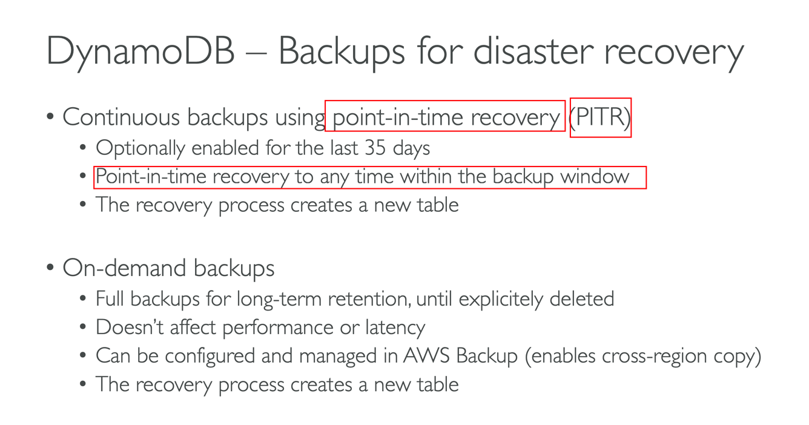

### SecurityGroup不能把Internet Gateway ID 当作target
一下是可以当作SG目标的资源
- 单个ip
- ip范围
- aws服务的前缀list id
- 另一个sg
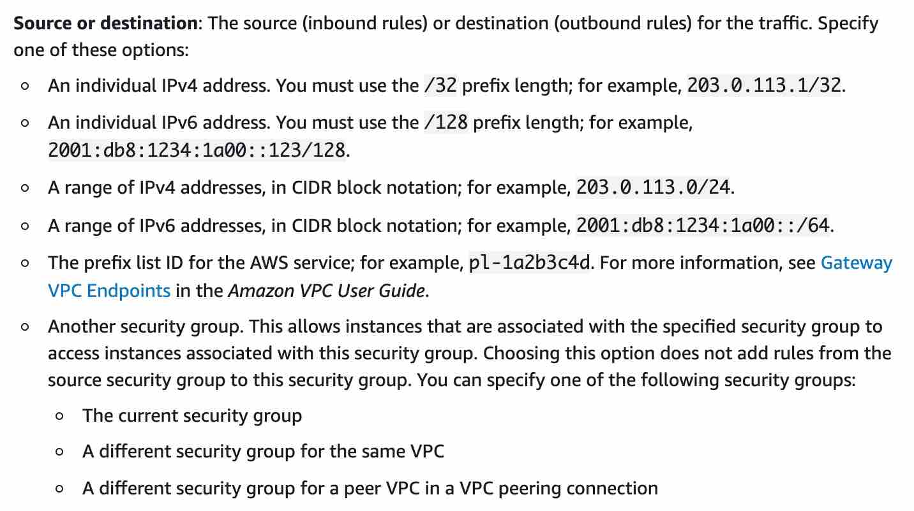

### EC2的tenancy转换
dedicate 和 host相互转化 OK

## Practice 4
### DynamoDB改变了以后，发送email
使用DynamoDB stream + Lambda。
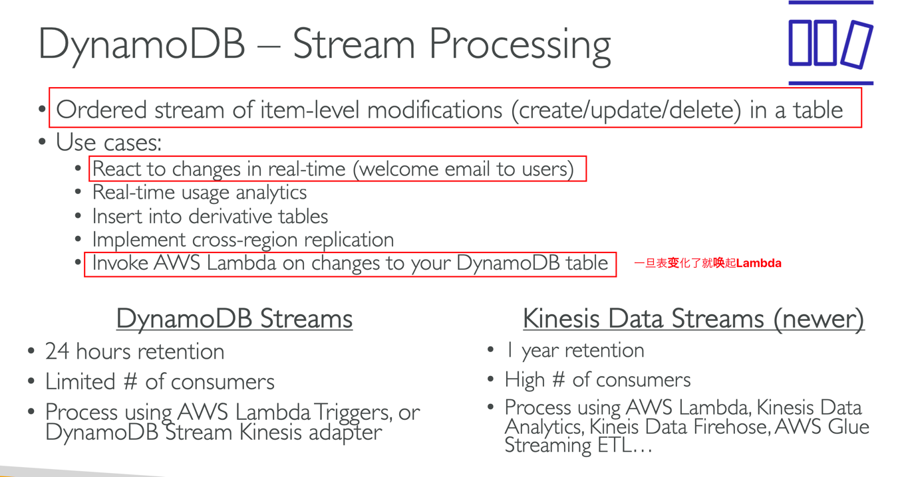
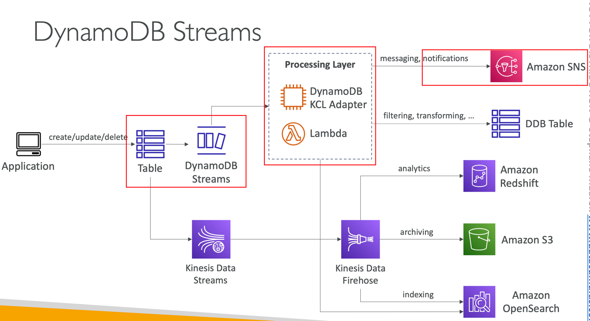

### identity-based policy vs resource-based policy
identity-based policy： 就是作用在user/account/organization上面的policy
resource-based policy： 作用在s3服务或者资源上面的，比如s3 桶和object

以上两种都支持的是trust policy，就是规定哪些人能用哪些服务。哪些服务可以被哪些人或者主体使用
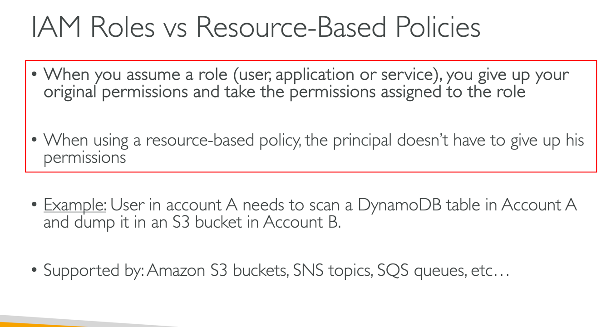

### Disaster Recovery Strategies
- For Pilot light, RPO/RTO is in 10s of minutes
- For Backup and Restore, RPO in hours  
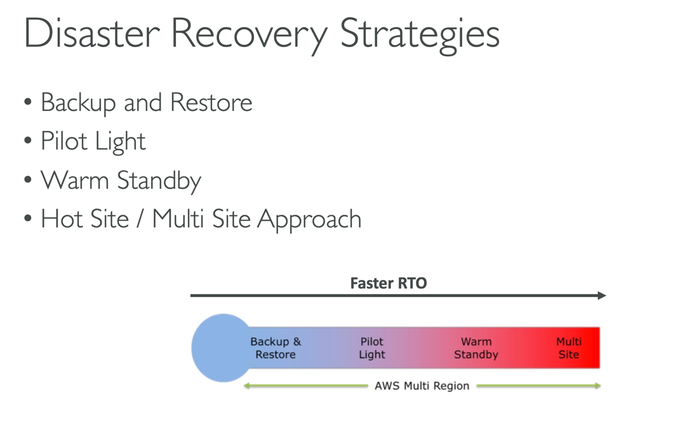
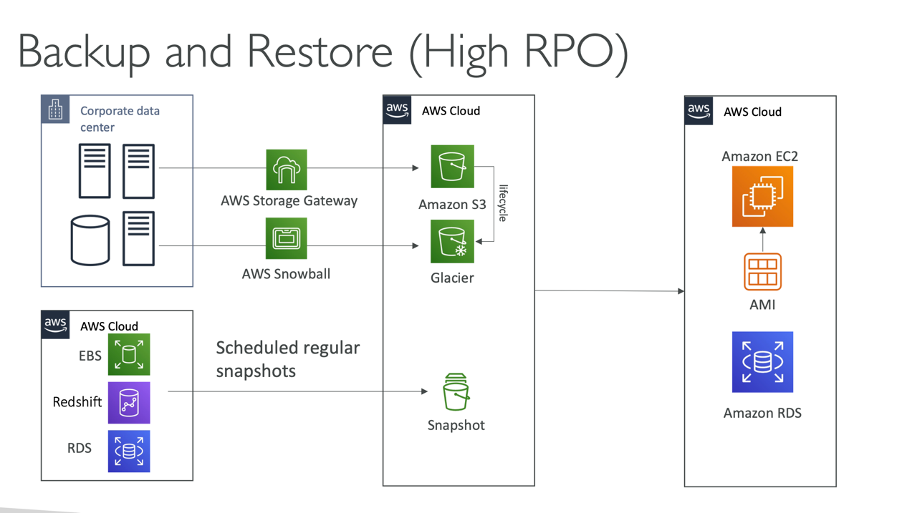
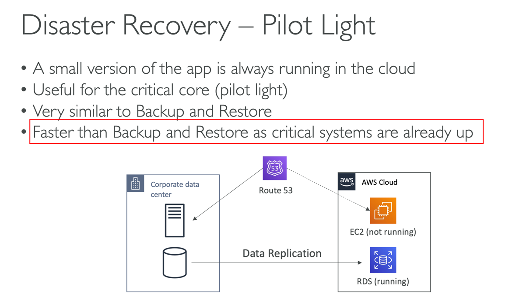
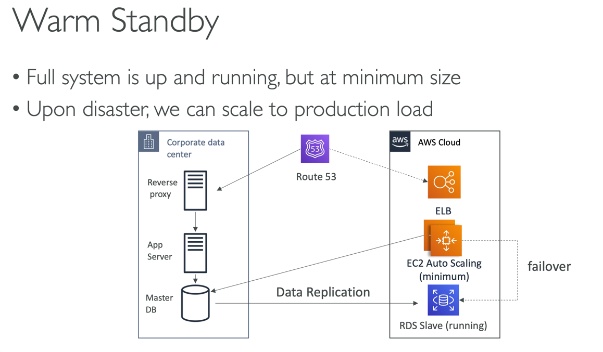
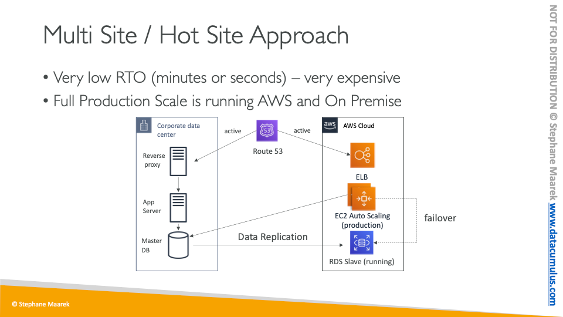


### Lambda和DB使用用户名和密码相连，怎么提高安全性
- Attach an AWS Identity and Access Management (IAM) role to AWS Lambda（给lambda一个entity，然后给entity可以连接db的role）
- Use IAM authentication from AWS Lambda to Amazon RDS PostgreSQL
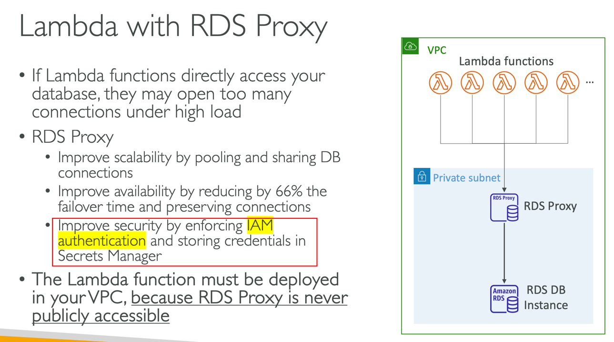

### 看到异步，缓存图像，压缩，可以优先考虑SQS
Amazon SQS will allow you to buffer the image compression requests and process them asynchronously. It also has a direct built-in mechanism for retries and scales seamlessly.

### 使用encrypt in transit来加强app连接RDS的安全性
Using SSL, you can encrypt a PostgreSQL connection between your applications and your PostgreSQL DB instances. You can also force all connections to your PostgreSQL DB instance to use SSL.
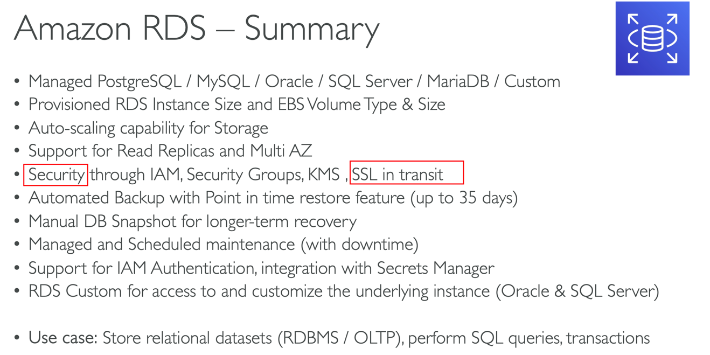

注意不能ssh到RDS的实例上去，一旦选项中出现，就是错的


### API Gateway Caching
缓存endpoint的response，启用缓存可以
- 减少接口被调用的数量
- 默认TTL 300s，最大值3600s

## Practice 5
### RDS 数据库备份和灾难恢复
- Use cross-Region Read Replicas
- Enable the automated backup feature of Amazon RDS in a multi-AZ deployment that creates backups across multiple Regions

注意上面第二点一定是multiple region，不能是single region，因为region down了，就不能恢复了，一定是多region

### S3的object被写入，并且同时被read，怎么避免数据差异
- A process replaces an existing object and immediately tries to read it. Amazon S3 always returns the latest version of the object
- 进程替换现有对象并立即尝试读取它。 Amazon S3 始终返回对象的最新版本

### 分析S3的object的工具 Athena
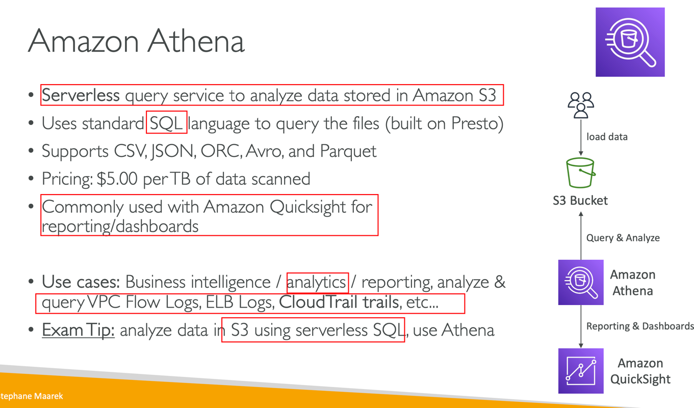


### AWS WAF可以被部署到 3A2C
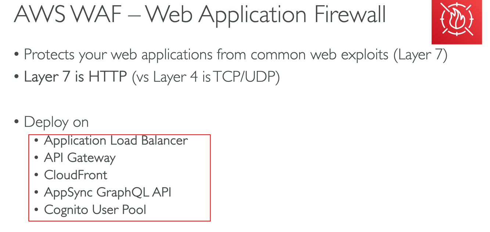

### S3的object的metadata不能被s3加密
所以metadata不能保存敏感信息  
object包括：
- Key – The name that you assign to an object. You use the object key to retrieve the object.
- Version ID – Within a bucket, a key and version ID uniquely identify an object.
- Value – The content that you are storing.
- Metadata – A set of name-value pairs with which you can store information regarding the object.
- Subresources – Amazon S3 uses the subresource mechanism to store object-specific additional information.
- Access Control Information – You can control access to the objects you store in Amazon S3.


### Dynamo DB 默认加密
By default, all Amazon DynamoDB tables are encrypted using AWS owned keys, which do not write to AWS CloudTrail logs  
默认情况下，所有 Amazon DynamoDB 表均使用 AWS 拥有的密钥进行加密，这些密钥不会写入 AWS CloudTrail 日志  

注意：不是下面的3中表述
> By default, all Amazon DynamoDB tables are encrypted under AWS managed Keys, which do not write to AWS CloudTrail logs  
> By default, all Amazon DynamoDB tables are encrypted under Customer managed keys, which do not write to AWS CloudTrail logs  
> By default, all Amazon DynamoDB tables are encrypted using Data keys, which do not write to AWS CloudTrail logs  


### CloudWatch Alarms的适用target
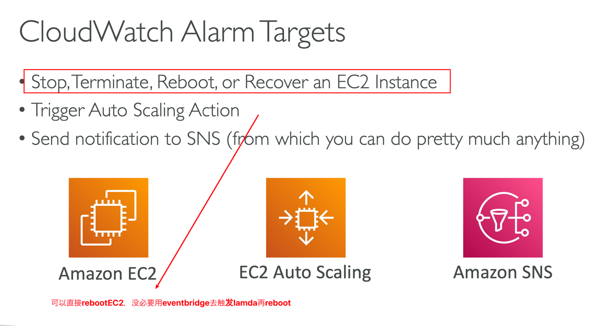

### Aurora没有standby DB选项
只能建立read replica，主数据库down的时候会自动failover  
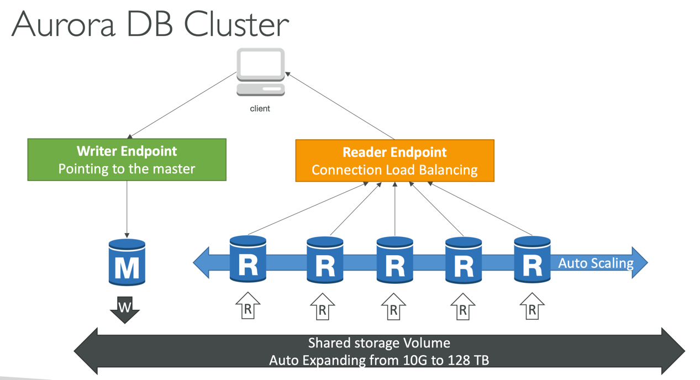

### Kinesis 支持多个consumer
- Streams: OK ,看到多个消费者，multiple，several 要反应过来
- Firehose: NG

## Practice 6
### ASG的activity区别
- Rebalancing：先启新的，在杀旧的
- Scaling activity：先杀旧的，后启新的

### 大数据分析
- EMR
- 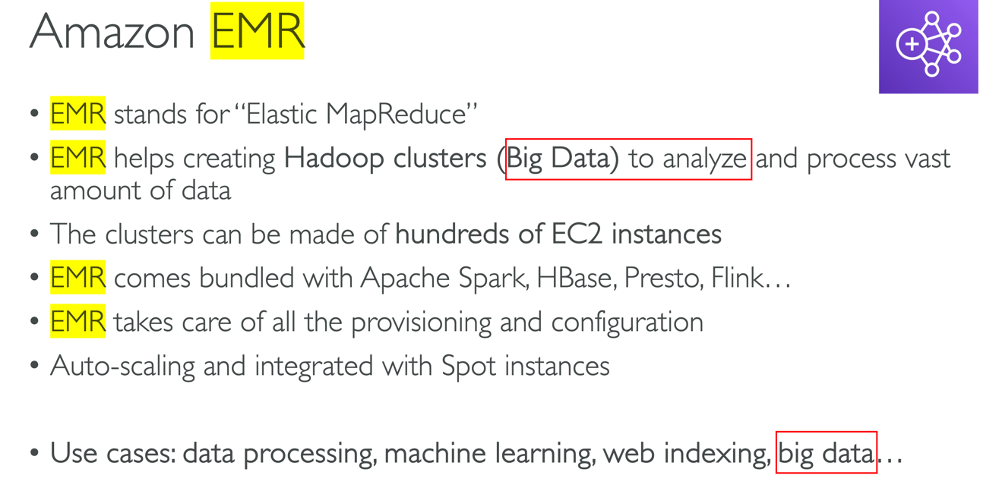
- GLUE
- 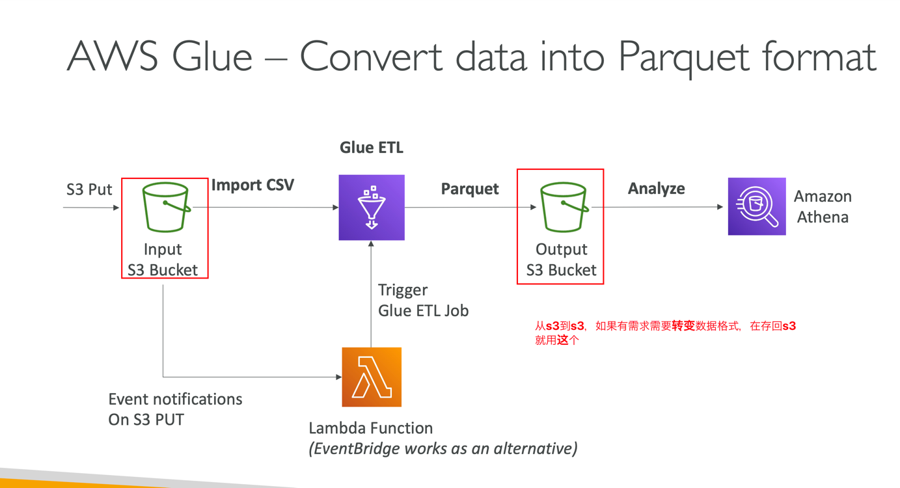
- Amazon Redshift： Postgre数据库

### AWS Firewall Manager 能配置哪些资源的rule
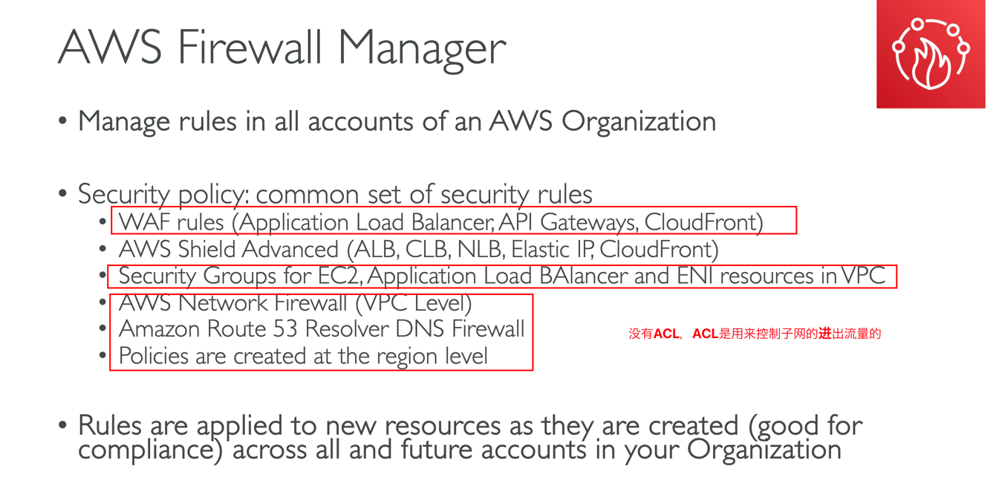


### 只有单个实例的app，灾难恢复
- 创建EIP（elastic IP address）并且使用user-data script绑定到EC2上
- 赋予ec2正确的role去使用api call（完成上面的绑定）
- 设置asg的min，max，desire都是1

使用ALB，也能做到，但是因为只有一个实例，所以没必要使用ALB


### 