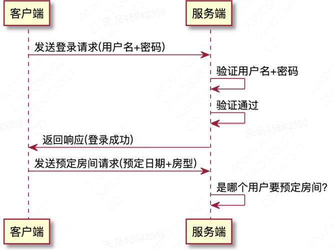

# Cookie
## 概念
Cookie 是浏览网站时，由web服务器创建，并由浏览器存放在用户计算机或其他设备的小文本文件。


## 作用
Cookie 的作用是：使Web服务器能在浏览器存储状态信息，解决HTTP协议的无状态问题。

> HTTP协议“无状态”的含义是什么？
>> 每个HTTP请求都是独立的(单个请求包含处理这个请求需要的全部信息)，服务端不记住之前的请求信息  
>> 客户端发送请求前建立连接，服务端响应请求之后连接被关闭，下一个请求需要重新建立连接，上一次请求的信息都没有了


---
> “无状态”会造成什么问题？
>> 给客户端登录验证造成困难。假设客户端先发送登录请求，再发送其他请求，由于服务端不能记住之前的请求信息，所发送的其他请求并不知道是之前登录的用户发送的



---
> 为什么HTTP协议设计成“无状态”的？
>> **简化服务器的管理**：服务器不需要为每个客户端记录大量的状态信息，从而可以减轻服务器的负担，提高系统的效率和稳定性。  
>> **让Web应用更灵活**：因为HTTP是一种无状态协议，Web应用程序可以更容易地水平扩展，支持更多的用户和更大的负载。  
>> **提供更好的可读性和可维护性**：HTTP协议的无状态设计使得HTTP请求和响应之间的关系更加明确和可读，从而使通信更加可维护。  
>> **促进协议的发展和演变**：由于HTTP协议的无状态特性，使得协议的设计更具有灵活性和适应性，可以更容易地添加新的特性和功能。  

---
> 在无状态协议下如何解决登录验证问题？
- 方案1: 每次请求都让用户输入登录信息(体验极差)


- 方案2: 将用户信息以cookie的形式保存的客户端(推荐)


---

## Cookie的属性
### 1. Name
Cookie 的名称，用于在服务器中识别 Cookie。

### 2. Value
Cookie 的值，用于存储在客户端电脑上的数据。


### 3. Domain
- Cookie 所属的域名。此属性用于限制 Cookie 的作用域，浏览器只会向指定的域名发送 Cookie 。
- 如果不配置，默认为当前的域名。

### 4. Path
- Cookie 所属的路径。此属性用于限制 Cookie 的作用路径，浏览器只会向指定路径发送 Cookie 。
- 如果不配置，路径默认为“/项目名/…/当前路径的上一层地址”。
- 根据情况需要配置 path，如果希望当前项目所有路径都发送 cookie，使用 getContextPath (根目录)


### 5. Max-Age
- Cookie 的存活时间，单位为秒，表示 x 秒后 Cookie 会被清除。默认值为 -1。
- Max-Age = 负数，表示 Cookie 只储存在浏览器内存，不储存在客户端电脑。关闭浏览器 Cookie 就消失，我们把这类 Cookie 叫做“会话Cookie”。
- Max-Age = 正数，表示 Cookie 储存在客户端电脑，x 秒后 Cookie 会被清除，浏览器关闭 Cookie 依然有效。这列Cookie叫做“持久性Cookie”
- Max-Age = 0，删除 Cookie ，使用场景：退出登录。

### 6. Expires
- Cookie 的失效时间，是一个时间对象，表示 Cookie 什么时刻会失效。
- 当 Max-Age = 正数时，Cookie 的 Expires 属性才有意义。

### 7. Secure
- 指示浏览器是否仅通过 HTTPS 发送该 Cookie，默认值为 false。
- 如果 Cookie是在 HTTPS 下创建的，且 Secure = true ，那么之后用 HTTPS 访问时 Cookie 会被发送到服务器，之后如果用 HTTP 访问时 Cookie 不会被发送到服务器。

### 8. HttpOnly
- 指示是否限制 Cookie 的 JavaScript 访问，默认值为 false。
- 如果设置为 true，则 Cookie 不能被 JavaScript 访问和修改，从而提高 Cookie 的安全性。
- 由服务器生成的，存在cookie中的sessionId就是HttpOnly的

# Session
## 定义
Session（会话)，是指客户端与服务器之间一段持续的交互过程，通常在用户打开浏览器访问网站时开始，直到用户关闭浏览器时结束。在这个交互过程中，服务器为每个客户端维护一个唯一的标识符（session id），用于识别该客户端与服务器之间的会话状态，并将相关的会话数据保存在服务器端。

- 是什么：客户端与服务端之间一段持续交互的过程
- 生命周期：打开网站到关闭浏览器
- 谁创建：服务端
- 存在哪：服务端（客户端仅保存 session id）


## 作用
Session 的作用是：维护用户的会话状态，解决HTTP协议的无状态问题。可以用来解决用户登录、购物车等问题。

## 使用
```java
    // 获取session
    HttpSession session1 = req.getSession(); // 获取当前 Session，Session 不存在则创建。
    HttpSession session2 = req.getSession(true); // 获取当前 Session，若不存在，根据参数决定
    
    // 设置属性
    session1.setAttribute("wahaha", "wahah");
    
    // 获取属性
    session1.getAttribute("wahaha");
```

## Session的实现
- Session 的实现基于 Cookie，session id 以 Cookie 的形式在服务端和客户端之间交互。
- Session 在服务端以嵌套 map 的数据结构存储，外层 map key 是 session id，内层 map key 是 attribute name。


## Session的过期机制
- 为什么需要过期机制
  - 服务端为每个客户端维护一个Session，客户端增多，服务端维护的 Session 也会增多。
  - 服务端维护的Session data 保存在 web 服务器内存，海量的Session data 可能会占满服务器内存。
  - 如果客户端长时间处于离线状态，例如客户端打开了一个网页，但是长时间离开了电脑或者断开了网络连接，在这段时间内Session还将一直保留在服务器中，浪费了服务器的资源。

- 过期方式1： 设置过期时间
  - 通过 **setMaxInactiveInterval** 方法设置过期时间，单位为秒。
  - 设置的是处于不活跃状态的时间，即如果这段时间有访问该 Session，Session 会进行续期。

- 过期方式2： 手动过期
  - 通过 **invalidate** 方法强制将 Session 置为无效。
  - 手动过期是一种特殊的操作，不建议使用。

# Cookie和Session区别
Cookie 和 Session都是用来在Web应用程序中跟踪用户访问状态和保存用户信息的技术，但它们存在以下几方面的区别：

1. 存储位置不同：Cookie是存储在客户端中的文件，而Session是存储在服务器端的内存中。
2. 生命周期不同：Cookie可以在一定时间内保留（关闭浏览器再次打开仍有效），也可以在浏览器关闭后失效。Session在浏览器关闭后失效。
3. 存储数据类型不同：Cookie只能存储字符串类型的数据，而Session可以存储任意类型的对象。
4. 存储容量不同：每个Cookie的存储量有限制，通常不能超过4KB，而Session存储的容量没有限制。
5. 安全性不同：Cookie存储在客户端浏览器缓存中，可能会受到浏览器和网络传输的攻击，安全不如Session存储在服务器端。

综上所述，Cookie和Session都具有各自的优势和适用场景。如果需要存储小量的数据或者希望跟踪用户状态时，可以使用Cookie；如果需要存储大量数据，或者需要存储敏感信息时，建议使用Session。
