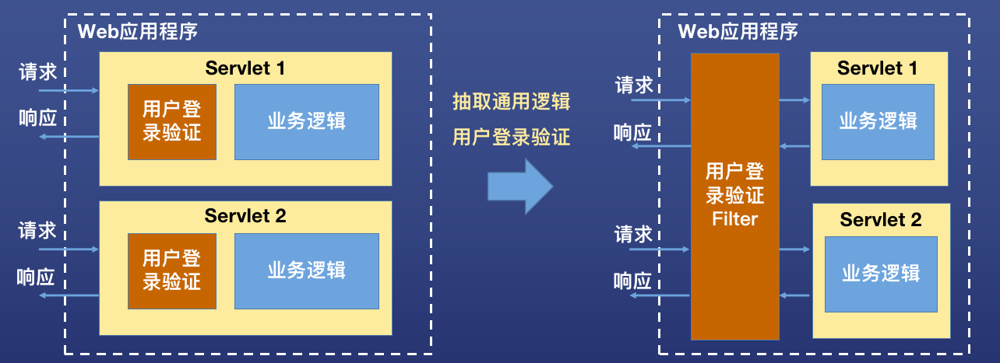

# 过滤器 Filter

## 概念
Filter，过滤器，是Servlet规范中一种非常重要的组件，用于在web应用程序中拦截请求和响应，以实现一些通用的处理逻辑。



## 使用
1. 创建 Filter 类，实现 Filter 接口或继承 HttpFilter（推荐）。
2. 重写 doFilter 方法。
3. 在 web.xml 中配置 Filter。

**重写 doFilter 方法**
```java


public class MyFirstFilter extends HttpFilter {
    @Override
    protected void doFilter(HttpServletRequest req, HttpServletResponse res, FilterChain chain) throws IOException, ServletException {
        System.out.println("My filter before");
        super.doFilter(req, res, chain);
        System.out.println("My filter after");
    }
}
```
**在 web.xml 中配置 Filter**
```xml
    <filter>
        <filter-name>myFirstFilter</filter-name>
        <filter-class>com.app.web.filter.MyFirstFilter</filter-class>
    </filter>

    <filter-mapping>
        <filter-name>myFirstFilter</filter-name>
        <url-pattern>/*</url-pattern>
    </filter-mapping>
```

## Filter生命周期
- Filter 由谁创建？生命周期由谁管理？
  - 跟 Servlet 一样，Filter 由 Web 容器创建，生命周期由 Web 容器管理。
- Filter 的生命周期分哪几步？
  - 实例化。跟 Servlet 一样，由 Web 容器利用反射机制调用 Filter 的无参构造函数完成实例化。不同于 Servlet 的点是，Servlet 默认在第一次访问时才实例化，Filter 在 Web 容器启动时实例化。
  - 初始化 (init)。实例化完成后，Web 容器调用 Filter 对象的 init 方法执行初始化。
  - 过滤 (doFilter)。每次路径匹配的请求到来时，Web 容器调用 Filter 的 doFilter 方法拦截请求。
  - 销毁 (destroy)。Web 容器关闭前， Web 容器调用 Filter 对象的 destroy 方法执行销毁前处理。

