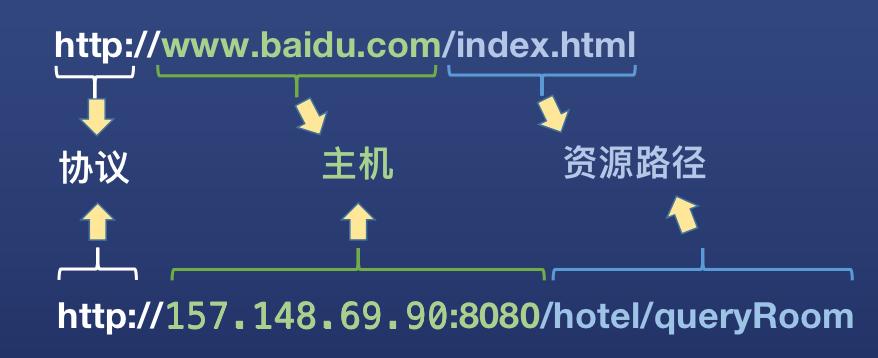
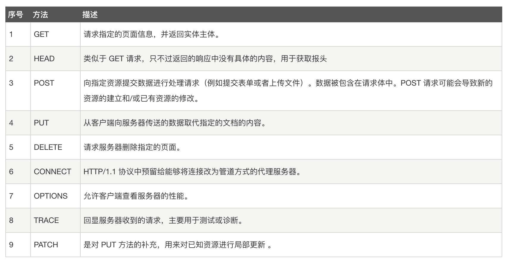
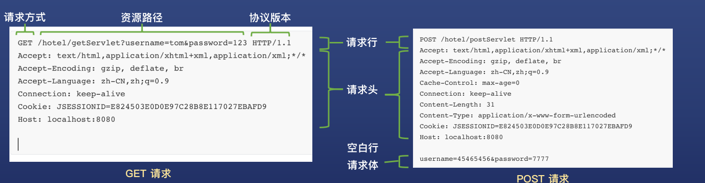
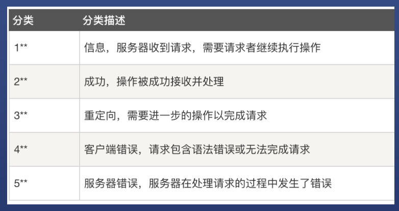

# HTTP协议
## 概念
### 什么是http协议
> 协议，在计算机领域指通信双方为了实现通信而设计的约定或通话规则  
HTTP协议，是W3C制定的超文本传输协议，是因特网上应用最广泛的网络传输协议  
HTTP协议包括客户端和服务端两个实体，客户端发送请求给服务端，服务端返回响应给客户端  
在HTTP中，数据称为资源（可以是HTML文档、图片、普通文本等），资源通过URL进行定位  

### URL
> URL（Uniform Resource Locator），统一资源定位符。  
URL 是因特网上资源的地址，通过 URL 可以在因特网上定位到一个唯一的资源。  
URL由“协议”、“主机名(包含端口号)”、“资源路径”三部分组成。  

## HTTP请求详解

### 请求方式
> HTTP协议定义了9种请求方式，来表明对资源不同的操作方式，最常用的是 GET 和 POST  
GET 用于获取数据（例如查询酒店剩余空房），POST用于提交数据（例如下单预定房间）

### 请求格式
> HTTP请求由请求行、请求头、空白行、请求体四部分组成  
>> 请求行，包括请求方式、资源路径(get请求还包含queryString)、协议版本  
>> 请求头，为服务器提供了一些额外信息，包括一些访问的域名、用户信息、 Cookie等信息  
>> 空白行，用于分隔请求头和请求体  
>> 请求体，客户端提交的数据  

## HTTP响应详解

### 响应格式
> HTTP响应由状态行、响应头、空白行、响应体四部分组成
>> 状态行，包括协议版本、状态码及状态描述  
>> 响应头，为客户端提供一些额外信息，包括响应时间、响应体长度等信息  
>> 空白行，用于分隔响应头和响应体  
>> 响应体，服务端返回的数据  

## 状态码
> HTTP 状态码由三个十进制数字组成，第一个十进制数字定义了状态码的类型。响应分为五类：

## GET和POST的区别
1. 使用目的
   - GET 请求用于获取资源（例如各种查询服务），是无副作用的
   - POST 请求用于传入实体对象（进行添加、修改、删除等操作），是有副作用的
2. 传递参数方式
    - GET 请求将参数放到URL中
    - POST 请求将参数放到请求体中
3. 参数长度限制（浏览器限制，不是w3c的规范限制）
    - GET 请求对参数长度有限制
    - POST 请求对参数长度无限制
4. 支持参数类型
    - GET 请求的参数只能为普通字符串
    - POST 请求可以发送任何类型的数据，包括普通字符串、文件、视频、音频等

## GET 和 POST 哪个比较安全？
- **从数据传输的角度，POST请求“看起来”更安全**
  - GET 请求的参数直接出现在地址栏的 URL 中，可以直接从浏览记录里看到请求参数
  - POST 请求的参数在请求体里，无法直接从浏览器地址栏看到请求参数
  - 但 POST 的请求参数也可以通过抓包方式获取，并不绝对安全。安全传输需要加密，使用 HTTPS

- **从服务端数据的角度，GET请求更安全**
  - GET 请求不会变更服务端数据
  - POST 请求会变更服务端数据
