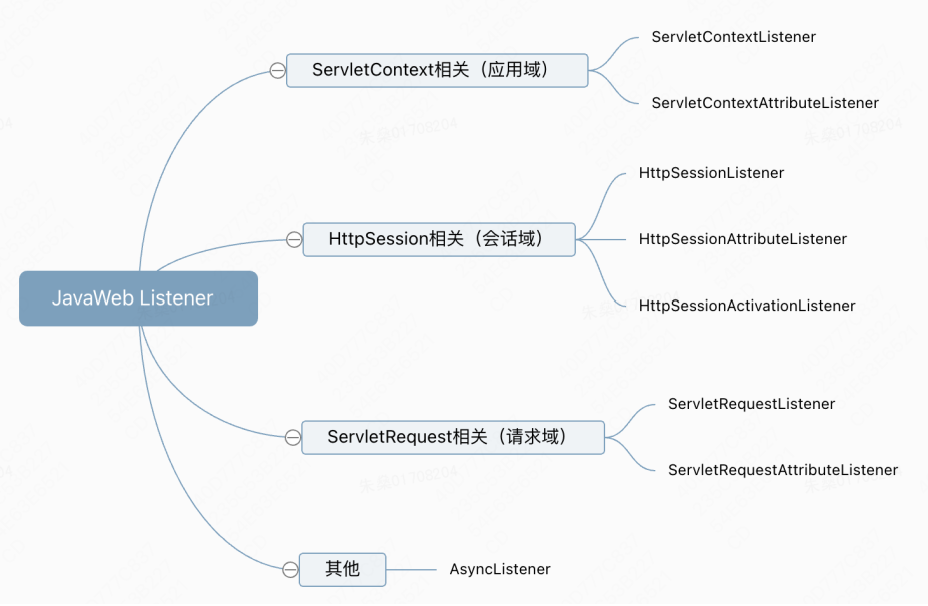

# Listener

## 概念
- Listener ，监听器，是 Servlet 规范中一种组件，用于监听Web应用程序中的事件，以便在事件发生时采取一些自定义的动作。
- Listener 使用了观察者模式，也叫发布订阅模式。


## Listener类型
JavaWeb中，不同的事件对应不同的 Listener 接口。总共有 8 个 Listener 接口，按Listener监听的事件域，可以分为 4 类：应用域Listener、会话域Listener、请求域Listener、异步Listener。

### Listener分类
- 请求域：表示在处理一个用户请求期间存活的数据，请求域中的数据在该请求期间可以使用。这些数据在用户提交请求时创建，在该请求被响应之前一直存在。用 HttpServletRequest 实现请求域。
- 会话域：表示在一个用户会话期间存活的数据，同一个会话内的不同请求可以共享会话域数据。这些数据从会话开始时开始创建，在该会话结束前一直存在。用 HttpSession 来实现会话域。
- 应用域：表示应用程序中所有用户共享的数据，这些数据在应用程序的启动时创建，在应用程序关闭前一直存在。用 ServletContext 来实现应用域。


### 关于 ServletContext
- ServletContext 是 JavaWeb中的一个接口，提供了一系列方法用来共享数据。
- ServletContext 对象由 Web 容器负责创建，每个 Web 应用程序只会有一个 ServletContext 对象实例，并在整个应用程序的生命周期中有效。它可以被所有在这个Web应用程序中运行的servlet共享，可以用来传递数据，存储全局变量和监听Web应用程序的生命周期事件。
- 可以通过getServletContext() 方法获得 ServletContext 对象。

### 应用域
- ServletContextListener：用于监听 ServletContext 对象的创建和销毁事件，可以在 ServletContext 对象初始化时执行一些初始化代码，也可以在 ServletContext 对象销毁时执行一些清理代码。
- ServletContextAttributeListener：用于监听 ServletContext 对象中属性的添加、删除和替换事件，可以在属性添加时执行一些逻辑处理，比如更新配置信息等；在属性删除时执行一些清理操作，比如释放资源等。

### 会话域
- HttpSessionListener：用于监听 HttpSession 对象的创建和销毁事件，可以在 HttpSession 对象初始化时执行一些初始化代码，也可以在 HttpSession 对象销毁时执行一些清理代码。
- HttpSessionAttributeListener：用于监听 HttpSession 对象中属性的添加、删除和替换事件，可以在属性添加时执行一些逻辑处理，比如更新用户信息等，在属性删除时执行一些清理操作，比如清空数据等。
- HttpSessionActivationListener：用于监听 HttpSession 对象的钝化和活化事件，可以在 HttpSession 对象钝化时执行一些清理操作，比如将 Session 中的数据写入硬盘等，在 HttpSession 对象活化时执行一些初始化代码，比如重新读取数据等。

### 请求域
- ServletRequestListener：用于监听 HttpServletRequest 对象的创建和销毁事件，可以在 HttpServletRequest 对象初始化时执行一些初始化代码，也可以在 HttpServletRequest 对象销毁时执行一些清理代码。
- ServletRequestAttributeListener：用于监听 HttpServletRequest 对象中属性的添加、删除和替换事件，可以在属性添加时执行一些逻辑处理，比如更新请求参数等，在属性删除时执行一些清理操作，比如释放资源等。

### 其他
- AsyncListener：用于监听异步操作的事件，可以在异步操作完成时执行回调函数，比如通知用户异步任务已完成等。

## 使用Listener
**统计活跃的在线人数（即session个数）**

- 使用应用域来存储session个数，那么使用应用域的监听器来初始化个数
```java
public class MyListener implements ServletContextListener {
    @Override
    public void contextInitialized(ServletContextEvent sce) {
        System.out.println("tomcat start");
        ServletContext servletContext = sce.getServletContext();
        servletContext.setAttribute("onlineCount", 0);
    }

    @Override
    public void contextDestroyed(ServletContextEvent sce) {
        System.out.println("tomcat end");
    }
}
```

- 使用会话域的监听器来给个数进行更新
```java
public class MyHttpSessionListener implements HttpSessionListener {
    @Override
    public void sessionCreated(HttpSessionEvent se) {
        ServletContext servletContext = se.getSession().getServletContext();
        Object onlineCount = servletContext.getAttribute("onlineCount");
        servletContext.setAttribute("onlineCount", (int) onlineCount + 1);
    }

    @Override
    public void sessionDestroyed(HttpSessionEvent se) {
        ServletContext servletContext = se.getSession().getServletContext();
        Object onlineCount = servletContext.getAttribute("onlineCount");
        servletContext.setAttribute("onlineCount", (int) onlineCount - 1);
    }
}
```

- 配置监听器
```xml
    <listener>
        <listener-class>com.app.web.listener.MyListener</listener-class>
    </listener>
    
    <listener>
        <listener-class>com.app.web.listener.MyHttpSessionListener</listener-class>
    </listener>
```