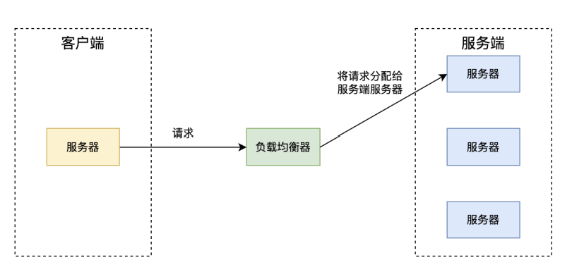
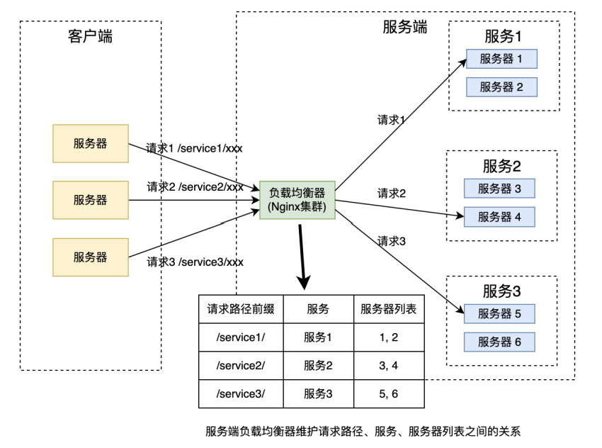
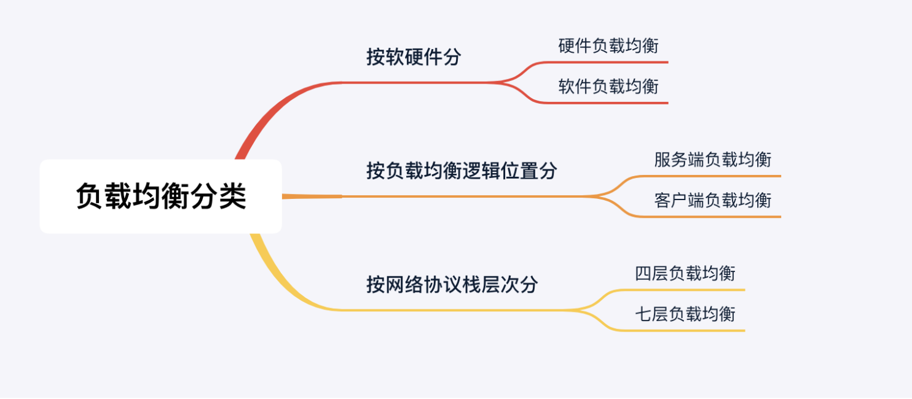
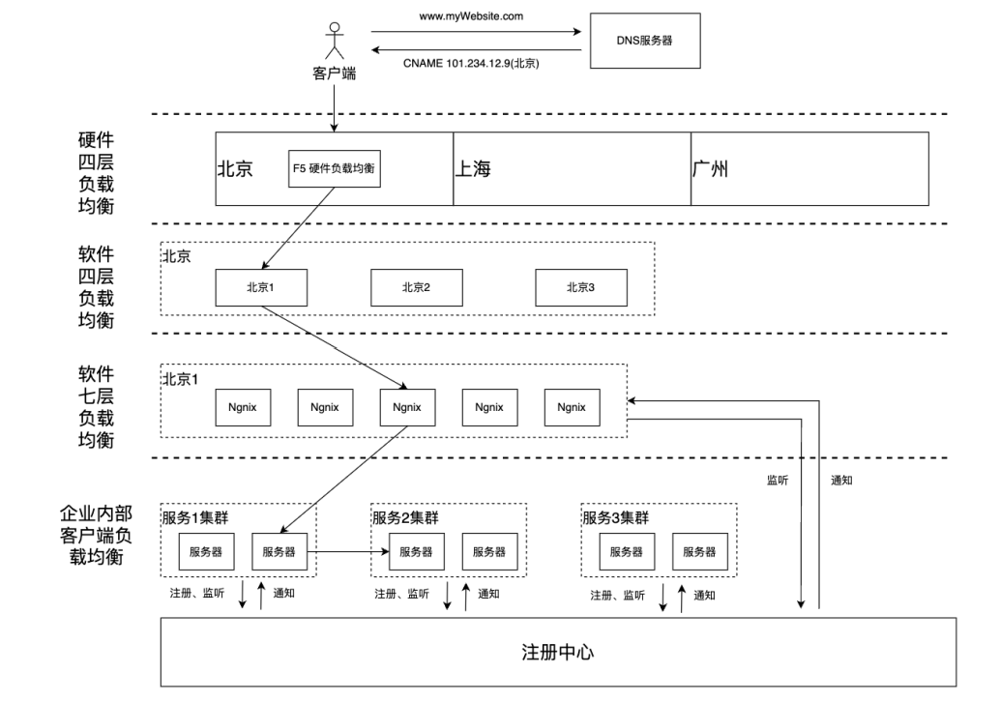

# 负载均衡
## 1 概念
- 负载均衡（Load Balancing）：是指在计算机网络中，将工作负载（Workload）分配到多个计算资源上，以达到最优的资源利用率、最大化吞吐量、最小化响应时间、避免单点故障等目的的一种技术。负载均衡可以应用于各种计算机系统和网络应用中，如Web服务器、数据库服务器、消息队列等。
- 在负载均衡系统中，有一个负载均衡器（Load Balancer），它会接收来自客户端的请求，并将请求分配到多个服务器上。 

## 2 分类
### 按照软硬件分类
- 硬件负载均衡：是通过专门的硬件设备实现负载均衡的效果，如F5、Cisco等厂商提供的硬件负载均衡设备。硬件负载均衡设备通常具有高性能、高可用性、高安全性等特点。
- 软件负载均衡：是通过软件实现负载均衡的效果，如Nginx、HAProxy等软件提供的负载均衡功能。不需要专门的硬件设置，之需要将负载均衡软件安装在 Linux 服务器上。软件负载均衡通常具有灵活性高、可扩展性好、可定制化等特点。

> 硬件负载均衡和软件负载均衡各有优缺点，需要根据实际情况选择合适的负载均衡方式。
>> 硬件负载均衡：通常适用于大规模、高并发、高可用性的场景  
>> 软件负载均衡：通常适用于中小规模、低并发、可定制化的场景（不绝对，软件负载均衡也可以应付大规模、高并发、高可用的场景）

### 按照均衡逻辑防止位置分类  
- 服务端负载均衡：将负载均衡的逻辑放在服务端。负载均衡器接受客户端的请求，先根据请求路径找到对应的服务，再通过负载均衡算法选择一台服务器进行请求。Nginx 是一款常用的负载均衡应用。
> 服务端负载均衡的优点：可以集中管理服务器资源，包括负载、带宽、处理能力等，从而更好地实现负载均衡。  
> 服务端负载均衡的缺点：请求都需要经过负载均衡器转发，有额外的网络开销。
> 

- 客户端负载均衡：将负载均衡的逻辑放在客户端。微服务注册中心维护服务端服务与服务器列表的关系，并将信息同步给客户端。客户端发送请求时直接通过负载均衡算法选择一台服务器进行请求。Nacos 是一款微服务管理平台，具备客户端负载均衡功能。
> 客户端负载均衡的优点：  
>> 网络开销低，客户端服务器直接像服务端服务器发送请求，不经过转发。  
>> 避免集中式的单点问题。  

> 客户端负载均衡的缺点：  
>> 负载均衡器消耗客户端服务器的资源。  
>> 需要从注册中心持续监听其他服务的状态，负担大。  
>> 对于服务端，请求可能来自任意服务节点，安全风险高。  

### 网络协议栈不同层次分类
- 四层负载均衡：在传输层（Transport Layer）进行负载均衡（还有另一个说法，“四层负载均衡”，其实是多种均衡器工作模式的统称。“四层”的意思是说，这些工作模式的共同特点是都维持着同一个TCP连接，而不是说它就只工作在第四层）。通常基于IP地址和端口号进行负载均衡（负载均衡器维护虚拟IP:端口号和实际IP:端口号的关系，客户端向虚拟IP:端口号发送请求，负载均衡器转发给实际IP:端口号）。四层负载均衡通常具有高性能、高可用性、高安全性等特点，适用于大规模、高并发、高可用性的场景。
- 七层负载均衡：在应用层（Application Layer）进行负载均衡，工作在应用层，可以感知应用层通讯的具体内容（例如请求路径等信息），可以实现更加细粒度的负载均衡。七层负载均衡通常具有灵活性高、可扩展性好、可定制化等特点，适用于中小规模、低并发、可定制化的场景，

> 现实生活的例子：四层负载均衡器就像是银行的自助排号机，转发效率高且不知疲倦，每一个达到银行的客户都可以根据排号机的顺序，选择对应的窗口接受服务；而七层负载均衡器就像银行的大堂经理，他会先确认客户需要办理的业务，再安排排号。这样，办理理财、存取款等业务的客户，可以根据银行内部资源得到统一的协调处理，加快客户业务办理流程；而有些无需柜台办理的业务，由大堂经理直接就可以解决了。

### 分类总括图

## 负载均衡经典架构
