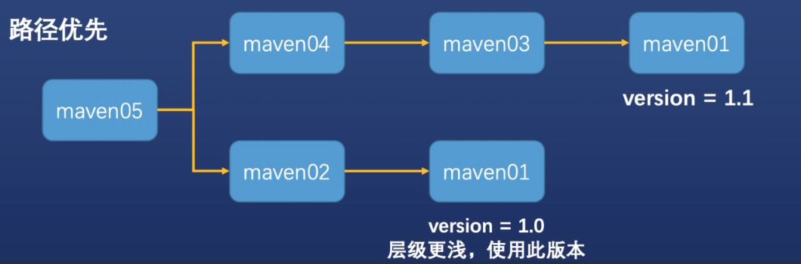
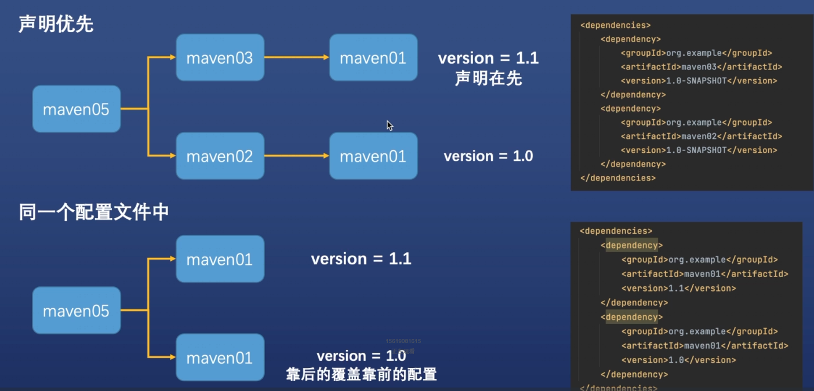
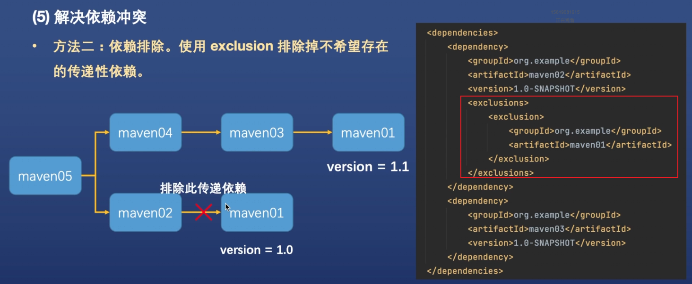

# Maven
## 概念以及作用
### 是什么
Maven是一个项目管理工具

### 有什么用
Maven可以对Java项目进行构建，依赖管理

### 什么是构建（build）
构建是以源代码（例如java代码，配置文件）为原材料，生产出可以运行的项目（例如war包）的过程

## 下载/安装

1. 打开maven官网，下载maven
2. 将压缩包移动到目标文件家（~/Library）后解压缩
3. 配置环境变量，编辑~/.bash_profile
    > export M2_HOME=/Users/xxx/Library/apache-maven-3.9.1  
   > export PATH=$PATH:$M2_HOME/bin
4. 执行mvn -version验证maven安装完成,(没有配置环境变量的话，就拿bin目录执行./mvn -version)

## 基本概念-坐标
- 坐标的作用-用来描述资源在仓库中的位置，maven根据坐标来定位资源
- 组成部分
  - groupId：组id，隶属的组织名称，通常是域名反写
  - artifactId：项目名称
  - version：版本号

## 配置仓库
### 配置本地仓库
- 通常不需要配置，IDEA初次使用maven时，会自动创建
- 默认的本地仓库是~/.m2/repository，M2_HOME/conf/settings.xml里配置仓库目录
- 如果要手动配置本地仓库，到~/目录下面输入mvn命令，则会自动创建一个仓库

### 远程仓库配置
- 可以到M2_HOME/conf/settings.xml搜索mirror字段

## POM（Project Object Model）项目对象模型
### pox.xml 配置文件的结构
- POM（Project Object Model）项目对象模型
- Maven将项目开发和管理过程抽象成一个项目对象模型
- 一个基础的pom文件结构可以分为三大块
  - 基本信息
  - 坐标配置
  - 依赖配置
```xml
<project xmlns="http://maven.apache.org/POM/4.0.0" xmlns:xsi="http://www.w3.org/2001/XMLSchema-instance"
         xsi:schemaLocation="http://maven.apache.org/POM/4.0.0 http://maven.apache.org/xsd/maven-4.0.0.xsd">
    <!-- 1.基本信息  -->
    <modelVersion>4.0.0</modelVersion>

    <!-- 2.坐标信息  -->
    <groupId>org.mavendemo</groupId>
    <artifactId>nonwebapp</artifactId>
    <version>1.0-SNAPSHOT</version>
    <packaging>jar</packaging>

    <name>nonwebapp</name>
    <url>http://maven.apache.org</url>

    <properties>
        <project.build.sourceEncoding>UTF-8</project.build.sourceEncoding>
    </properties>

    <!-- 3.依赖信息  -->
    <dependencies>
        <dependency>
            <groupId>junit</groupId>
            <artifactId>junit</artifactId>
            <version>3.8.1</version>
            <scope>test</scope>
        </dependency>
    </dependencies>
</project>
```

### Maven项目构建与生命周期
1. 什么是生命周期
   - 生命周期用来表示一个生物从出生到死亡的过程
   - 在软件开发领域，生命周期用来表示一个对象从创建到销毁的过程
   - Maven用声明周期定义了项目构建和发布的过程，定义了生命周期包含哪些阶段
2. Maven声明周期
   - clean：项目清理
     - pre-clean：执行一些需要在clean之前完成的工作
     - clean：移除上一次构建生成的文件
     - post-clean：执行一些需要在clean之后立刻完成的工作
   - default（或build）：项目部署  
   - 
     | 阶段          | 处理     | 描述                                             |
     | ------------- | -------- | ------------------------------------------------ |
     | 验证 validate | 验证项目 | 验证项目是否正确且所有必须信息是可用的           |
     | 编译 compile  | 执行编译 | 源代码编译在此阶段完成                           |
     | 测试 test     | 测试     | 使用适当的单元测试框架运行测试                   |
     | 包装package   | 打包     | 创建jar/war包如在pom.xml中定义提及的包           |
     | 检查verify    | 检查     | 对集成测试的结果进行检查，以保证质量达标         |
     | 安装install   | 安装     | 安装打包的项目到本地仓库，以供其他项目使用       |
     | 部署 deploy   | 部署     | 拷贝最终的工程包到远程仓库中，以共享给其他的工程 |
   - site：项目站点文档创建的处理（使用较少）

### Maven依赖管理
1. dependency
   - 在每个dependencies的标签下面配置依赖
   - 一个依赖配置一个dependency
   - 每个依赖配置都需要指定坐标
2. 依赖传递
   - 依赖具有传递性
     - 直接依赖：通过依赖配置直接建立依赖的关系
     - 简介依赖所依赖的资源依赖其他资源，当前项目间接依赖其他资源
3. 依赖冲突
   - 概念：jar包之间的间接依赖，导致项目依赖统一种jar包的多个版本
   - 当发生依赖冲突，Maven会选择哪个版本？
     - 路径优先：层级越浅，优先级越高
     - 声明优先(间接依赖)：层级相同时，配置顺序靠前的覆盖靠后的
     - 同一个配置文件中(直接依赖)：靠后的覆盖靠前的


4. 发现依赖冲突  
   - 命令行：mvn -Dverbose dependency:tree
   - 插件：Maven helper。安装重启完以后，点击Dependency Analyzer
5. 解决依赖冲突
   - 直接依赖正确版本的jar包，根据路径优先原则，直接依赖的层级最浅
   - 依赖排除：排除掉不希望存在的依赖
     
6. 快照版本（snapshot）vs 正式版本（release）
   - 快照版本以SNAPSHOT结尾，是开发调试阶段使用的版本
   - 开发阶段可能会进行快节奏的bug修复改进，会需要频繁将资源发布到远程仓库
   - 同一个快照版本可以多次发布到远程仓库，新的覆盖旧的。非快照版本版本号不能冲突
   - 资源依赖方如果使用的是快照版本，那么每次构建都会自动获取最新快照
   - 好处：
     - 避免版本号爆炸
     - 提升团队间开发合作效率
7. 新项目创建时候，自动利用自己的maven
File -> new project setup