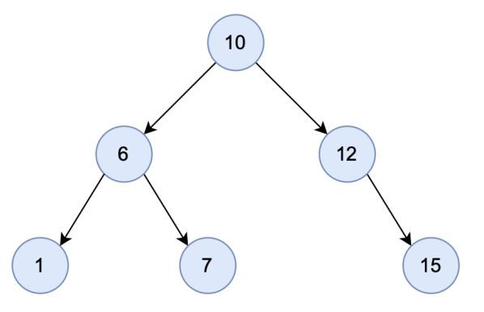
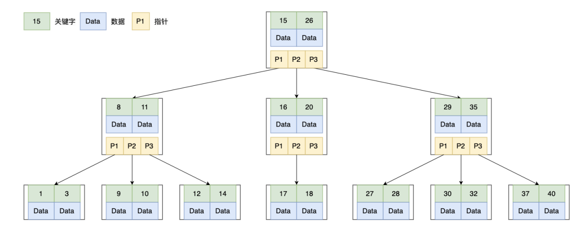
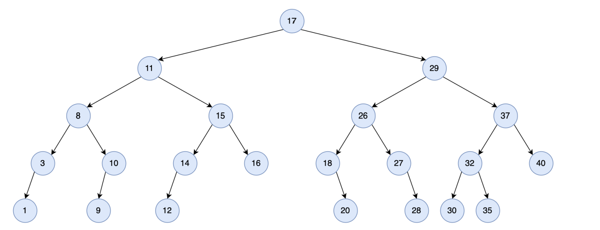
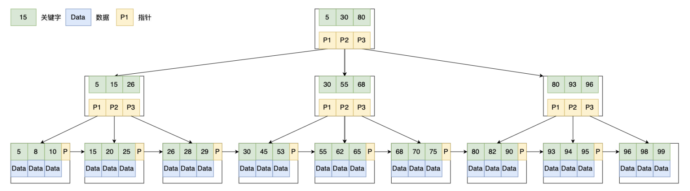
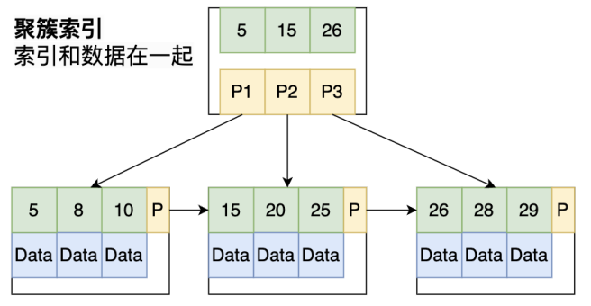
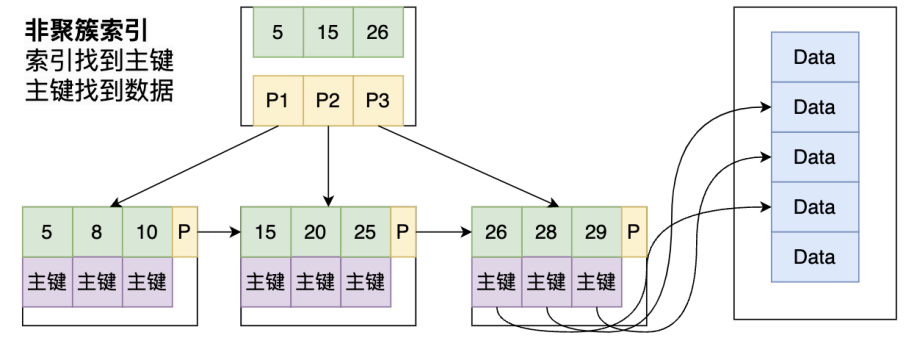
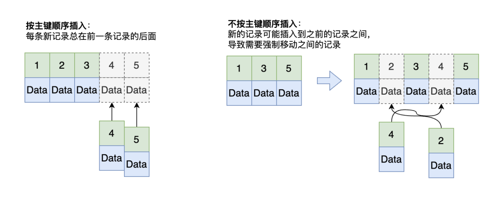
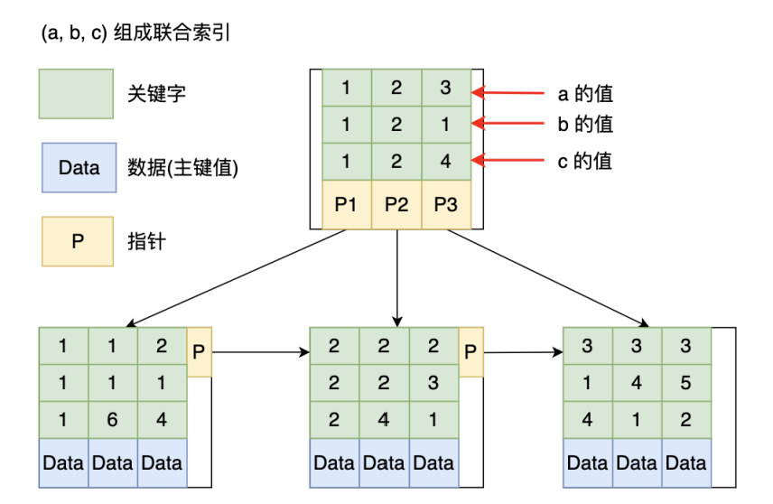
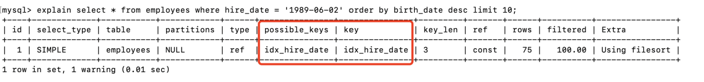

# Mysql
## 安装Mysql
```shell
# 开启容器
docker run --name mysql -v local-dir/mysql-metadata:/var/lib/mysql -p 3306:3306 -e MYSQL_ROOT_PASSWORD=root -d mysql:latest

# 进入容器
docker exec -it containerId sh

# 进入mysql
mysql -uroot -p
```

## 索引基础  
### 概念
- 索引： index ，在 MySQL 中也叫做“键（key）”，是一种用于快速找到记录的数据结构。在 MySQL 中，存储引擎根据索引快速定位到对应的数据行。
- 作用
  - 提高查询效率：索引可以加速查询操作，减少数据库的扫描次数，从而提高查询效率。
  - 保证数据的唯一性和完整性：索引可以用于保证表中某些列的值是唯一的，从而保证数据的唯一性和完整性。
  - 加速数据的排序和分组：索引可以用于加速数据的排序和分组操作，从而提高查询效率。
  - 减少数据库的锁竞争：索引可以减少数据库的锁竞争，从而提高数据库的并发性能。
- 注意事项：索引的建立和维护需要消耗一定的资源（索引也占用存储空间，插入、更新、删除数据时也需要变更相关索引），因此在建立索引时需要考虑索引的数量和列的选择。通常情况下，只需要建立必要的索引，避免建立过多的索引，以减少索引的维护成本和磁盘空间的占用。

### 索引的结构
MySQL常用的索引结构有：哈希索引（HASH）、B树索引（B-TREE）、B+树索引（B+TREE）

#### 哈希索引
  - Hash Index，是一种基于哈希表实现的索引类型。哈希索引将索引列的值通过哈希函数计算得到一个哈希值，然后将哈希值与数据的物理地址关联起来，从而可以快速定位到需要查询的数据。类似 Java 中的HashMap。
  - 优势：
    - 对于等值查询非常有效，可以直接根据哈希值定位到需要查询的数据，速度非常快
  - 劣势
    - 只支持等值查询，不支持范围查询
    - 索引数据并不是按照索引值顺序存储，无法用于排序
    - 不支持部分索引列匹配查找，例如在数据列（A，B）上建立哈希索引，如果查询条件只有数据列A，则无法使用索引。因为哈希索引始终使用索引列的全部内容来计算哈希值
    - 如果哈希冲突较多（不同的数据值对应的哈希值相同），索引的维护代价较高。

#### B树索引
**平衡二叉树**  
树（Tree）是一种非线性数据结构，它由若干个节点（Node）和它们之间的连接（Edge）组成。节点包含数据元素和指向其他节点的指针。  
平衡二叉搜索树（Balanced Binary Search Tree，BBST）。它满足以下性质：
- 左子树上所有节点的值均小于它的根节点的值。
- 右子树上所有节点的值均大于它的根节点的值。
- 左右子树也分别为二叉搜索树。
- 每个节点的左右子树高度差不超过1.

> 我们要查找值等于7的节点，分为以下几步：  
> 从根节点开始检索，将目标值7与节点的值10比较，7 < 10，往左子树继续查找。  
> 将7与当前节点值6比较， 7 > 6，往右子树继续查找。  
> 将7与当前节点值7比较，7 = 7，查找完成。  



**B树**  
> 虽然平衡二叉搜索树可以实现快速查找，但其不适合做为数据库的索引，为什么？
- 因为平衡二叉搜索树索引执行一次查询需要多次读写磁盘，而磁盘的读写速度相对较慢。
- 索引是存在于磁盘中的索引文件。因为索引通常是很大的，因此无法一次将全部索引加载到内存当中，因此每次只能从磁盘中读取一个磁盘页的数据到内存中。而这个磁盘的读取的速度较内存中的读取速度而言是差了好几个级别。
- 二叉树结构不能利用磁盘预读，需要多次读取磁盘。
  - 磁盘预读：磁盘往往不是严格按需读取，而是每次都会预读，即使只需要一个字节，磁盘也会从这个位置开始，顺序向后读取一定长度的数据放入内存。这样做的理论依据是计算机科学中著名的局部性原理。
  - 局部性原理： 当一个数据被用到时，其附近的数据也通常会马上被使用。 程序运行期间所需要的数据通常比较集中。
  - 二叉树的物理实现是数组。然后由于在逻辑结构上相近的节点在物理结构上可能会差很远。每次读取的磁盘页的数据中可能有许多是用不上的。因此，查找过程中要进行许多次的磁盘读取操作。
  - 例如上一个例子中，10节点和6所在节点在物理结构上可能相差很远，读取10节点所在的磁盘页时，不能通过磁盘预读读取到6节点所在的磁盘页，因此读取6节点时需要再次访问磁盘。
- 二叉树每个节点只有两个分叉，当节点树较多时，树的高度会很高，意味着需要进行更多次磁盘读取（多次磁盘IO）。

---

> B树（B-Tree，有时也写作B-树，不要读成B减树），是一种多路平衡搜索树。B树的特点：

- 每个节点包含 M- 1个关键字和对应的数据，按关键字从小到大排列，K[1],K[2],…,K[M-1]，K[i] < K[i +1]
- 非叶子结点包含 M 个指向子节点的指针：P[1], P[2], …, P[M]；其中P[1]指向关键字小于K[1]的子树，P[M]指向关键字大于K[M-1]的子树，其它P[i]指向关键字属于(K[i-1], K[i])的子树。
- 所有叶子结点位于同一层；


> B树对应的二叉树，要查找关键字等于12的数据，二叉树需要读5次磁盘，B树只需要读3次。



**B+树**  
> B+树（B+Tree，读作B加树），是B树的变体，也是一种多路搜索树。B+树的特点：  
- 非叶子节点包含 M 个关键字（不包含数据），按关键字从小到大排列，K[1],K[2],…,K[M]，K[i] < K[i +1]
- 非叶子结点包含 M 个指向子节点的指针：P[1], P[2], …, P[M]；其中P[i]指向关键字属于 [K[i], K[i+1]) 的子树，P[M]指向关键字大于等于K[M1]的子树。
- 叶子节点包含 M 个关键字和对应的数据，所有数据均仅在叶子节点。
- 叶子节点还包含指向下一个叶子节点的指针。



> 相较于B树，B+树的优势是什么？  
- B+树的查询效率更高。存储相同容量的数据，B+树比B树高度矮。因为B+的非叶子节点仅存储关键字不存储数据，单个非叶子节点就可以存储更多的关键字，从而减少了树的高度，意味着更少的磁盘读操作，提高了查询效率。
- B+树更适合做范围查找。因为B+树的叶子节点之间形成了一个有序链表，范围查找只需要找到左端点，再通过叶子节点之间的指针可以很快找到右端点，左右端点之间就是符合条件的数据。B树实现范围查找需要使用树的中序遍历算法，复杂度较高。而数据库中经常使用到范围查找。
- 综上，MySQL使用 B+ 树作为其索引结构。


### 索引分类

#### 按功能分
- 主键索引（Primary Key）：用于唯一标识表中的记录，索引值不允许重复，不允许为null。一张表只能有一个主键索引。
- 辅助索引（也称为二级索引，Secondary Index）：
  - 唯一索引（Unique Index）：索引值不允许重复，允许为null，一张表可以有多个唯一索引。
  - 非唯一索引：索引值允许重复，允许为null，一张表可以有多个非唯一索引。

#### 按数据列数
- 单列索引：索引只包含一个列。
- 联合索引（组合索引）：索引包含多个列。

#### 按物理存储分
- 聚簇索引（ Clustered Index ）：不是单独的一种索引类型，而是一种数据存储方式。具体的细节依赖其实现方式，InnoDB 的聚簇索引实际上是同一个结构中保存了B+树索引和数据行。聚簇索引可理解为将数据存储与索引放到了一块，找到索引也就找到了数据。
- 非聚簇索引：数据和索引是分开的，B+树叶子节点存放的不是数据表的行记录。查询时需要先查找索引，然后再根据索引查找对应的记录。
- 每次创建非聚簇索引，都会生成一个B+书在磁盘上面，假如创建了一个(a,b,c)索引和一个d(索引)，那么就会创建两个B+树
- 每次使用非聚簇索引查找到记录以后，需要在赚到聚簇索引的那颗B+树上面去找真正的记录
- InnoDB 的主键索引是聚簇索引，辅助索引是非聚簇索引



> InnoDB 主键索引使用聚簇索引的优缺点分析

- 优势
  - 根据聚簇索引访问更快。聚簇索引将索引和数据保存在同一个B+树中，找到了索引也就找到了数据，不需要再进行额外查找。
- 劣势
  - 数据插入速度严重依赖插入顺序。按照主键的顺序插入是速度最快的方式，因为按照主键顺序插入可以保证都插入到最后一条记录的后面，而不按主键顺序需要在已有数据中间分配空间，增加额外工作与磁盘IO。

为保证数据按主键顺序插入，InnoDB 通常推荐使用自增id作为主键。


### 最左匹配原则
**最左前缀匹配原则：**
> 是指在使用联合索引进行查询时，只有在查询条件中使用了索引的最左前缀列，才能使用该索引进行查询。例如有一个联合索引 (a, b, c)，在查询时，只有在查询条件中使用了索引的最左前缀列 a 或a、b或 a、b、c时，才能使用该索引进行查询。创建联合索引(a, b, c) 相当于创建了索引 (a), (a, b), (a, b, c)。



> 为什么是最左前缀匹配原则？
>> 因为联合索引中，靠左的索引在B+树排序中靠前。例如有一个联合索引 (a, b, c)，比较两个索引值 (a1, b1, c1) 和 (a2, b2, c2)，先比较 a1 和 a2，若 a1 和 a2 相等再比较b1 和 b2，若 b1 和 b2 相等再比较 c1 和 c2。
> 
>> 比较的时候需要把每一列（就是每行记录）看成一个整体去比较

> 如图所示
>> 查询条件为 where a = 2 可以使用索引  
>> 查询条件为 where a = 2 and b = 3 可以使用索引  
>> 查询条件为  where b = 2 不可以使用索引  
>> 查询条件为 where a = 2 and b = 2 and c > 3 可以使用索引  
>> 查询条件为 where a > 1 and b = 1 and c = 2 可以使用索引，但使用的是索引(a)，不能使用索引(a, b, c)。这是因为使用联合索引，且最左的索引不是一个定值的话，剩下的记录需要1条1条的往后遍历去寻找，所以b和c的索引是使用不了的  

**所以，创建联合索引时经常把最常用的列放在最左**

## 索引的使用
### 创建

**非唯一索引**
```sql
ALTER TABLE `table_name` ADD INDEX `index_name` (`field1`, `field2`, ...);
```

**唯一索引**
```sql
ALTER TABLE `table_name` ADD UNIQUE INDEX `index_name` (`field1`, `field2`, ...);
```

### 删除
```sql
ALTER TABLE `table_name` DROP INDEX `index_name1`, DROP INDEX `index_name2`;
```

### 使用explain查看是否走了索引
key 表示本次查询使用的索引，rows 表示查询扫描行数。


## 事务
