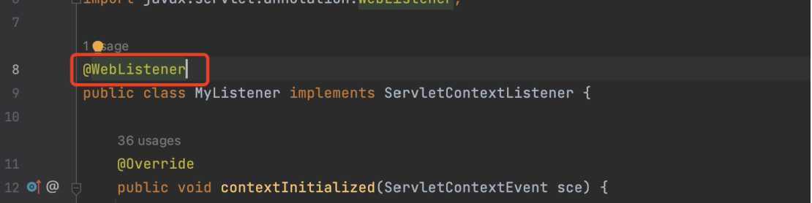
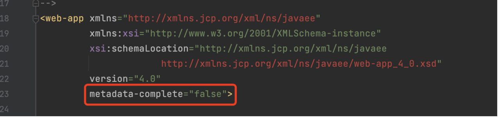
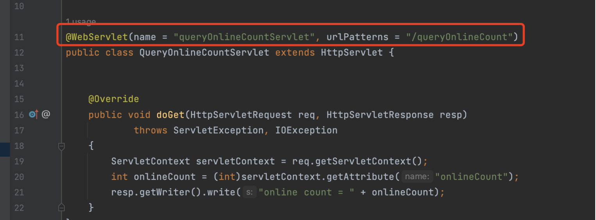
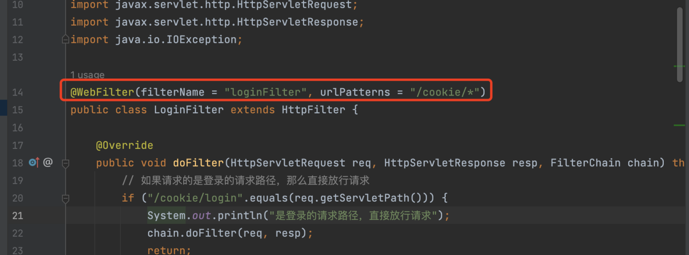

# Web Servlet Annotation

## @WebListener
在 Listener 类上使用 @WebListener 注解标注这是一个 web 监听器，不需要去 web.xml 中配置。  
在 web.xml 中设置 metadata-complete = false，让注解生效。

## @WebServlet
在 Servlet 类上使用 @WebServlet 注解标注这是一个 servlet。  
设置注解的属性 name、urlPatterns。

## @WebFilter
在 Filter 类上使用 @WebFilter 注解标注这是一个 filter。  
设置注解的属性 filterName、urlPatterns。
