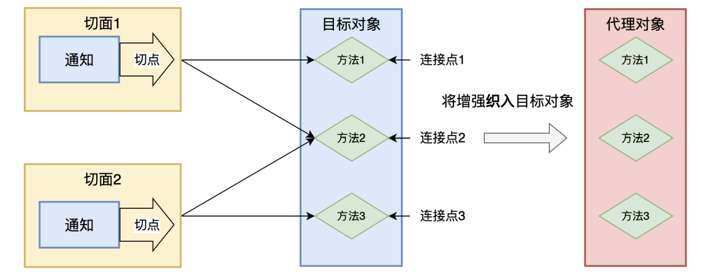

# AOP
## 介绍

### 概念
- AOP，Aspect-Oriented Programming，面向切面编程。  
- AOP 是一种编程范式，它通过将横切关注点从业务逻辑中分离出来，以模块化的方式实现了横切关注点的复用。  
- AOP 的核心思想是将横切关注点抽象成切面（Aspect），然后通过编织（Weaving）的方式将切面与业务逻辑进行组合，从而实现横切关注点的复用。
- 切面是一个横跨多个对象的关注点，它可以包含一些通用的逻辑，例如日志记录、异常处理等，通常这些逻辑与具体的业务功能不挂钩。

### 实现原理概述

- AOP 的本质是对目标类方法的增强。目标类的方法只实现业务逻辑，AOP 来完成其他增强逻辑。
- Spring AOP 使用动态代理来实现，即 Spring 在运行时创建代理对象，代理对象会将方法调用转发给目标对象，并提供方法增强。
- Spring AOP 的动态代理有两种方式：
  - 基于接口的代理，使用 JDK 动态代理实现，要求目标对象实现接口。
  - 基于类的代理，使用 CGLIB 动态代理实现。

### AOP核心术语
- 切面（Aspect）：切面是横切关注点的抽象，它包含了切点和通知。切面定义了在哪些地方（切点）以及何时执行哪些增强操作（通知）。
- 切点（Pointcut）：切点是指在哪些地方应该执行切面的增强操作。
- 通知（Advice）：通知是切面的具体实现，又叫增强，它定义了增强操作的具体行为，是我们抽取出来的共性功能。通知分为：前置通知、后置通知、环绕通知、异常通知、最终通知。
- 连接点（Joinpoint）：连接点是在应用执行过程中能够插入切面的一个点，例如方法调用、方法执行、异常处理等。连接点是切点的基础，切点定义了在哪些连接点上应该执行切面的增强操作。（简单例子：连接点是一个类中的所有方法，而切点则是被增强的那些方法）
- 织入（Weaving）：织入是将切面应用到目标对象上的过程。
- 目标对象（Target）：被织入增强的对象。
- 代理对象（Proxy）：一个目标对象被织入增强后产生的新对象。



## spring aop实现
### 1, 引入依赖
```xml
<dependency>
    <groupId>org.springframework</groupId>
    <artifactId>spring-context</artifactId>
    <version>5.3.29</version>
</dependency>

<dependency>
    <groupId>org.springframework</groupId>
    <artifactId>spring-aspects</artifactId>
    <version>5.3.29</version>
</dependency>
```

### 2, 创建spring配置类
```java

@Configuration
@ComponentScan(basePackages = "com.xxx.xxx.aop")
@EnableAspectJAutoProxy // 开启切面自动代理
public class SpringConfiguration{
    
}
```

### 3, 创建目标类
```java
@Service
public class MyService {
    public int query(int id) {
        System.out.println("query executed");
        return 100;
    }
}
```

### 4, 创建切面（切点 + 通知）
```java
@Component // 切面也是bean，也需要注册进ioc
@Aspect // 使用aspect告诉spring，这是一个切面
public class MyAspect {
    @Before("execution(* com.xxx.xxx.MyService.*(..))")
    public void before() {
        System.out.println("before");
    }  
}
```

### 5, 执行测试方法
```java
class Main {
    public static void main(String[] args) {
        ApplicationContext applicationContext = new AnnotationConfigApplicationContext(SprngConfiguration.class);
        
        MyServcie myServcie = applicationContext.getBean("myService", MyService.class);
    }
}
```

## 通用切点
可以定义通用切点，减少重复开发。
```java
class Main {
    
    // 通用切点
    @Pointcut("execution(* com.xxx.xxx.MyService.*(..))")
    public void generalPointCut() {}
    
    // 使用通用切点
    @Before("generalPointCut()")
    public void before() {
      System.out.println("before");
    }
}
```

## 使用注解来定义切点
### 自定义祝来

```java
import java.lang.annotation.ElementType;
import java.lang.annotation.Retention;
import java.lang.annotation.RetentionPolicy;

@Target(ElementType.METHOD)
@Retention(RetentionPolicy.RUNTIME)
public @interface MyAnnotation {

}
```

### 使用注解定义切点
```java
class Main {
    
    @Pointcut("@annotation(com.xxx.xxx.MyAnnotation)")
    public void generalPointCut() {
        
    }
}
```

### 用注解标注方法，Spring对标注的方法进行增强
```java
class Main {
    @MyAnnotation
    public int query(int id) {
       System.out.println("wahaha");
       return 1000;
    }
}
```

