# 配置文件IOC
## JavaBean

### 谁创建javabean
Controller 层的 Servlet 对象是由 Tomcat 创建的，Service 层和 Dao 层的对象由来创建呢？  
Q：如果我们在依赖这些对象的类中创建, 有什么问题？  
A：高层模块依赖底层模块，违反了依赖倒置原则。


 
 
### 什么是依赖倒置
依赖倒置原则，DIP（Dependency Inversion Principle）。DIP原则是指高层模块不应该依赖于底层模块，它们都应该依赖于抽象。面向接口编程是 DIP 的一种实现方式。


## IOC思想：由第三方来创建javabean


- 为了满足 DIP 原则，我们把创建对象的控制权交给了第三方。Java 程序员完成类的定义，第三方获取类定义，通过反射创建对象并完成依赖注入（DI），这种思想叫做 IoC。
- IoC，Inverse of Control，控制反转。指控制权的转移，将对象的创建和管理交给容器来完成，而不是由程序员来完成。
- DI，Dependency Injection，依赖注入。指将一个对象所依赖的其他对象通过构造函数、属性或方法参数的方式传递给它，通过注入的方式实现依赖关系的管理，DI 是实现 IoC 的一种手段。
- Spring 是一个基于 IoC 的框架，换句话说，Spring 帮 Java 程序员完成了对象的创建和管理，让 Java 程序员能更专注于业务功能的实现。

**DIP、IoC、DI、Spring 的关系**

- DIP，Dependency Inversion Principle，依赖倒置原则。指高层模块不应该依赖于底层模块，它们都应该依赖于抽象。
- IoC， Inverse of Control，控制反转。指控制权的转移，将对象的创建和管理交给容器来完成，而不是由程序员。IoC 是实现 DIP 的一种手段。
- DI， Dependency Injection，依赖注入。指将一个对象所依赖的其他对象通过构造函数、属性或方法参数的方式传递给它，通过注入的方式实现依赖关系的管理，DI 是实现 IoC 的一种手段。
- Spring 是一个基于 IoC 的框架，Spring 帮 Java 程序员完成了对象的创建和管理。IoC 是 Spring框架最底层的核心。

## 循环依赖
### 概念
什么叫循环依赖？A 依赖 B，B 依赖 A，依赖关系形成一个环。一旦执行程序会overFlowStack


### 原因分析


### 解决思路
增加二级缓存map，bean 对象创建完成之后就放入二级缓存map，属性注入完成后再放入一级缓存map（ApplicationContext）。


# SpringIOC 实现 - xml配置文件方式
## 步骤
1, 引入 spring-context 依赖(不要用6.x的，不支持java8)
```xml
<!-- https://mvnrepository.com/artifact/org.springframework/spring-context -->
<dependency>
    <groupId>org.springframework</groupId>
    <artifactId>spring-context</artifactId>
    <version>5.3.29</version>
</dependency>

```

2, 定义类
```java
public class User {
    private String name;
    private Integer age;
    private Account account;
    
    // getter / setter
}

public class Account {
    private Integer money;

    // getter / setter
}
```

3, 配置xml文件  
配置文件使用setter方法进行属性注入
```xml
<?xml version="1.0" encoding="UTF-8"?>
<beans xmlns="http://www.springframework.org/schema/beans"
    xmlns:xsi="http://www.w3.org/2001/XMLSchema-instance"
    xsi:schemaLocation="
        http://www.springframework.org/schema/beans http://www.springframework.org/schema/beans/spring-beans.xsd">

    <!-- bean definitions here -->
    <bean id="user" class="User">
        <property name="name" value="Vincent"/>
        <property name="age" value="18"/>
        <property name="account" ref="account"/><!-- 引用account的bean -->
    </bean>
    
    <bean id="account" class="Account">
        <property name="money" value="12345"/>
    </bean>
</beans>
```

4, 从springIOC容器中获取bean
```java
public class Main{
    @Test
    public void testContext() {
        ApplicationContext applicationContext = new ClassPathXmlApplicationContext("bean.xml");
        Object user = applicationContext.getBean("user");
        System.out.print(user);
    }
}
```

5, Set方法注入
使用 set 方法完成依赖注入。利用反射调用类的无参构造函数，再调用 set 方法完成依赖注入。


6, 构造器注入

```xml
<?xml version="1.0" encoding="UTF-8"?>
<beans xmlns="http://www.springframework.org/schema/beans"
    xmlns:xsi="http://www.w3.org/2001/XMLSchema-instance"
    xsi:schemaLocation="
        http://www.springframework.org/schema/beans http://www.springframework.org/schema/beans/spring-beans.xsd">

    <!--    第一种方式：index-->
    <bean id="user" class="User">
        <constructor-arg index="0" value="Vincent"/>
        <constructor-arg index="1" value="Vincent"/>
        <constructor-arg index="2" ref="Vincent"/>
    </bean>

    <!--    第一种方式：name-->
    <bean id="account" class="Account">
        <constructor-arg index="0" value="Vincent"/>
        <constructor-arg index="1" value="Vincent"/>
        <constructor-arg index="2" ref="Vincent"/>
    </bean>
</beans>
```

7, 自动装配
自动装配是针对 bean 类型的属性，可以不指定属性的 ref，通过自动装配的方式自动完成注入。
第一种方式：byType，根据类型自动装配。  
如果只有一个 bean 的类型属于 property 的类型，那么自动完成装配。  
```xml
<!-- 基础类型的注入 -->
<bean id="user" class="User" autowire="byType">
    <property name="name" value="Vincent"/>
    <property name="age" value="18"/>
</bean>

<bean id="account" class="Account">
    <property name="money" value="12345"/>
</bean>

<!-- 基础名字的注入 -->
<bean id="user" class="User" autowire="byName">
    <property name="name" value="Vincent"/>
    <property name="age" value="18"/>
</bean>
    
<bean id="account" class="Account">
    <property name="money" value="12345"/>
</bean>
```

# 注解IOC
## 实现步骤
1, 引入spring-context 依赖(不要用6.x的，不支持java8)
2, 定义类
3, 使用注解进行标注
```java
@Component
public class User {
    @Value("1234")
    private String name;

    @Value(18)
    private Integer age;
    
    @Autowired
    private Account account;
    
    // getter / setter
}

@Component
public class Account {

    @Value("1234")
    private Integer money;

    // getter / setter
}
```

4, 配置spring扫描路径
```xml
<beans>
    <context:component-scan base-package="com.xxx.xxx"/>
</beans>
```

5, 容器中获取bean

## 标记bean的注解 @Component @Service @Controller @Repository

### @Component
Spring扫描到装饰有@Component注解的类，会给这个类创建bean，并放入spring ioc容器  
@Component注解的value是bean的id，如果没有配置value，那么去类名首字母小写为bean的id

### 剩下其他3个注解
@Service、@Controller、@Repository： 这三个注解上都有 @Component，这三个注解的作用跟 @Component 是一样的。  
区别在于这三个注解用于装饰不同层的类。 @Controller 装饰 Controller 层， @Service 用于装饰 Service层， @Repository 用于装饰 Dao 层。  
如果只看实际效果的话， @Component 、@Service、@Controller、@Repository 是一样的。  


## 实现注入的注解 @Value
@Value 用于注入简单类型的属性。可以作用在字段、方法（set方法）、参数（构造方法的参数）上。

## 实现注入的注解 @Autowired
@Autowired 用于注入 bean 类型的属性。可以作用在字段、set方法、构造方法的参数、构造方法上。

@Autowired 优先根据类型装配。  
> 先按照属性的类型寻找 bean，如果该类型只找到一个bean，直接装配  
> 如果该类型找到多个bean，再在这些类型匹配的 bean 之中找与属性名称匹配的，找到则装配  
> 在多个类型匹配的 bean 中找不到名称匹配的，装配失败，抛异常。  
> @Autowired 可配合 @Qualifier 使用， @Qualifier 用于指定使用装配 bean 的名称  

## 实现注入的注解 @Resource
@Resource 优先根据名称装配。名称是 @Resource 的 name，如果不配置 name，以属性名为名称。  
先按名称寻找 bean，找到则检查类型是否匹配，类型匹配注入，类型不匹配抛异常  
按照名称找不到 bean，按属性的类型寻找，若按类型只找到一个 bean 则装配，按类型找到多个则抛异常。  


## IOC 全注解编程
### 用java类替换spring xml配置文件
```java
@Configuration
@ComponentScan(basePackages = "com.xx.xx")
public class SpringConfiguration{
    
}
```

### 使用 AnnotationConfigApplicationContext 
```java
class Demo {
    @Test
    public void demo() {
        ApplicationContext applicationContext = new AnnotationConfigApplicationContext(SpringConfiguration.class);
        Object obj = applicationContext.getBean("xxx");
    }
}
```

# IOC 进阶
## Bean的作用域
- 默认情况下，Spring IoC 容器创建的 bean 作用于单例（singleton）
- 所谓单例，就是在 Spring IoC 容器中这个类只会创建一个实例
- 可以将 scope 配置为 prototype， 表示这个 bean 是多例的。
- 多例，就是每次从 Spring IoC 容器中获取 bean，都会创建一个新的实例 

### 四种作用域
- singleton：单例，Spring 的默认 scope，Spring容器只创建唯一一个bean的实例，所有该对象的引用都共享这个实例，并且Spring在创建第一次后，会在Spring的IoC容器中缓存起来，之后不再创建
- prototype：原型，也即多例，每次调用或请求这个bean都会创建一个新的实例。
- 还有 2 个使用较少的作用域，仅在 Web 应用程序中使用：
  - request：每一次HTTP请求都会产生一个新的bean，同时该bean仅在当前HTTP request内有效。
  - session：表示该针对每一次HTTP请求都会产生一个新的bean，同时该bean仅在当前HTTP session内有效。

## Bean的获取
### 方式1:构造函数
- 没有显示声明构造函数时，调用无参数构造函数实例化
- 声明了有参构造函数，未声明无参构造函数，调用有参构造函数实例化
- 同时声明了有参、无参构造函数，调用无参构造函数实例化

### 方式2:FactoryBean
- 定义实现 FactoryBean 接口的工厂类
- 在工厂类的 getObject 方法中定义获取 bean 的逻辑
- Factory 也是被 Spring IoC 容器管理的 bean
```java
@Component
public class AppleFactory implements FactoryBean<Apple> {
    
    @Override
    public Apple getObject() throws Exception {
        System.out.println("get obj called");
        return new Apple();
    }

    @Override
    public Clazz<?> getObjectType() throws Exception {
        return Apple.class;
    }

    @Override
    public boolean isSingleton() throws Exception {
        return FactoryBean.super.isSingleton();
    }
}
```

### BeanFactory 和 FactoryBean 的区别
这是一道常见面试题
- BeanFactory 是接口，定义了 Spring IoC 容器实现的规范，是各种 IoC 容器类的顶层接口。
- FactoryBean 是 bean，是负责生产 bean 的 工厂 bean。

## Bean的生命周期
### 5步生命周期
说明：Spring 只对单例 bean 进行完整的生命周期管理。多例 bean Spring 只负责创建。
> 实例化 - 属性注入 - 初始化 - 使用 - 销毁
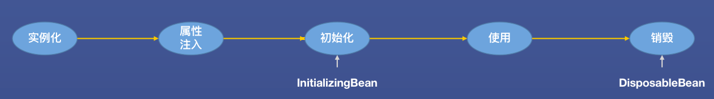
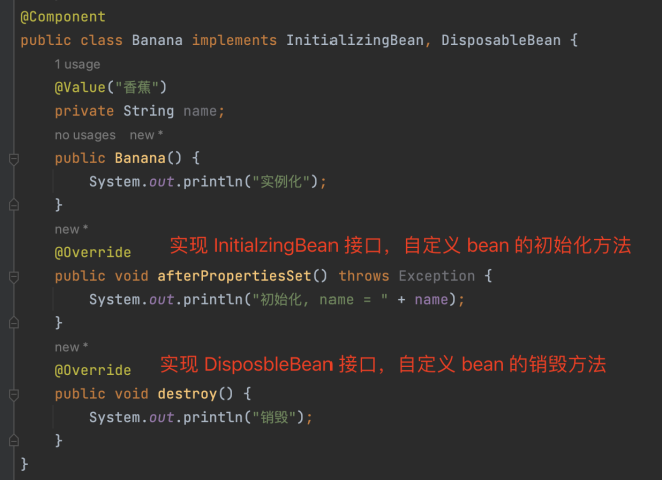
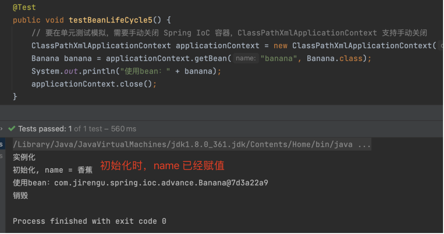

### 7步生命周期
> 实例化 - 属性注入 - bean后处理器before - 初始化 - bean后处理器after - 使用 - 销毁
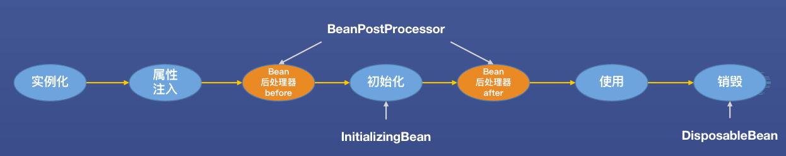
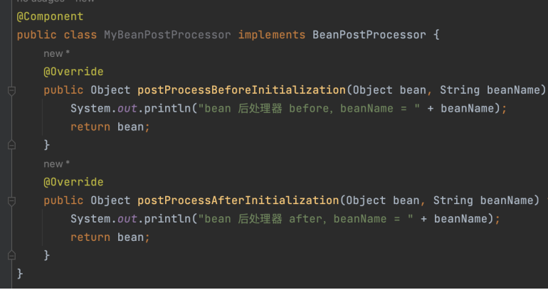
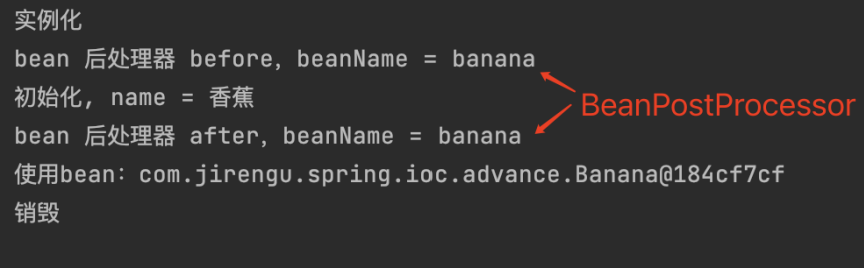

- BeanPostProcessor 是一个接口，我们叫 Bean 后处理器
- BeanPostProcessor 接口有两个方法
  - postProcessBeforeInitialization，在初始化方法执行前调用
  - postProcessAfterInitialization，在初始化方法执行后调用
- 实现了 BeanPostProcessor 的类也是一个 bean，在同一个 Spring IoC 容器中的 bean 被创建后， BeanPostProcessor 的 before、after 方法将被调用。

--- 


- BeanPostProcessor 的使用场景
  - postProcessBeforeInitialization：允许程序员在 bean 初始化方法被执行前，执行一段逻辑。
  - postProcessAfterInitialization：允许程序员在 bean 初始化方法被执行后，执行一段逻辑。典型应用AOP，使用代理（Proxy）将初始化完成的 bean 包装起来。

### 生命周期扩展
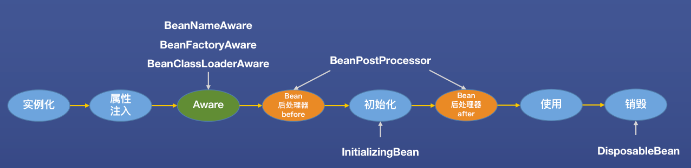
如果 bean 实现了 BeanNameAware, BeanFactoryAware, BeanClassLoaderAware
那么在属性注入后 aware 相关方法会被调用
> 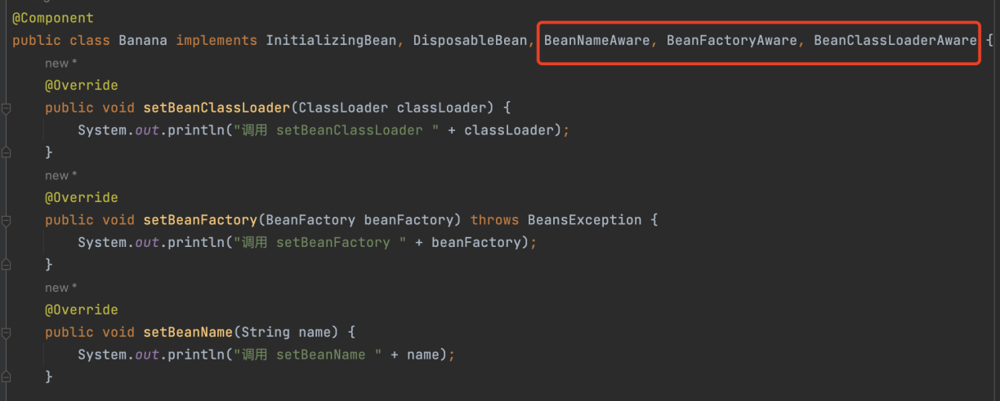
> 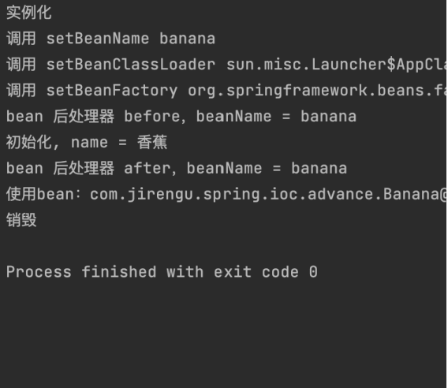
> Aware 表示“意识到”、“被通知到”，Spring IoC 容器会在某些事件发生后，对关心这些事件的 bean 进行通知。例如某个 bean 实现 BeanNameAware 接口，表示这个 bean 想知道自己的 beanName，Spring IoC 会在 beanName 确定后调用 bean 的 setBeanName 方法进行通知。


# Spring 循环依赖问题
## 使用set方法来解决循环依赖
- 如果使用的是 set 注入，循环依赖可以解决
- 如果使用的是构造函数注入，循环依赖不能解决，因为对于构造函数注入方式，“实例化 bean”和“属性注入”是同时完成的。
> 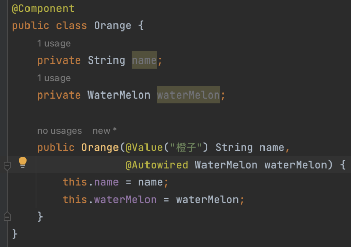
> 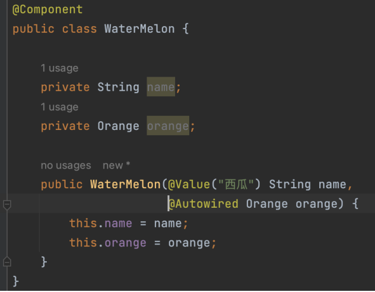

## 三级缓存
### Spring 使用三级缓存解决循环依赖问题，所有三级缓存的数据结构都是map，key是bean id。
- 第一级缓存：存放的是成品 bean，也就是初始化完成后的 bean，可以被外部直接使用。
- 第二级缓存：存放的是半成品 bean，还没有完成初始化，不能被外部使用。
- 第三级缓存：存放的是生产 bean 的 ObjectFactory， ObjectFactory 定义了一段创建 bean 的逻辑。
> 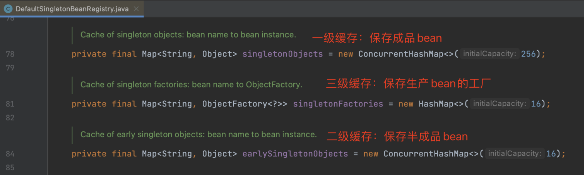

### 图示
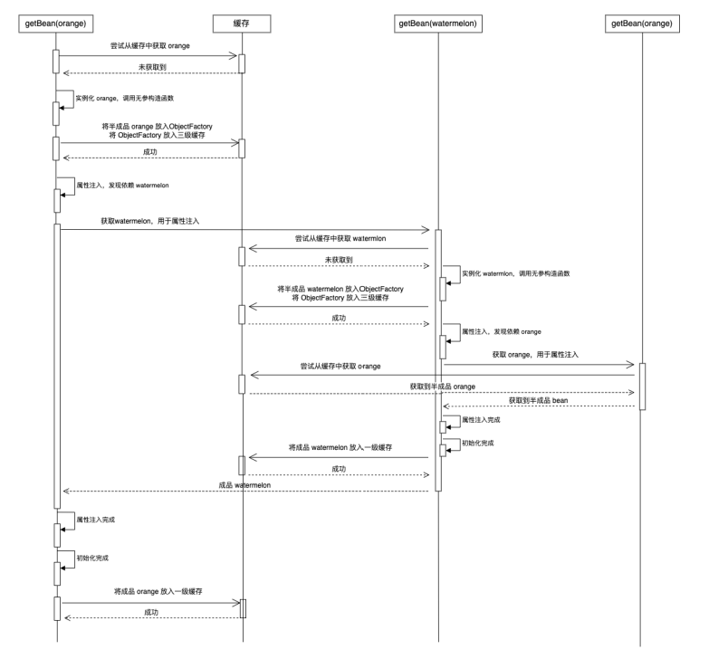

***为什么解决循环依赖要使用三级缓存？***  

**思考：如果我们在目标 bean 上定义了 AOP 增强，那放入缓存的是“原始 bean” 还是“代理 bean”？**
- 能被外部引用的必须放入代理 bean
- 三级缓存中，一、二级缓存能被外部引用，放入代理 bean，三级缓存放入原始 bean。

**Spring 设计原则：在 bean 初始化方法执行完成之后，再生成其 AOP 代理对象。**
- 当发生循环依赖时，Spring 被迫在初始化方法执行前（放入二级缓存时）就创建代理对象。
- 如果不发生循环依赖，那么 Spring 还是可以在初始化完成后，放入一级缓存前创建代理对象。
- 如果只有两级缓存，那么不论是否发生循环依赖，Spring 都要在初始化方法执行前提前创建代理对象并放入二级缓存。因此，相较仅使用二级缓存，三级缓存的优势是：存在 AOP 时，尽可能晚地创建代理对象，仅在发生循环依赖时，提前创建代理对象。
