# IOC
## JavaBean

### 谁创建javabean
Controller 层的 Servlet 对象是由 Tomcat 创建的，Service 层和 Dao 层的对象由来创建呢？  
Q：如果我们在依赖这些对象的类中创建, 有什么问题？  
A：高层模块依赖底层模块，违反了依赖倒置原则。
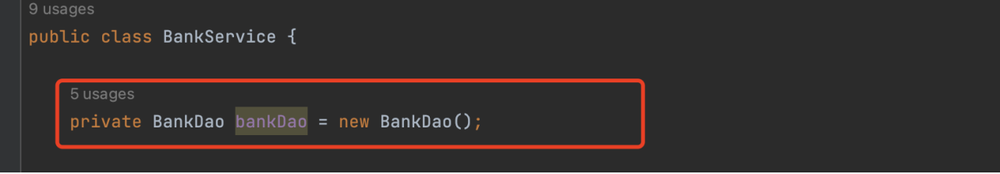

 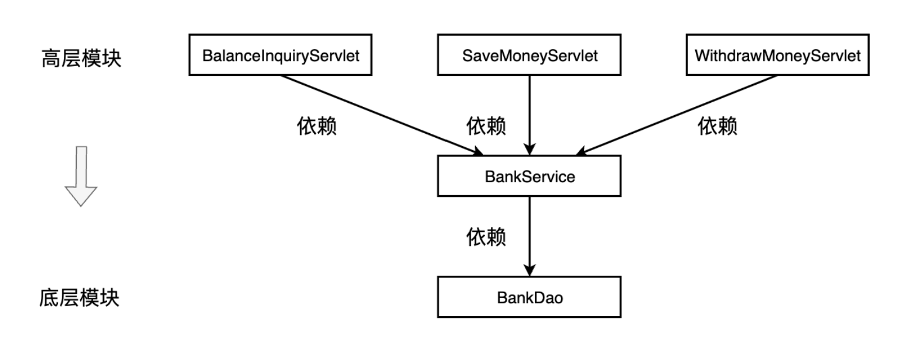
 
### 什么是依赖倒置
依赖倒置原则，DIP（Dependency Inversion Principle）。DIP原则是指高层模块不应该依赖于底层模块，它们都应该依赖于抽象。面向接口编程是 DIP 的一种实现方式。
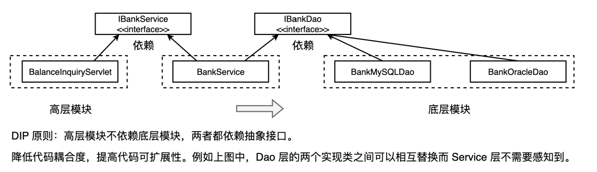

## IOC思想：由第三方来创建javabean
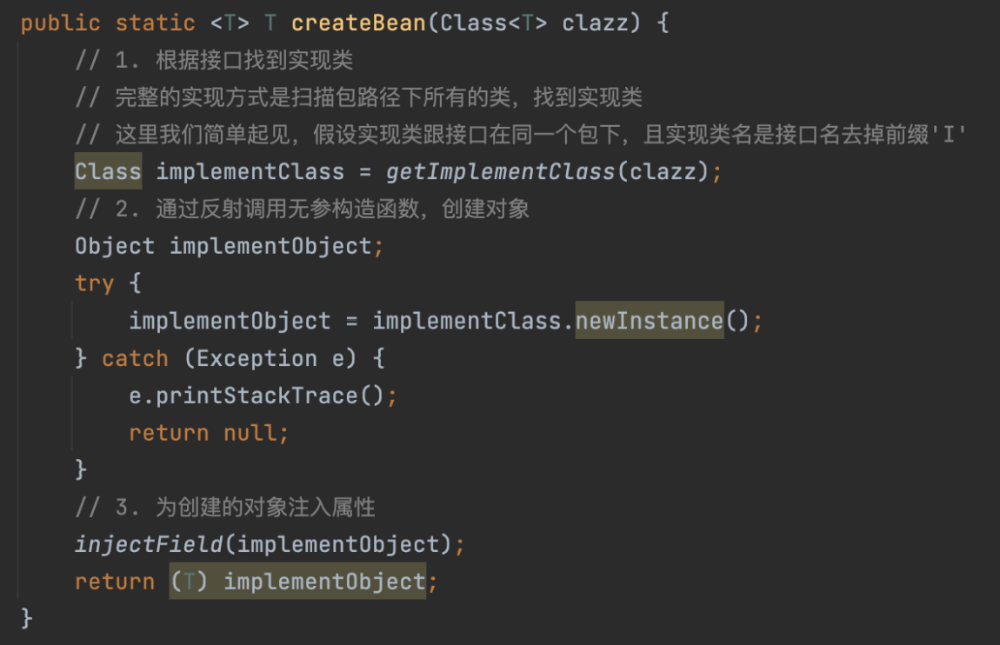
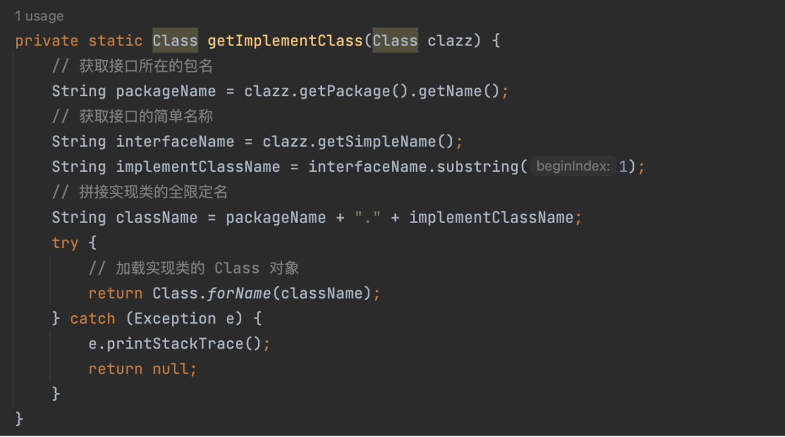
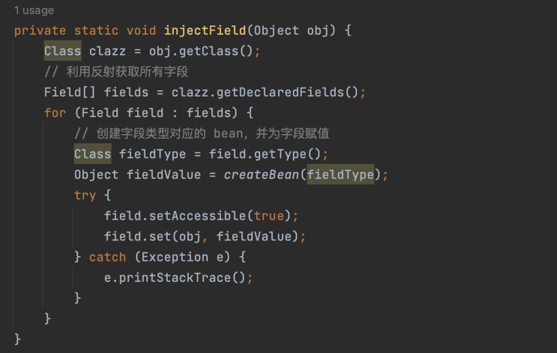

- 为了满足 DIP 原则，我们把创建对象的控制权交给了第三方。Java 程序员完成类的定义，第三方获取类定义，通过反射创建对象并完成依赖注入（DI），这种思想叫做 IoC。
- IoC，Inverse of Control，控制反转。指控制权的转移，将对象的创建和管理交给容器来完成，而不是由程序员来完成。
- DI，Dependency Injection，依赖注入。指将一个对象所依赖的其他对象通过构造函数、属性或方法参数的方式传递给它，通过注入的方式实现依赖关系的管理，DI 是实现 IoC 的一种手段。
- Spring 是一个基于 IoC 的框架，换句话说，Spring 帮 Java 程序员完成了对象的创建和管理，让 Java 程序员能更专注于业务功能的实现。

**DIP、IoC、DI、Spring 的关系**
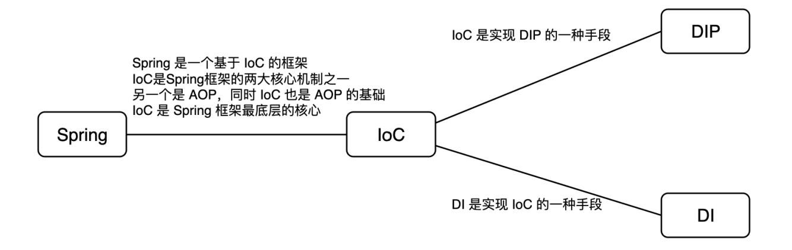
- DIP，Dependency Inversion Principle，依赖倒置原则。指高层模块不应该依赖于底层模块，它们都应该依赖于抽象。
- IoC， Inverse of Control，控制反转。指控制权的转移，将对象的创建和管理交给容器来完成，而不是由程序员。IoC 是实现 DIP 的一种手段。
- DI， Dependency Injection，依赖注入。指将一个对象所依赖的其他对象通过构造函数、属性或方法参数的方式传递给它，通过注入的方式实现依赖关系的管理，DI 是实现 IoC 的一种手段。
- Spring 是一个基于 IoC 的框架，Spring 帮 Java 程序员完成了对象的创建和管理。IoC 是 Spring框架最底层的核心。

## 循环依赖
### 概念
什么叫循环依赖？A 依赖 B，B 依赖 A，依赖关系形成一个环。一旦执行程序会overFlowStack
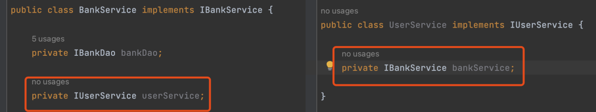

### 原因分析
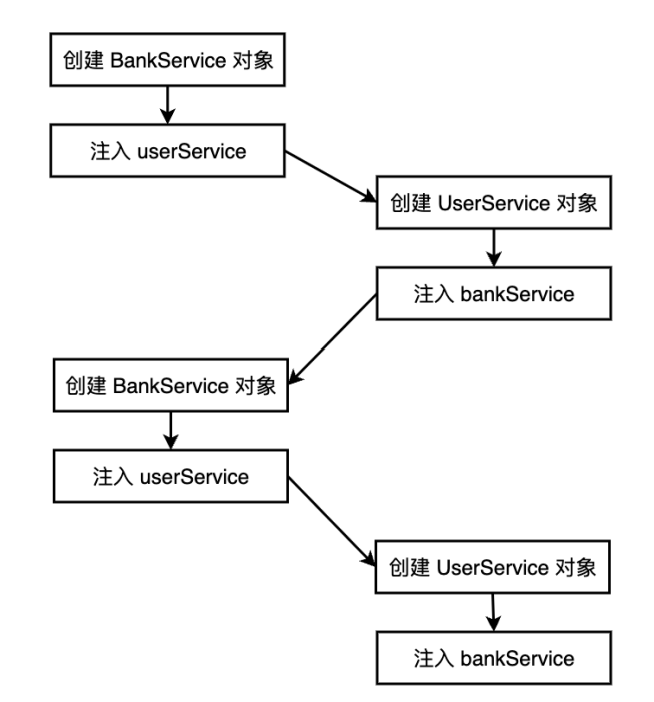

### 解决思路
增加二级缓存map，bean 对象创建完成之后就放入二级缓存map，属性注入完成后再放入一级缓存map（ApplicationContext）。
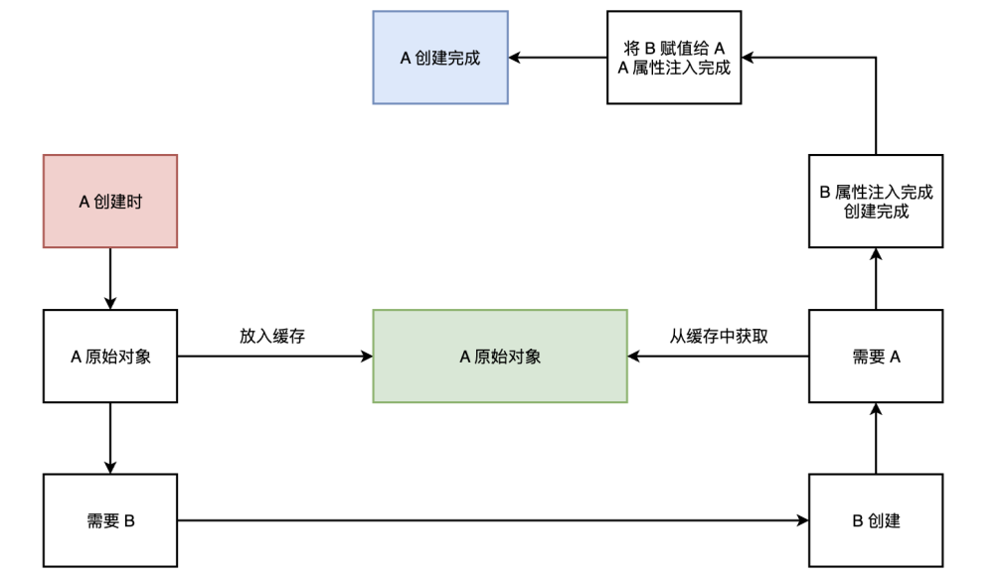

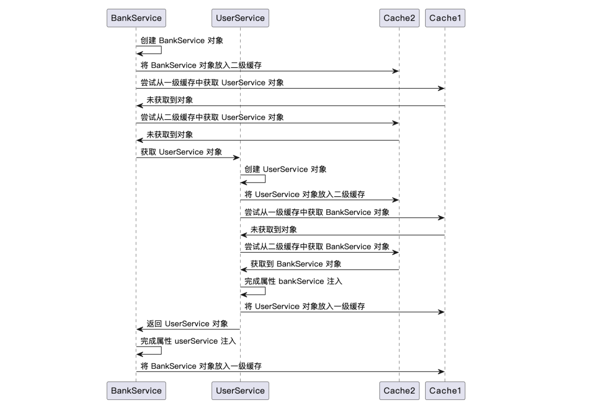

# SpringIOC 实现 - xml配置文件方式
## 步骤
1, 引入 spring-context 依赖(不要用6.x的，不支持java8)
```xml
<!-- https://mvnrepository.com/artifact/org.springframework/spring-context -->
<dependency>
    <groupId>org.springframework</groupId>
    <artifactId>spring-context</artifactId>
    <version>5.3.29</version>
</dependency>

```

2, 定义类
```java
public class User {
    private String name;
    private Integer age;
    private Account account;
    
    // getter / setter
}

public class Account {
    private Integer money;

    // getter / setter
}
```

3, 配置xml文件  
配置文件使用setter方法进行属性注入
```xml
<?xml version="1.0" encoding="UTF-8"?>
<beans xmlns="http://www.springframework.org/schema/beans"
    xmlns:xsi="http://www.w3.org/2001/XMLSchema-instance"
    xsi:schemaLocation="
        http://www.springframework.org/schema/beans http://www.springframework.org/schema/beans/spring-beans.xsd">

    <!-- bean definitions here -->
    <bean id="user" class="User">
        <property name="name" value="Vincent"/>
        <property name="age" value="18"/>
        <property name="account" ref="account"/><!-- 引用account的bean -->
    </bean>
    
    <bean id="account" class="Account">
        <property name="money" value="12345"/>
    </bean>
</beans>
```

4, 从springIOC容器中获取bean
```java
public class Main{
    @Test
    public void testContext() {
        ApplicationContext applicationContext = new ClassPathXmlApplicationContext("bean.xml");
        Object user = applicationContext.getBean("user");
        System.out.print(user);
    }
}
```

5, Set方法注入
使用 set 方法完成依赖注入。利用反射调用类的无参构造函数，再调用 set 方法完成依赖注入。

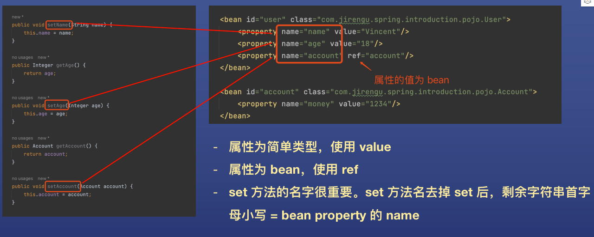

6, 构造器注入

```xml
<?xml version="1.0" encoding="UTF-8"?>
<beans xmlns="http://www.springframework.org/schema/beans"
    xmlns:xsi="http://www.w3.org/2001/XMLSchema-instance"
    xsi:schemaLocation="
        http://www.springframework.org/schema/beans http://www.springframework.org/schema/beans/spring-beans.xsd">

    <!--    第一种方式：index-->
    <bean id="user" class="User">
        <constructor-arg index="0" value="Vincent"/>
        <constructor-arg index="1" value="Vincent"/>
        <constructor-arg index="2" ref="Vincent"/>
    </bean>

    <!--    第一种方式：name-->
    <bean id="account" class="Account">
        <constructor-arg index="0" value="Vincent"/>
        <constructor-arg index="1" value="Vincent"/>
        <constructor-arg index="2" ref="Vincent"/>
    </bean>
</beans>
```

7, 自动装配
自动装配是针对 bean 类型的属性，可以不指定属性的 ref，通过自动装配的方式自动完成注入。
第一种方式：byType，根据类型自动装配。  
如果只有一个 bean 的类型属于 property 的类型，那么自动完成装配。  
```xml
<!-- 基础类型的注入 -->
<bean id="user" class="User" autowire="byType">
    <property name="name" value="Vincent"/>
    <property name="age" value="18"/>
</bean>

<bean id="account" class="Account">
    <property name="money" value="12345"/>
</bean>

<!-- 基础名字的注入 -->
<bean id="user" class="User" autowire="byName">
    <property name="name" value="Vincent"/>
    <property name="age" value="18"/>
</bean>
    
<bean id="account" class="Account">
    <property name="money" value="12345"/>
</bean>
```

