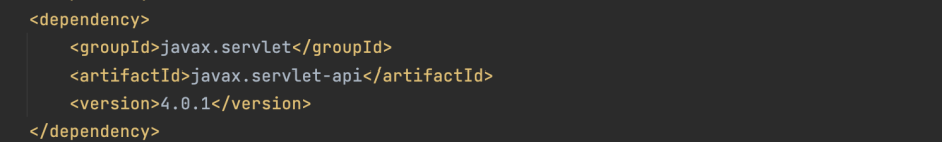
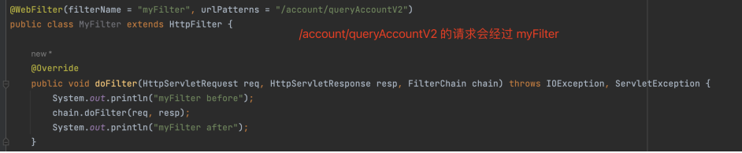
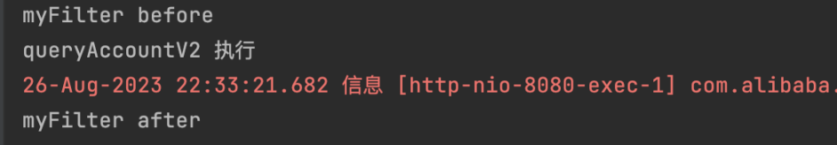
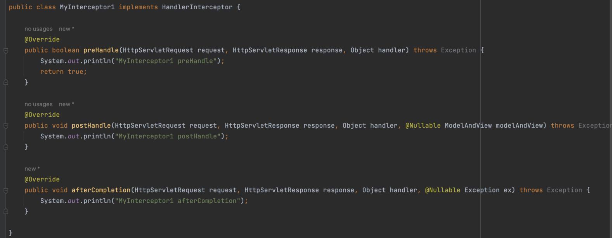
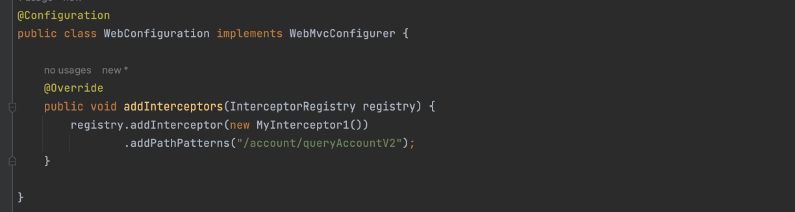
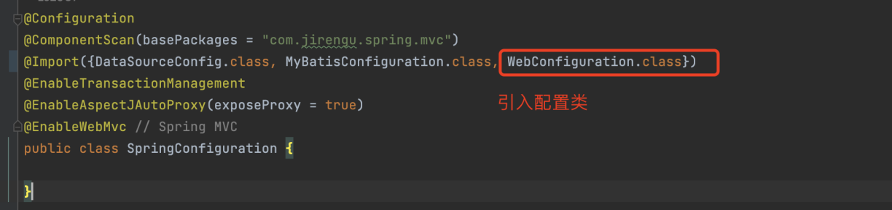
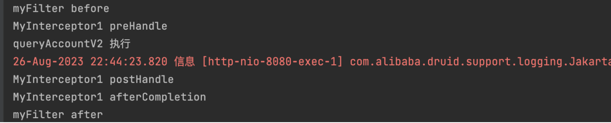

# SpringMVC
## MVC框架概述
- MVC，Model-View-Controller，模型-视图-控制器，是一个软件设计典范。
- MVC 用一种业务逻辑、数据、界面显示分离的方法组织代码，将业务逻辑聚集到一个部件里面，在改进和个性化定制界面及用户交互的同时，不需要重新编写业务逻辑。
- Model（模型）：表示领域信息的对象，包含除了用于UI部分的所有数据和行为。对应后端的Service层和Dao层。
- View（视图）：表示UI中模型的显示。可以简单理解为前端页面，包括html静态页面，jsp动态页面等。
- Controller（控制器）：接收用户输入，操作模型，并使视图更新。对应后端的 Controller 层。 

## Filter与Interceptor
### 在spring mvc中使用filter
- Filter 是 Servlet 规范中定义的接口，可以在 Spring MVC 框架中使用
- 第一步：引入 servlet 依赖

- 第二步：定义 Filter

- 第三步：请求接口

### Interceptor
- Spring MVC 提供了拦截器 Interceptor，对请求进行拦截处理，作用类似 Servlet 的 Filter
- 第一步：定义拦截器

- 第二步：配置拦截器

- 第三步：请求接口
