# Spring 集成 MyBatis 与事务管理
## Spring集成Mybatis

### 步骤
- 第 1 步：准备数据表，使用 account 表
- 第 2 步：新建模块并引入依赖
  - spring-context
  - spring-jdbc
  - mysql 驱动
  - mybatis
  - mybatis-spring：mybatis 提供的与 spring 框架集成的依赖
  - druid 连接池
  - Junit
  - mybatis-generator 插件
- 第 3 步：创建包和类
- 第 4 步：创建 mapper 接口、mapper.xml 映射文件、pojo 类（使用 mybatis 插件自动创建）
- 第 5 步：编写 jdbc.properties 配置文件
- 第 6 步：编写 DataSource（数据源） 配置类
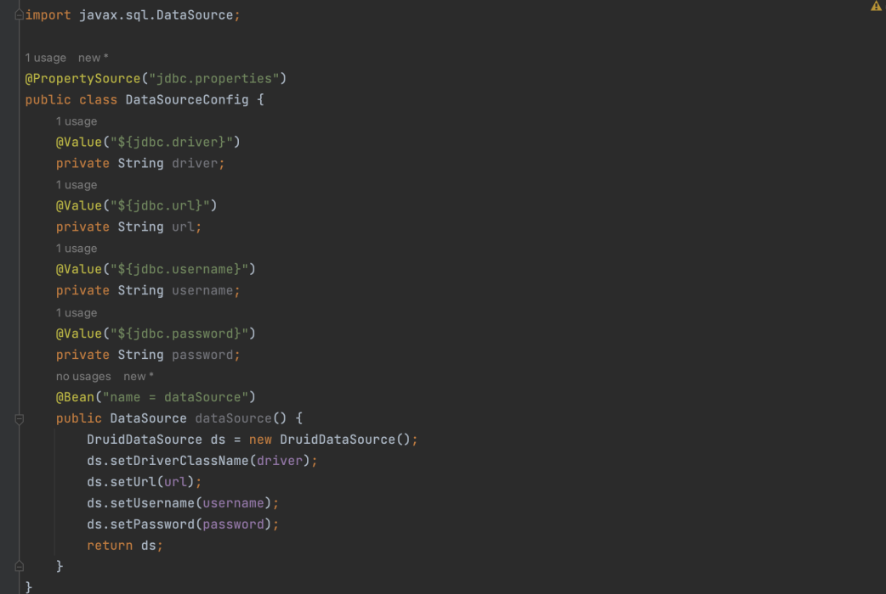
- 第 7 步：编写 MyBatis 配置类
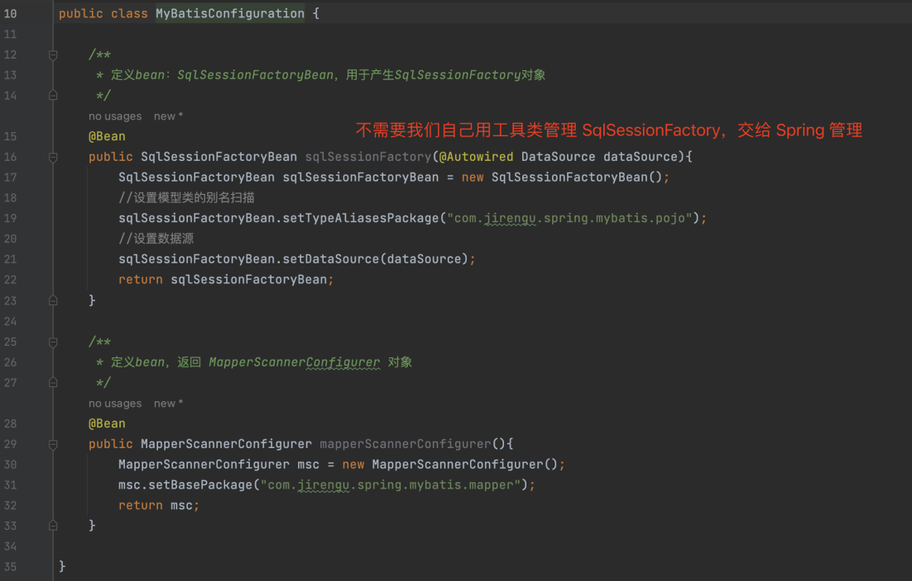
- 第 8 步：编写 Spring 核心配置类
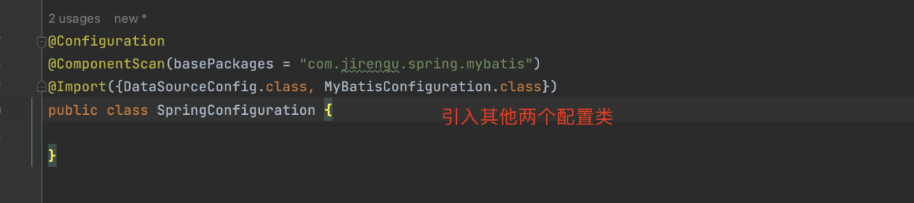

## Spring事务管理
### 步骤
- 第 1 步：配置事务管理器 bean
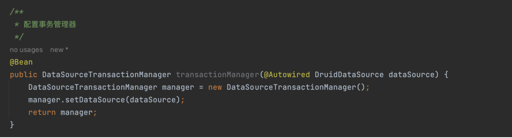
- 第 2 步：配置开启事务的注解支持，会自动加载事务管理器
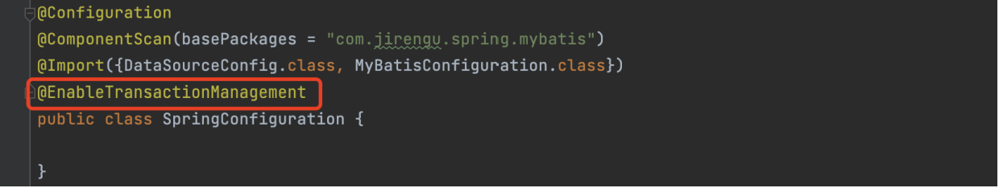
- 第 3 步：在目标方法上增加 @Transactional 注解
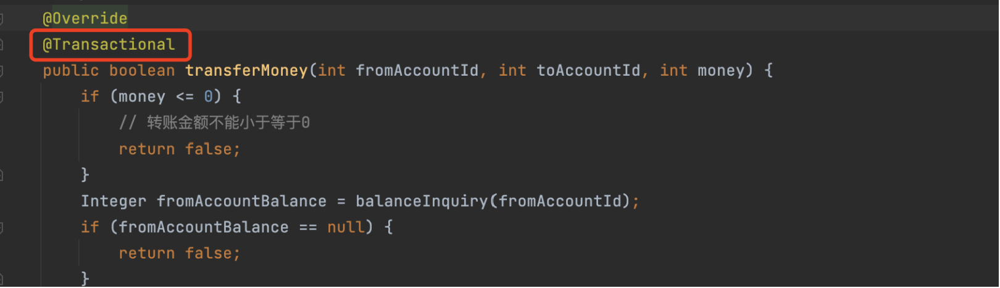

### 思考：同一个类内直接调用标有 @Transactional 的方法，事务是否生效？
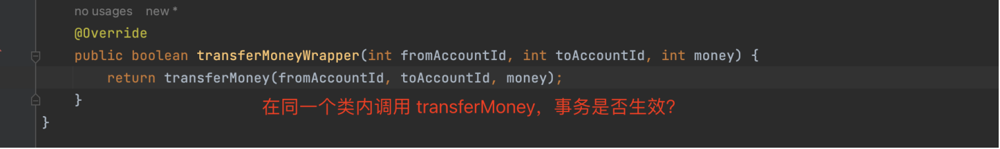

同一个类内直接调用，事务不生效。因为同一个类内调用，调用的是非代理类的方法。也即没有进行 AOP 增强，@Transactional 注解也就不生效。  
两种解决方案：  

方案 1：属性注入当前 bean 本身
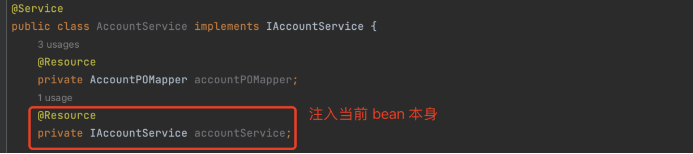
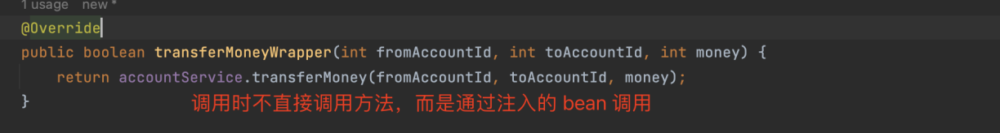

方案 2：获取当前 bean 的代理类对象
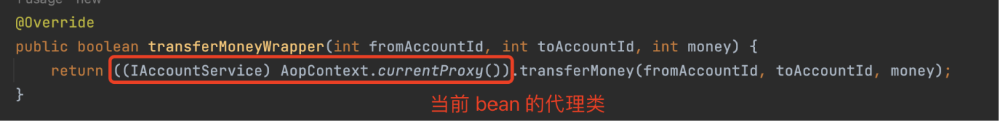
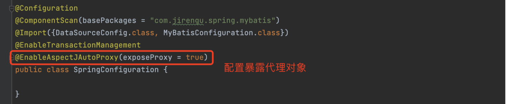
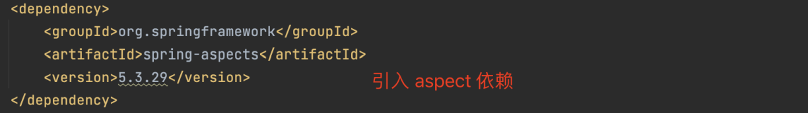

方案 3：写代码的时候避免类之内的方法相互调用，写成类之间的方法相互调用

# 事务传播行为
## @Transactional rollbackFor 属性

- @Transactional 通过 rollbackFor 属性配置当目标方法抛出什么类型的异常时执行回滚。
- 如果不配置 rollbackFor，默认抛出 RuntimeException、Error 及这两个类的子类时回滚。
- 如果配置了 rollbackFor，则增加触发回滚的异常类型，不会覆盖 RuntimeExcetion、Error。
- 如果希望只要出现异常就回滚的话，配置 @Transactional rollbackFor = Exception.class 

## Spring 事务传播行为
- @Transactional 通过 propagation 属性配置事务的“传播行为”。
- 传播行为，是指当一个事务方法被另一个事务方法调用时，如果处理这些事务的关系。
- 例如：methodA 事务方法调用 methodB 事务方法时，methodB 是继续在调用者 methodA 的事务中运行呢，还是为自己开启一个新事务运行，这就是由 methodB 的事务传播行为决定的。
- Spring 事务可以配置 7 类传播行为：
  - REQUIRED：Spring默认的事务传播行为。如果当前存在事务，则加入该事务；如果当前没有事务，则创建一个新的事务。
  - SUPPORTS：如果当前存在事务，则加入该事务；如果当前没有事务，则以非事务的方式继续执行。
  - MANDATORY：如果当前存在事务，则加入该事务；如果当前没有事务，则抛出异常。
  - REQUIRES_NEW：创建一个新的事务，如果当前存在事务，则挂起当前事务。（挂起事务就是不管外面调用方法的事务，被调用的方法有自己的事务）
  - NOT_SUPPORTED：以非事务的方式执行操作，如果当前存在事务，则挂起当前事务。（如果调用方有事务，则被调用方不受这个事务控制，以非事务的方式运行）
  - NEVER：以非事务的方式执行操作，如果当前存在事务，则抛出异常。
  - NESTED：如果当前存在事务，则在嵌套事务内执行；如果当前没有事务，则创建一个新的事务。

## 对表比较像的传播行为
对比 REQUIRED、 REQUIRES_NEW 、 NESTED
相同点：
- 如果当前没有事务，则创建一个新的事务

不同点：
- 存在事务时， REQUIRED 是加入当前事务，一起回滚，一起提交
- 存在事务时， REQUIRES_NEW 是不加入当前事务，新事务独立回滚，独立提交
- 存在事务时， NESTED 是在嵌套事务执行，跟当前事务一起提交，但可以独立回滚
